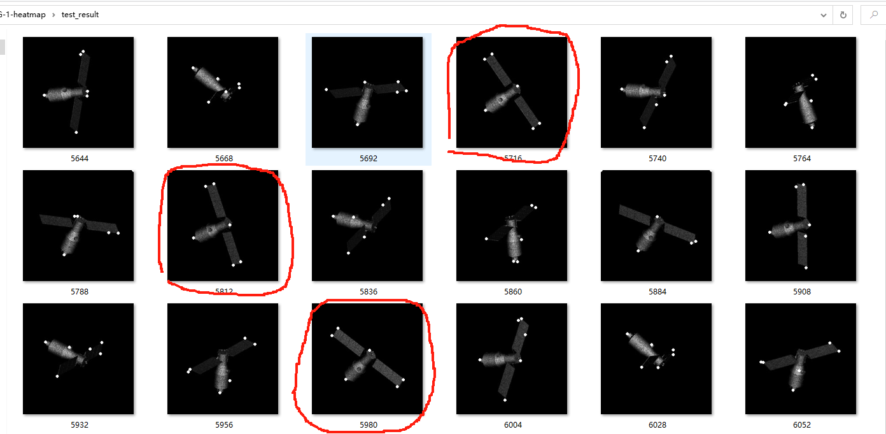
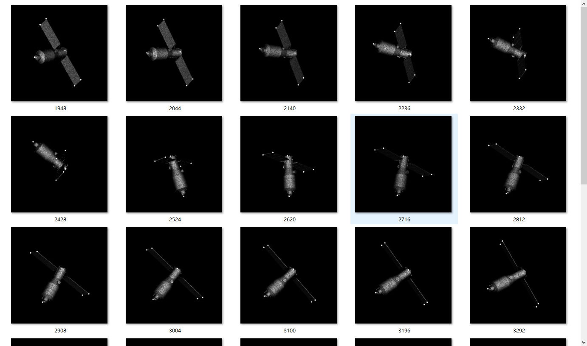
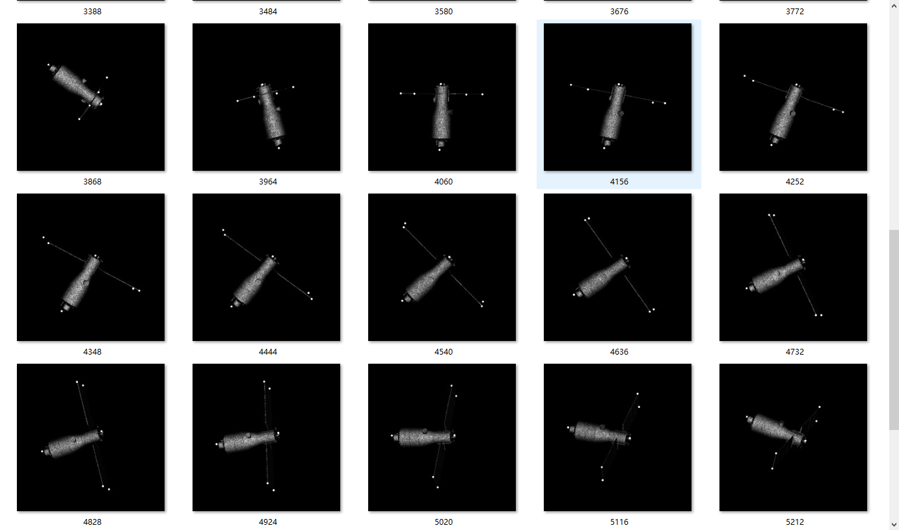

## 周报10.09

### 1.TG-1的关键点回归

训练参数：训练集50张,测试集20张（无挑选）；网络：Unet；训练轮数:120轮；学习率：1e-3；batchsize=2；损失函数：BCE Loss；图像的分辨率为512×512，颜色通道为单通道。

#### 解决

1.挑选训练集，使训练集尽可能涵盖全面，上周训练集中包含姿态不够全面；

2.改进优化网络；

训练参数：训练集113张,测试集44张（经过挑选,尽可能涵盖各种姿态）；网络：Linet；训练轮数:150轮；学习率：前五十轮1e-3；之后3e-4；batchsize=2；损失函数：MSE Loss；图像的分辨率为512×512，颜色通道为单通道。

## 下周计划

1.换目标进行测试，分别训练出参数，做一个前置分类网络，可以对这目标进行选择然后分别找对应的特征提取网络；

2.阅读相关论文。

