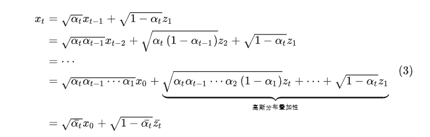

## 周报10.17

### 1.整理研究报告

### 2.时序预测 

- 扩散模型（diffusion models）

生成扩散模型DDPM如下图所示分为前向、逆向两个过程，它首先通过不断往原始清晰数据中添加噪声使其变成标准高斯噪声（前向过程），而后期望从标准高斯噪声中还原原始数据（逆向过程）。若能实现，那我们便可从已知的标准高斯分布中采样一个噪声数据，而后利用DDPM模型生成符合原始数据分布的新数据啦。下面将分别从前向过程和逆向过程两个角度解析DDPM算法。
                                   
                                   
在DDPM的前向过程中，通过下式往原始数据中逐步添加高斯噪声**（添加噪声的过程被假设为服从马尔可夫过程）**， T步过后（ T 足够大，在原始论文中作者取值是1000），数据就将变成纯高斯噪声 Z~N(0，**I**)
                                 

反向过程：  

​                                     

   前项过程提供标签 ，反向过程用这个标签去预测 噪声分布 Zt
   

                                

### 3 多类别+关键点检测

- 关键点个数相同的多类别 可以使用一个网络，进行微调；
- 关键点个数不同的多类别 需要前置分类，之后进入不同网络。
- 数据集 

