# 周报10.24

### 1.时序预测相关
- 扩散模型 隐马尔可夫
在DDPM中我们基于初始图像状态以及最终高斯噪声状态，通过贝叶斯公式以及多元高斯分布的散度公式，可以计算出每一步骤的逆向分布。之后继续重复上述对逆向分布的求解步骤，最终实现从纯高斯噪声，恢复到原始图片的步骤。

DDPM是基于Markovian扩散过程的模型，就是由于在重建生成阶段是需要一步步进行，q(xt-1 | $x_t$) 推理时间非常长，需要多次迭代才能产生高质量的生成样本，
DDIM（denoising diffusion implicit model，去噪扩散隐式模型）核心针对耗时问题进行优化，在满足DDPM中逆向推理的条件下，找到一种用xt和x0表达 xt-1 且能能大幅减少计算量的推理方式。

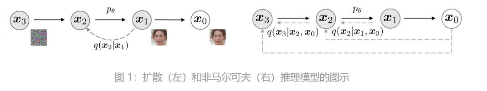

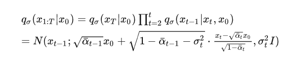

### 2.多类别+关键点检测 
- 1.生成数据集 
- 2.标注数据集 太阳能板四个角点和上方类似长方体底面的四个角点
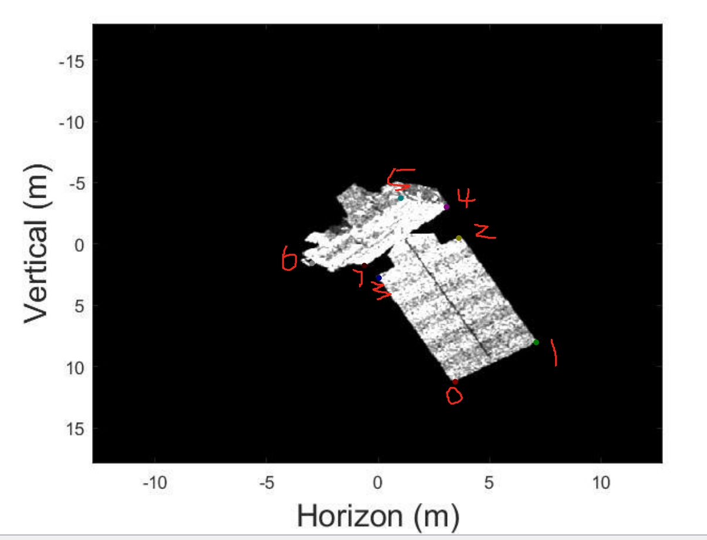
- 3.换目标做关键点检测
原数据集参数：分辨率;700×525，颜色通道：三通道。
处理后：分辨率:256×256 ；颜色通道:三通道；
网络 Linet ; 训练集30张, 测试集11张； batchsize=2；
训练轮数:300轮；学习率：前五十轮：1e-3；之后3e-4
损失函数：BCE Loss
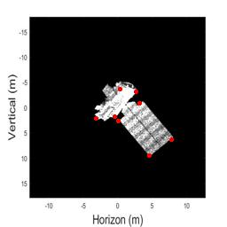 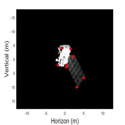 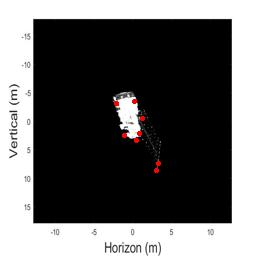 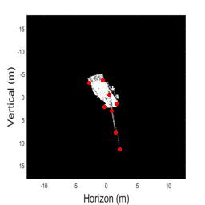  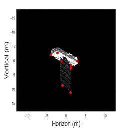 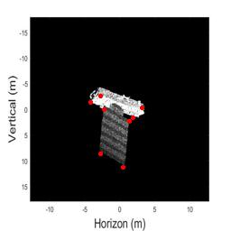 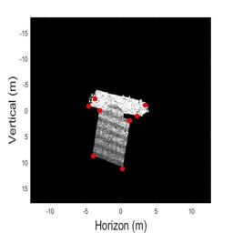 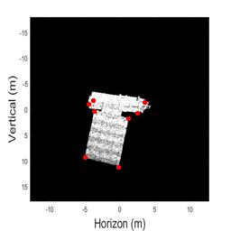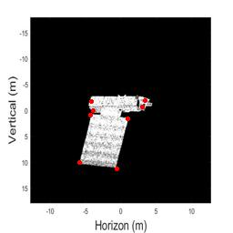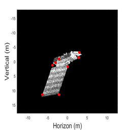

- 4 多类别  数据集 格式 分辨率 通道 统一 ？
