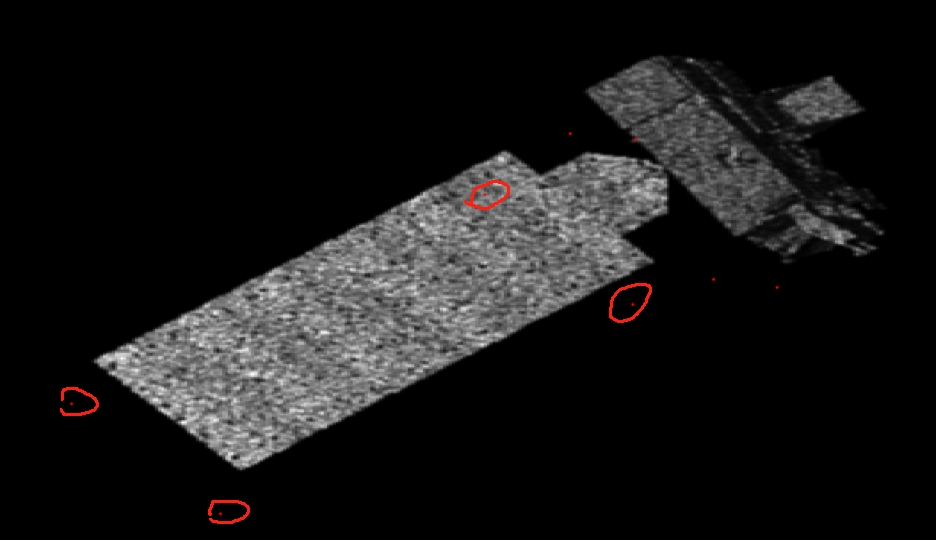

### 1.多类别+关键点检测 
- 主要是学习，熟悉 matlab生成图像的程序，学会自动标注; 生成了Aura, Worldview数据集, 并训练生成网络参数，测试达到了预期效果。
- 自动标注主要步骤：
 通过新目标三维fig1的标注关键点调整K矩阵;投影到二维图像中存在质心偏移，故需要矫正； 矫正：用角度相差较大的两张图像的关键点的偏移差值（向量）
#### Aura 大气卫星
（搭载了四个对地观测仪：高分辨率动态临边探测器（HRDLS）、微波临边探测器（MLS）、对流层放射光谱仪（TES）、臭氧监测仪（OMI））、
关键点选择

- 数据集制作： 总178张，训练集126张，测试集52张(按照观测角度顺序依次生成，分数据集时每十个为一组，前七个划分到训练集，后三个划分到测试集)
test_result 见下图：

#### worldview 世界眼卫星
- 关键点选择 如下图标注8个关键点；

- 数据集制作；总187张，训练集133张，测试集54张
- test_result 见下图：

测试结果达到预期。
### 2.问题
但是MRO卫星存在问题

标记三维图像更改k矩阵

未矫正之前图像MRO，对其进行矫正的始终无法对其，尝试其他关键点也不行（在这耗费了大量时间）
未矫正之前其他目标的偏移是规律的，呈平行四变形形
MRO:

Worldview : 

Aura:

### 3，小结
- 1.目前有Rosetta;  TG-1;  Aura;  MRO 四个目标的完整的数据集和训练好的网络参数；
- 2.应该还可以生成的 还有两个，美国导弹预警卫星DSP，制图 Cartography 印度  下周完成；
- 3.MRO存在问题；

