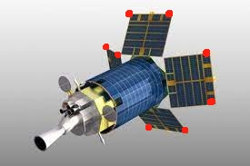
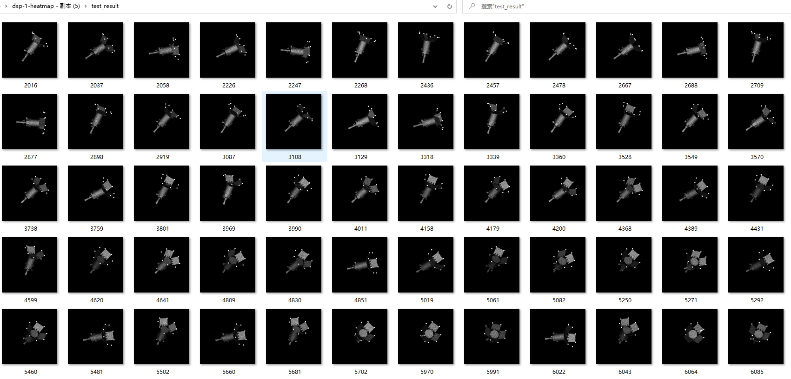
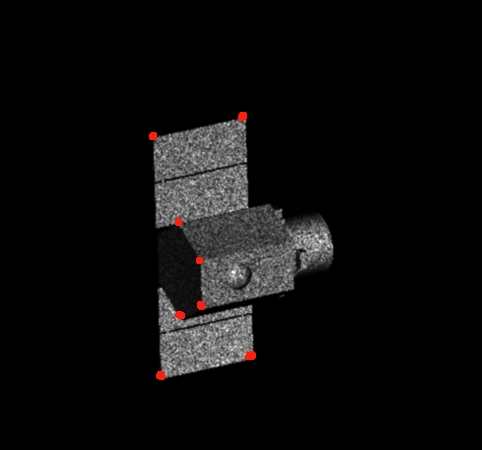
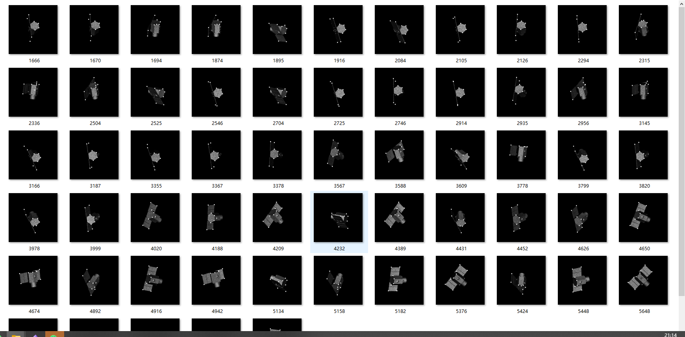

### 1.完成 整理 多视角合成孔径雷达目标三维重建方法研究   第三四章
### 2.多类别+关键点检测 
#### 2.1 DSP 导弹预警卫星
- 通过卫星上携带的传感器侦测到的热辐射来对导弹或者火箭的发射以及核爆炸提供侦测情报。
- 关键点选择 如下图标注8个关键点；
  

- 数据集制作；总200张，训练集133张，测试集54张(7:3)
- test_result 见下图：

- 测试结果达到预期。

#### 2.2  Cartography  印度制图卫星
- 关键点选择 如下图标注8个关键点；
  

- 数据集制作；总200张，训练集133张，测试集54张(7:3)
- test_result 见下图：

- 测试结果达到预期。
### 3，小结
- 1.目前已完成 Rosetta;  TG-1;  Aura;  DSP；Cartography；worldview  6个目标的  完整的数据集 和 训练好的网络参数 ；
- 2.MRO存在问题 生成数据集时 矫正对不齐；
- 3.多个目标关键点  使用同一套网络参数   师兄是建议 " 先通过一个分类  在进入的不同网络参数"    但又显的过于简单 ， 都是完成同一个任务  用一套网络参数   与  分类＋各自网络参数 意义大吗？ 
