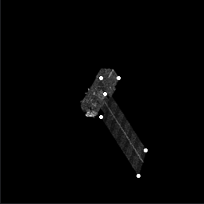
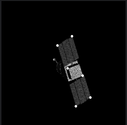

四个目标，其中三个目标8个关键点 ，一个目标关键点6个  采用原点补全到8个的方式，分别放入Linet 和Unet都可以回归，视觉上看不出太大差别，分别抽取8个关键点和6个关键点的10个预测值做一个精度量化

预测坐标-实际坐标 的绝对值 求平均 

 ULnet   50轮1$e^-3$  100轮3 $e^-4$ 

|             |worldview(8) |TG-1(6) | |
| ------   | ----       | ---------| ------    
| 单个目标  | 2.12|      | 
| 四个目标  | 1.90 |2.06（2.59）|

60轮1$e^-3$  40轮 3 $e^-4$
2 .07（worldview(8)）     2.10 (TG-1(6) )  

80轮1$e^-3$       40轮 3 $e^-4$  

  
  
  

关键点个数差别很大  可能会
在ULnet基础上增加注意力机制提高精度？
