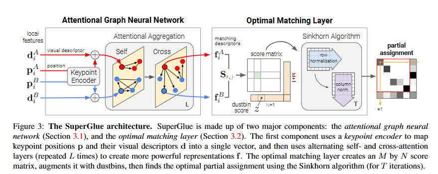
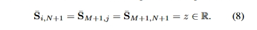
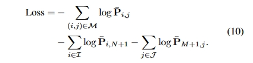
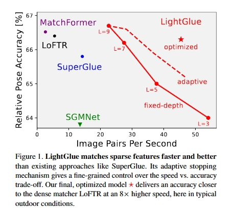
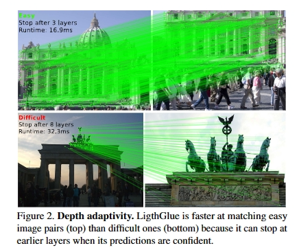
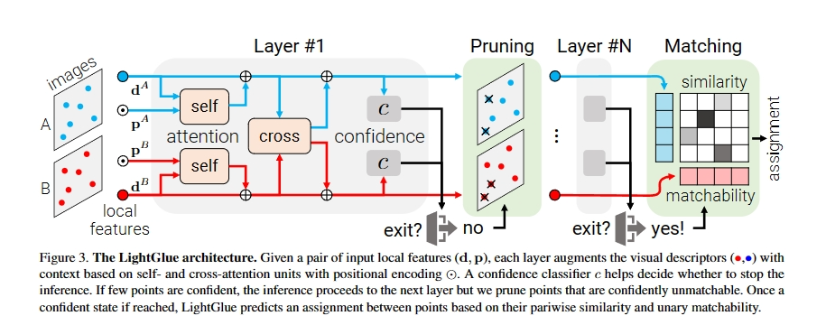
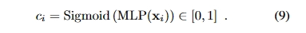
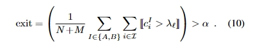
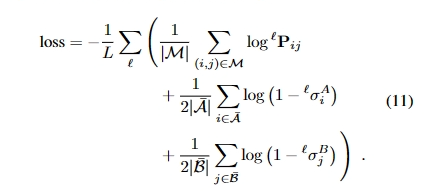

1.配合玮峰师兄生成Aura 、worldview 和Cartography 三个目标连续完整光学图像数据集(观测角度从361~8100，共计 7740×3 张)用于做预测实验。（今天可以生成完毕）

## 2. SuperGlue
论文pdf:

SuperGlue是一种通过联合寻找对应和拒绝非匹配点来匹配两组局部特征的神经网络;通过图神经网络预测的可微分的最优化分配问题来解决传输问题（如何最优地匹配一组图像中的特征点到另一组图像中的特征点）。引入了一种基于注意力的灵活的上下文聚合机制，使SuperGlue能够共同推理底层的三维场景和特征分配。与传统的、手工设计的启发式方法相比，我们的技术通过对图像对进行端到端训练，来学习三维世界的几何变换和规律。

1、将两个图之间的特征点匹配问题松弛为两个特征点图的最优传输问题，可以快速的处理遮挡点、不可重复点的问题；  
2、以图像对的形式进行端到端的训练，预先在大型数据集学习姿态估计的先验，使其能推理三维场景

在SLAM的背景下，通常会将问题分解为视觉特征提取前端和束调整或姿态估计后端，我们的网络直接位于中间——SuperGlue是一个可学习的中间端（见图1）。

  
  
SuperGlue 结构
图像之间的对应关系必须遵循一定的物理约束：
- i)一个关键点在另一幅图像中最多可以有一个对应关系；
- ii)一些关键点由于探测器的遮挡和故障而不匹配。 
一个有效的特征匹配模型应该是寻找相同三维点的重投影之间的所有对应，并识别没有匹配的关键点。

 
 
####  1 组成部分：
     1.SuperGlue由两个主要组件组成：
          1.注意力图神经网络 (Attentional Graph Neural Network)
          2.最优匹配层 (Optimal Matching Layer)

#### 2.注意力图神经网络：
     1.关键点编码器 (Keypoint Encoder): 为每个关键点提供一个初始表示，并将关键点位置嵌入到一个高维向量中。
    2.多路图神经网络 (Multiplex Graph Neural Network): 考虑了一个完整的图，该图的节点是两个图像中的关键点。这个网络使用 self 连接和 cross 连接来更新每个关键点的表示。
    
#### 3.最优匹配层：
    1.使用Sinkhorn算法计算两组特征之间的最优分配。
    2.该层产生一个部分的匹配矩阵，该矩阵显示了一组特征如何与另一组特征匹配。

#### 4.注意力聚合 (Attentional Aggregation)：
    1.使用注意力机制来聚合和计算消息，这些消息是基于关键点之间的跨图交互的。
     2. 考虑了自注意和交叉注意两种机制。
     (i) 自注意力 (self-attention)，它在同一张图片内部的关键点间建立关联;
     (ii) 交叉注意力 (cross-attention)，该机制允许跨图像的关键点间的互动，并由人类在观察和匹配物体时的直觉启发。
#### 5.视觉描述符：
    1.SuperGlue使用视觉描述符来帮助确定两个关键点之间的匹配程度。
    2.使用线性投影来创建最终的匹配描述符。
#### 6.阻塞与可见性 (Occlusion and Visibility)：
     1.SuperGlue可以处理被遮挡的关键点和在图像中不可见的关键点。
     我们用一个垃圾箱来增加每个集合，以便显式地分配不匹配的关键点给它。这种技术在图匹配中很常见，垃圾箱也被SuperPoint[18]使用来解释可能没有检测到的图像单元。我们通过添加一个新的行和列，点到箱和箱到箱的分数，填充一个可学习的参数来增加分数S到¯S：
 

  
	  
A中的关键点将被分配给B中的一个关键点或垃圾箱，而每个垃圾箱的匹配项和另一组中的关键点一样多：N、M分别为A、B中的垃圾箱。我们将
#### 7.Sinkhorn算法：
    1.用于解决优化问题，即如何最佳地匹配两组特征。
    
#### 3.1. 匹配矩阵
    SuperGlue预测两组局部特征之间的关联。它利用一个双向匹配矩阵P，其维度为M x N，表示第一组和第二组特征之间的关联。这个匹配矩阵是通过Sinkhorn算法进行优化的，它是一个可微分版本的匈牙利算法，经典用于为双向分配问题提供最优解。每次迭代后，都会丢弃掉双向匹配矩阵中的部分列和行

#### 3.2. 数据集和监督
     SuperGlue在两种数据集上进行训练，这些数据集提供了关键点之间的匹配信息。训练数据集包含了大量匹配的例子，通过这些数据可以获得更加稳定和鲁棒的匹配结果。
#### 3.3. 损失函数
    SuperGlue的损失函数目标是最大化匹配的精确度和召回率。它使用了一个特定的负对数似然损失函数，这个函数基于真实的匹配和预测的匹配之间的差异进行计算。

    
#### 3.4. 与其他方法的比较
    SuperGlue vs. Instance Normalization: SuperGlue的注意力机制更加灵活和强大，这使得它能够在各种情况下都实现高效的匹配。

    SuperGlue vs. ContextDesc: SuperGlue可以同时考虑外观和位置信息，而ContextDesc将这两者分开处理。SuperGlue还可以学习或硬编码局部特征，并且可以模拟前端的多种方法。

    SuperGlue vs. Transformer: SuperGlue借鉴了Transformer的自注意力机制，但将其嵌入到一个图神经网络中，使得注意力机制更为对称。这简化了架构并提高了各层之间的特征质量。
  
  与传统的匹配启发式方法相比，SuperGlue提供了一个强大的神经模型，将所有启发式和后处理整合到一个统一的架构中。

## 3.lightGlue
论文pdf:
  

LightGlue，这是基于深度学习局部特征匹配方法。论文重新审视了SuperGlue的多个设计决策，这是稀疏匹配领域的最新技术，并得出了简单但有效的改进方法。这些改进使得LightGlue在内存和计算方面更加高效，更准确，并且更容易训练。其中一个关键特性是LightGlue对问题的难度是自适应的：对于直观上易于匹配的图像对，例如具有更大的视觉重叠或有限的外观变化，推理速度更快。这为在对延迟敏感的应用中部署深度匹配器（例如3D重建）打开了令人兴奋的前景。

设计了LightGlue，一种深度网络，如图1所示，**在准确性、效率和训练易用性方面优于现有的SuperGlue**。通过对架构进行简单而有效的修改，提出了训练高性能深度特征匹配器的方法

 LightGlue具有**自适应的特性**，可以根据图像对的难度进行灵活调整。如图2所示，通过预测对应关系并允许模型自省，可以在易于匹配的图像对上实现更快的推理速度，而在具有挑战性的图像对上仍然保持准确性。
 

整体网络结构如上图所示，LightGlue是基于SuperGlue的，它预测从图像A和B提取的局部特征集之间的部分匹配关系。LightGlue由L个相同的层组成，这些层共同处理两个特征集合。每个层由自注意力和交叉注意力单元组成，用于更新每个点的表示。然后，一个分类器在每个层次上决定是否停止推理，从而避免不必要的计算。最后，一个轻量级的头从这些表示中计算出部分匹配。

#### 3.3 自适应深度和宽度
我们增加了两种机制，避免了不必要的计算，节省了推理时间：i)根据输入图像对的难度减少了层数；ii)剔除了早期确信被拒绝的点。

置信度分类器：
LightGlue的backbone通过上下文增强输入的视觉描述符。当图像对易于匹配时，早期层的预测结果与后期层的预测结果相同且置信度高。可以输出这些预测结果并停止推理。在每个层结束时，LightGlue使用一个紧凑的MLP推断每个点预测分配的置信度：

在最坏的情况下，紧凑型MLP仅增加2%的推理时间，但大多数情况下节省的时间要多得多。

停止准则：
对于给定的层 ℓ ，如果 C i > λ ℓ 
则认为一个点是可信的。如果有足够比例 α \alphaα 的点是可信的，停止推理：

λ ℓ 根据每个分类器的验证准确性逐渐降低，α 控制准确性和推理时间的权衡。

点修剪：
当不满足停止准则时，**被预测为既可信又不可匹配的点很可能不会在后续层次中对其他点的匹配有帮助**。这些点通常位于图像中明显不可见的区域。因此，在每个层次上丢弃这些点，并**仅将剩余的点传递到下一个层次**。这显著减少了计算量，考虑到注意力的二次复杂度，并且不会影响准确性

#### 3.4监督
分两个阶段训练LightGlue：首先训练它以预测对应关系，然后才训练置信度分类器。因此，后者不影响最后一层的准确性或训练的收敛。
使用从两视图单应变换得到的ground truth标签来监督soft partial assignment矩阵P。ground truth真实匹配M是在两个图像中具有低重投影误差和一致深度的点对。通过最小化每个层ℓ预测的分配的对数似然，我们让LightGlue尽早预测正确的对应关系。损失函数如下

