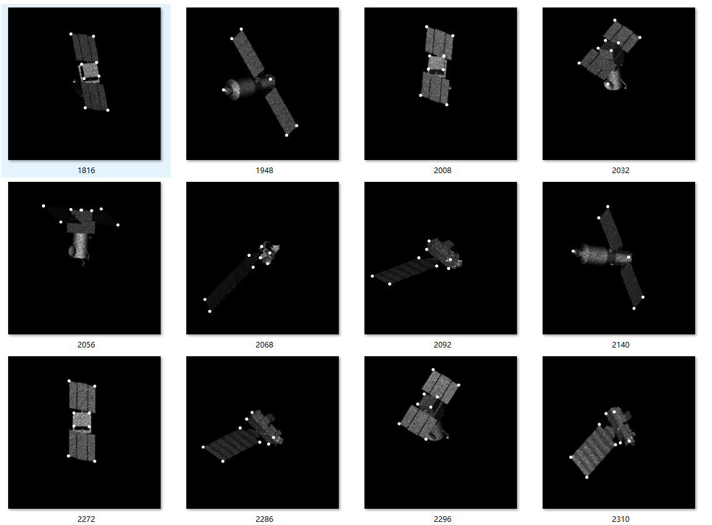

三个目标，其中两个目标8个关键点 ，一个目标关键点6个  采用原点补全到8个的方式，分别放入Linet 和Unet都可以回归， loss都可以收敛到 和单个目标时的等级

|  网络   | 损失函数 | 轮数 学习率 | loss|
| ------   | ----         | ------------   | ------    
| Linet    | MSE | 100 dou轮 1 $e^-3$ 后50轮3 $e^-4$| $e^-6$
| Unet  | MSE | 170轮 1 $e^-3$ 后50轮3 $e^-4$| $e^-5$

