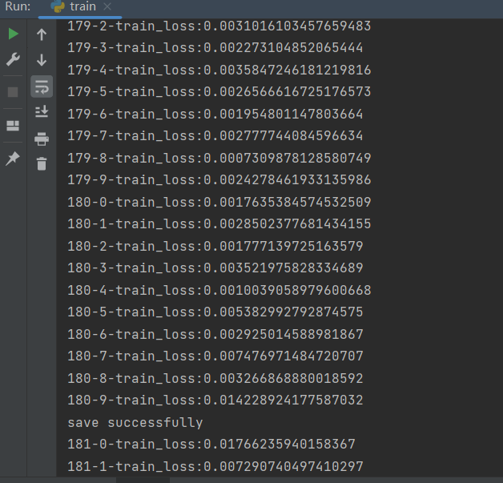
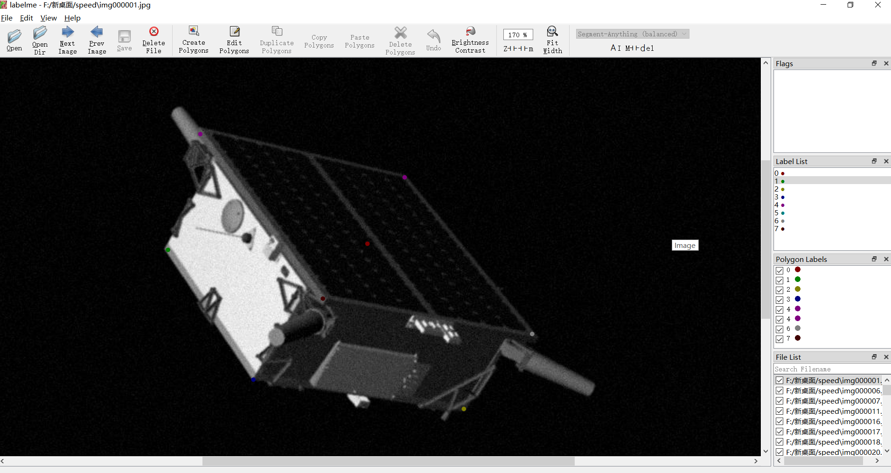
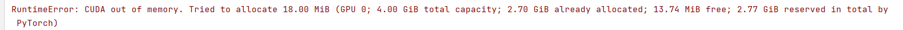

## 近期工作
### 一、人脸关键点检测
### 主要流程：
##### 1 首先准备人脸数据集，选取人脸五个关键点做标记 并生成.xml文件；
##### 2 然后解析.xml文件生成关键点.txt文件;图片归一化换轴 使用ToTensor() 函数;
##### 3 构建网络，训练，将网络输出与label输出做loss，优化。
#### train_loss: 

#### test_result:

### 二、卫星的关键点检测
数据集，使用标记软件labelme标记8个关键点，以人脸关键点检测为基础做卫星关键点检测

#### 把原本的单通道灰度图扩展为三通道

## 本周问题与下周计划解决
#### CUDA内存不足的问题

#### 1, 降低图片分辨率；卫星图片分辨率1920×1200，使用人脸数据集100×100，不好；
#### 2, 代码优化；做卫星关键点检测时，为了方便使用人脸关键点模型，把原本的单通道灰度图扩展为三通道，占用了过多内存；接下来尝试调整模型的结构或权重以适应单通道图像。
#### 3, 服务器；

