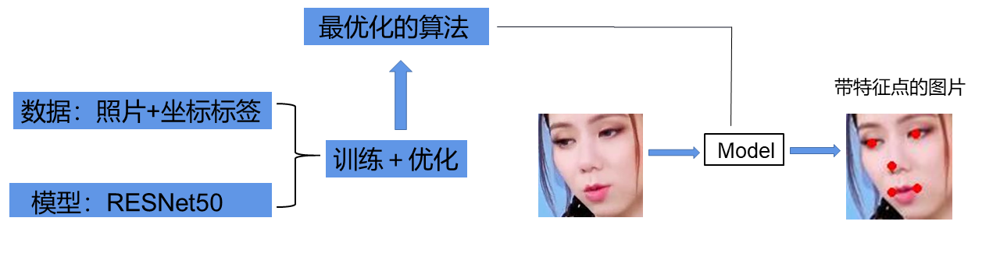
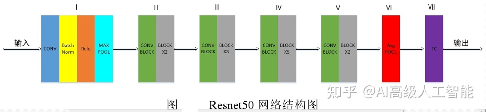
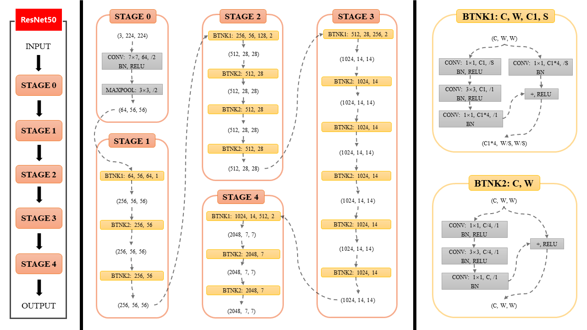
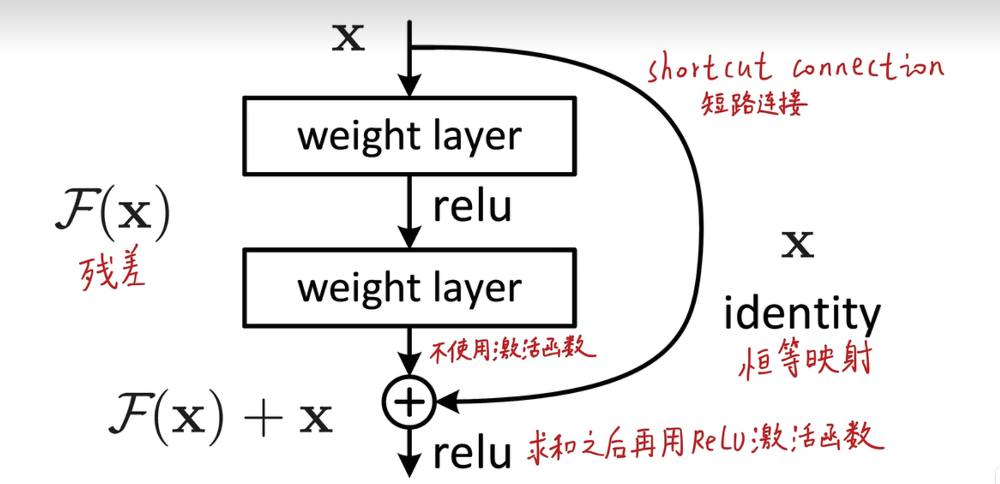

## 周报9.13
### 1.人脸的关键点回归

#### 选取人脸图像中眼睛、鼻子、嘴巴5个关键点的坐标做为标签，使用resnet50网络模型来学习人脸图像与关键点之间的映射关系，将网络输出与label输出做loss，并不断优化；继而使用优化后的算法将图片生成带有特征点的图片。
#### 具体参数：训练集20张, batchsize=2、图像的分辨率为100×100，颜色通道为三通道。
#### 对于回归任务，损失函数采用MSE Loss是均方误差，衡量模型真实值与预测值的差值的平方然后求和再平均(平均平方差)；
###           L(y, y') = 1/n * Σ(y - y')²
#### y是真实标签，y'是模型的预测输出，n是样本数量

### resnet50网络结构
  
Resnet50 网络中包含了 49 个卷积层、一个全连接层。如上图所示，Resnet50网络结构可以分成七个部分，第一部分不包含残差块，主要对输入进行卷积、正则化、激活函数、最大池化的计算。第二、三、四、五部分结构都包含了残差块，图 中的绿色图块不会改变残差块的尺寸，只用于改变残差块的维度。
 

在 Resnet50 网络结构中,残差块都有三层卷积，那网络总共有1+3×（3+4+6+3）=49个卷积层，加上最后的全连接层总共是 50 层，这也是Resnet50名称的由来。

#### resnet50网络中的残差结构

左侧是正常的卷积层，一层层往下传，在右侧增加一条连线，使得整个网络结构形成了一个残差结构。这样，网络的输出不再是单纯卷积的输出F(x)，而是卷积的输出和前面输入的叠加F(x) + X。

### 2.卫星的关键点回归及存在的问题
颜色通道单通道，batchsize=1，卫星图片分辨率1920×1200，降低分辨率后能跑起来，但是训练的十几轮轮数电脑过烫；训练轮数少，loss还未收敛，导致看不出效果。
服务器，学号目前未激活，无法连接校园网使用服务器。
