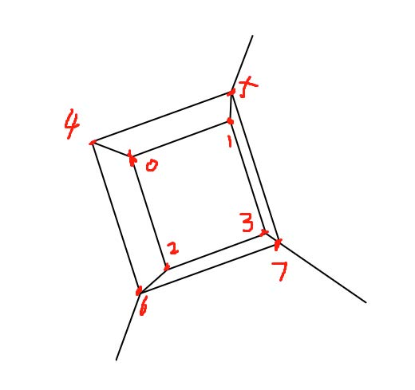
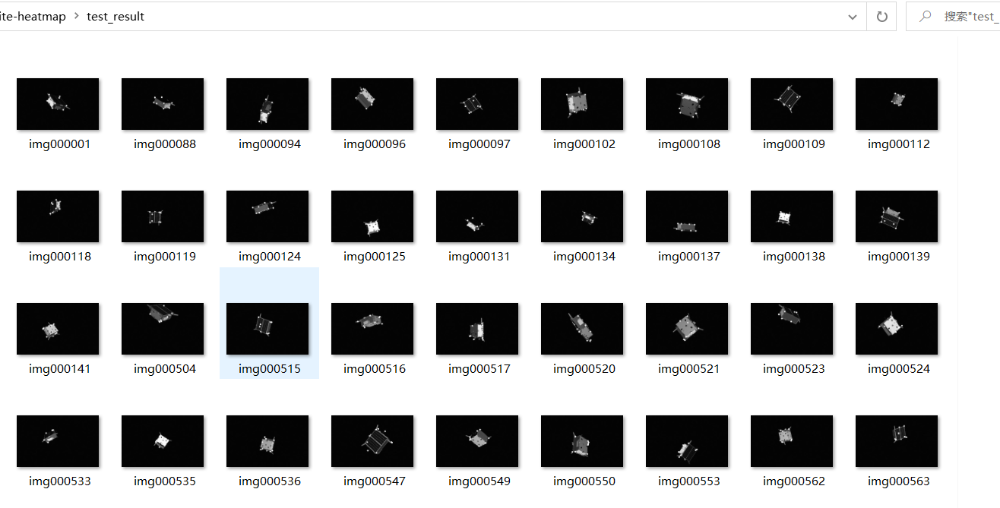
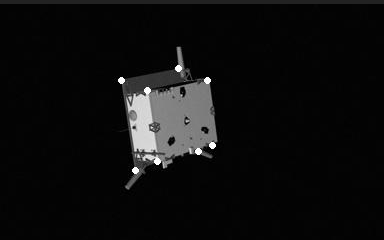
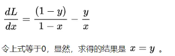

## 周报9.25
### 1.卫星的关键点回归

  

#### 卫星的大概形状如上图所示，是一个正方形盒子，前面像是一个箱子，箱子后面贴了一个太阳能板，先按序号 0-3 标注箱子的四个顶点，再序号 4-7 标注太阳能板上的四个关键点。共计8个关键点的坐标做为标签，

#### 输出结果如下图

        

数据集参数：训练集50张, batchsize=2、图像的分辨率为1920×1200，颜色通道为单通道。

#### 关键点的信息采用heatmap热力图表示

基于热力图回归：在基于坐标回归的方法中，**目标点其实很难准确的被某一个像素位置定义的，也就很难被准确的标注。而且目标点附近的点其实也很像目标点**，如果我们直接将其标为负样本，可能给网络的训练带来干扰，但如果用高斯函数为这些点做一个"软标注（soft label）"，
也就是每一点的标注是距离目标点的“激活值（程度）”，这样网络就会更好的收敛。这样也能够给网络的训练增加一个方向性的引导，距离目标点越近，激活值越大，这样网络能有方向的去快速到达目标点。

#### 损失函数采用BCE Loss,二分类交叉熵损失函数

L  =  -(y * log(x) + (1 - y) * log(1 - x)

其中：y代表真实的二进制标签（0或1）。x代表模型预测的概率。

BCE虽然总是用来学习0/1分布，即二分类问题，但不是0/1两个数，只要在0-1之间的数也都能学习。因为只要y在0-1范围内，BCE损失函数就是一个凸函数，有最小值。

因此输出必须在0-1之间，所以为了让网络的输出确保在0~1之间，一般都会加一个Sigmoid激活函数。对其损失函数求导

因此，BCE的学习目标就是让输出x去逼近label y。

Sigmoid激活函数是一种常用的非线性激活函数，用于将输入的实数值映射到0和1之间的概率值。 sigmoid(x) = 1 / (1 + exp(-x))。

## 下周计划

1.做TG-1数据集的关键点回归并录制视频

2.阅读相关论文。

