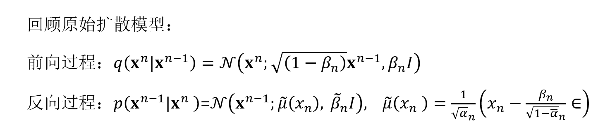
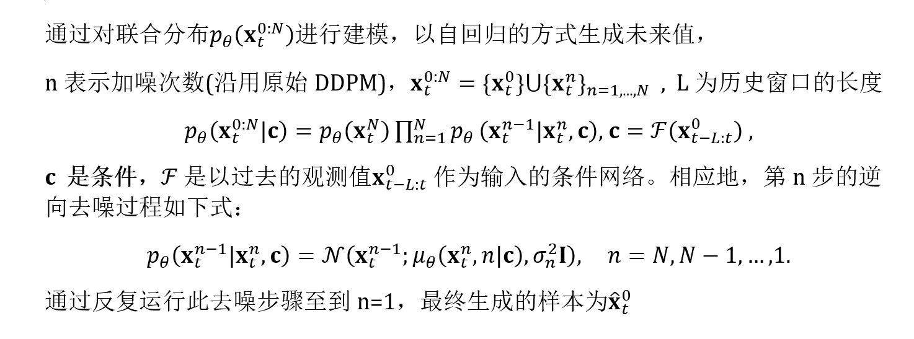
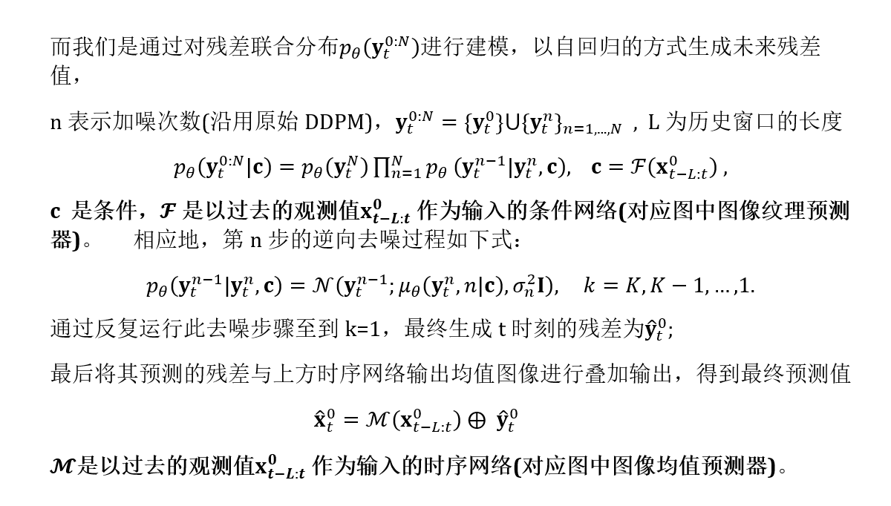
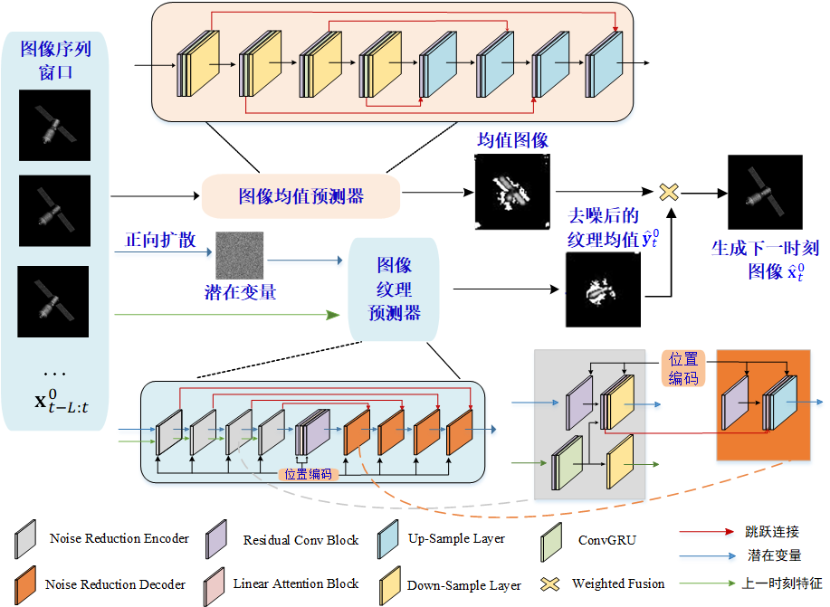

本周对论文正文部分进行推导，接下来继续**完善**！！

### 回顾原始扩散模型：

参考文献： [Ho 等 - 2020 - Denoising Diffusion Probabilistic Models.pdf](img\Ho 等 - 2020 - Denoising Diffusion Probabilistic Models.pdf) 

###  时间序列的条件扩散模型：

参考文献：

 [Rasul 等 - Autoregressive Denoising Diffusion Models for Mult.pdf](img\Rasul 等 - Autoregressive Denoising Diffusion Models for Mult.pdf) 

 [Shen 和 Kwok - Non-autoregressive Conditional Diffusion Models fo.pdf](img\Shen 和 Kwok - Non-autoregressive Conditional Diffusion Models fo.pdf) 

 [Shen 等 - 2024 - MULTI-RESOLUTION DIFFUSION MODELS FOR TIME SERIES .pdf](img\Shen 等 - 2024 - MULTI-RESOLUTION DIFFUSION MODELS FOR TIME SERIES .pdf) 

 

### 我们的方法

写在最后,**条件扩散模型：**从方法上来看，条件控制生成的方式分两种：事后修改（Classifier-Guidance）和事前训练（Classifier-Free）。 

Classifier-Guidance方案：前向过程我们是不改变的，对于大多数人来说，一个SOTA级别的扩散模型训练成本太大了，而分类器（Classifier）的训练还能接受，所以就想着直接复用别人训练好的无条件扩散模型，用一个分类器来调整生成过程以实现控制生成，这就是事后修改的Classifier-Guidance方案；

Classifier-Free方案：而对于“财大气粗”的Google、OpenAI等公司来说， **它们不缺数据和算力，所以更倾向于往扩散模型的训练过程中就加入条件信号**，达到更好的生成效果 ，这就是事前训练的Classifier-Free方案。，Classifier-Free方案就是训练成本大，本身“没什么技术含量”