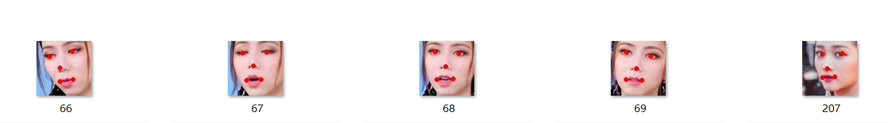
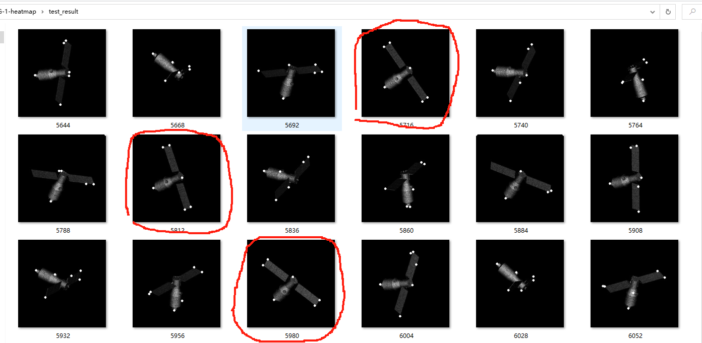
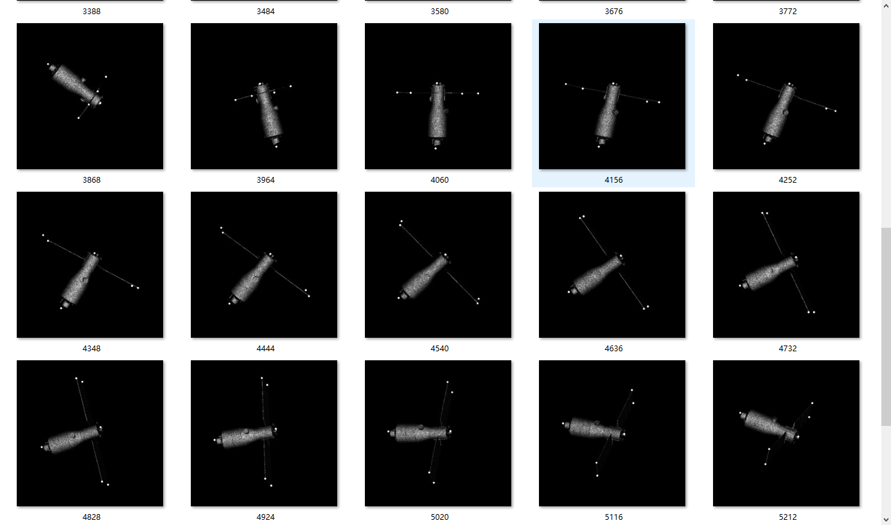
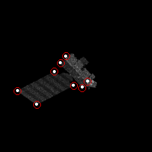
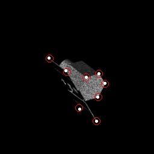
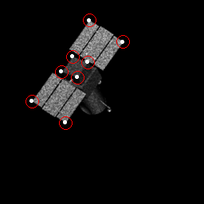
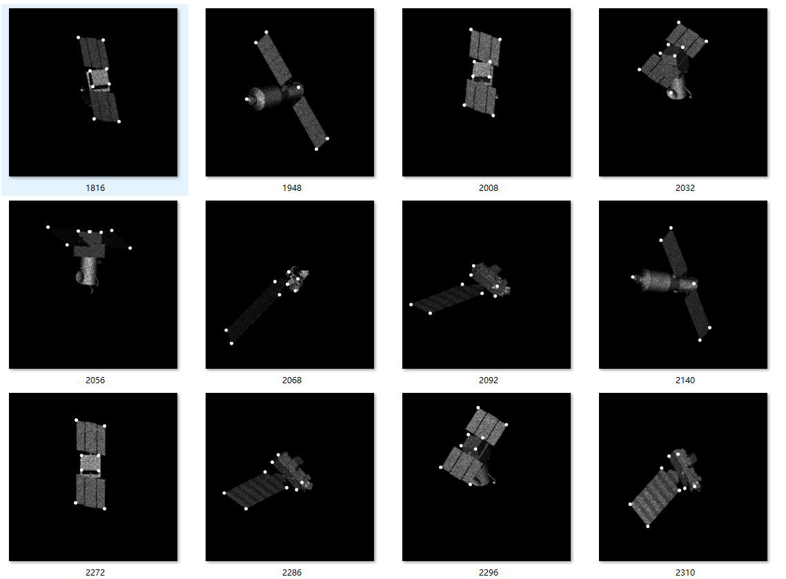
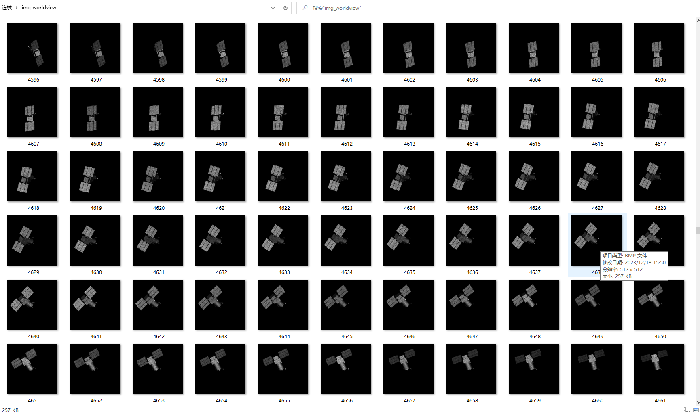
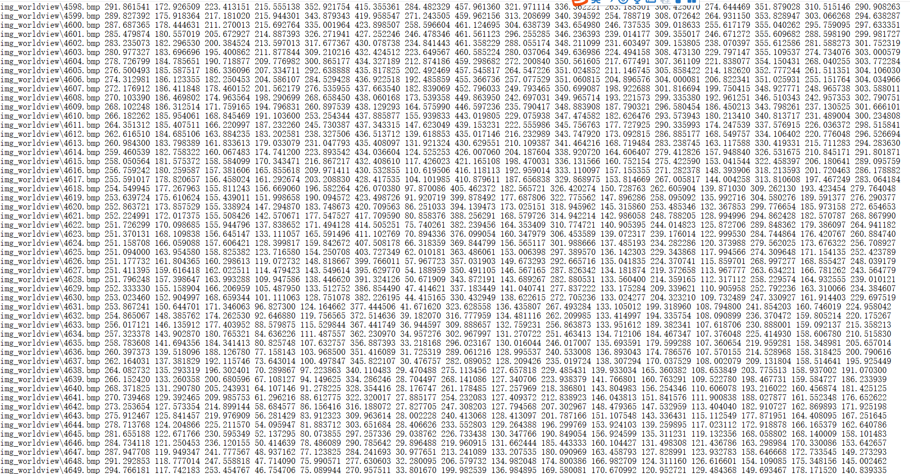

## 学期总结
### 一，关键点回归

从自己学习人脸关键点回归（resnet,unet），到公开数据集speed(resnet,unet网络准确度不够，换用ULinet),咱们自己数据集单个目标，再到多个目标关键点回归(ULinet)；

unet 部分结果偏差较大

换用ULinet 效果达到预期

之后延伸到Aura 、worldview 和Cartography等其他目标；红色圆圈为关键点真实位置置信范围，白色为ULNet预测的关键点位置

多目标：四个目标，其中三个目标8个关键点 ，一个目标关键点6个  采用原点补全到8个的方式，分别放入Linet 和Unet都可以回归，视觉上看不出太大差别，分别抽取8个关键点和6个关键点的10个预测值做一个精度量化

 ULnet     平均绝对误差 (MAE) ： 预测坐标 - 实际坐标 的绝对值 求平均 

| 训练设置                  | 目标个数   | worldview(8) | TG-1(6)      |
| ------------------------ | ---------- | ------------- | ------------ |
| 50轮1$e^{-3}$ 100轮3$e^{-4}$ | 单个目标   | 2.12          ||
| 50轮1$e^{-3}$ 100轮3$e^{-4}$（同上） | 四个目标   | 1.90          | 2.06（2.59） |
| 60轮1$e^{-3}$ 40轮3$e^{-4}$ | 四个目标   | 2.07          | 2.10         |

###   二，数据集制作

之前只有TG-1的带标签数据集，首先学会TG-1这个数据集是如何得到的，在延伸到其他目标；

matlab生成数据集的程序，学会自动标注; 生成多个目标的连续数据集
自动标注主要步骤： 通过新目标三维fig1的标注关键点调整K矩阵;投影到二维图像中存在质心偏移，故需要矫正； 矫正：首先用角度相差较大的两张图像的关键点的偏移差值（向量）；

### 三，运动预测

卡尔曼滤波及其变体 ；LSTM；基于去噪扩散概率模型；

baseline mothods:卡尔曼滤波算法及其变体

是一种**最优递归算法**，算法中涉及到滤波，也涉及到对下一时刻数据的预测

卡尔曼滤波算法有两个基本假设: ( 1) 信息过程的足够精确的模型，是由白噪声所激发的线性( 也可以是时变的) 动态系统; ( 2) 每次的测量信号都包含着附加的白噪声分量 。当满足以上假设时，可以应用卡尔曼滤波算法。

​      首先，我们先要引入一个离散控制过程的系统。该系统可用一个线性随机微分方程（Linear Stochastic Difference equation）来描述：

一、系统的状态方程状态方程是根据上一时刻的状态和 控制变量$^{\mathrm{Q}}$来推测此刻的状态
$$
x_k=Ax_{k-1}+Bu_{k-1}+w_{k-1}
$$
 ·$x_k$ 是状态分量的$n$维矢量
 ·$A$ 是 $n*n$ 的状态转移矩阵，也就是对目标状态转换的猜想模型，是已知的
 · $u_{k-1}$ 是新的，让系统可以接受外部控制
 · $B$ 是 $n*c$ 矩阵，将输入转换为状态的矩阵
 ·$w_{k-1}$ 是预测过程的噪声，对应 $x_k$ 中每个分量的噪声，期望为0，协方差为$Q$的高斯白噪声

二、观测方程
$$
z_k=Hx_k+v_k
$$
 ·$H$   **是 $m*n$矩阵，是状态变量 (观测)的转换矩阵，表示将状态和观测连接起来的关系**，卡尔曼滤波里为线性关系（咱们的实验数据为非线性关系，使用扩展卡尔曼滤波EKF；），它负责将m 维的测量值转换到 n 维，使之符合状态变量的数学形式，是滤波的前提条件之一。·$v_k$ 观测噪声，服从高斯分布 $N(0,R)$ ,$R$ 即下文测量噪声

卡尔曼滤波器时间更新方程如下：
$$
\begin{array}{rcl}\hat{x}\frac{}{k}&=&A\hat{x}_{k-1}+\:Bu_{k-1}\\
P\frac{}{k}&=&AP_{k-1}A^{T}\:+\:Q\end{array}
$$
 卡尔曼滤波器状态更新方程如下：
$$
K_k\:=\:\frac{P\frac{}{k}H^T}{HP\frac{}{k}H^T\:+R}
$$

$$
\begin{array}{rcl}\hat{x}_{k}\:=\:\hat{x}\frac{}{k}\:+\:K_{k}\:(z_{k}\:-\:H\hat{x}\frac{}{k})\end{array}
$$

$$
\begin{array}{rcl}P_k~=~(I-K_kH)P\frac{}{k}\end{array}
$$

这是卡尔曼滤波算法的核心内容，根据自己的项目内容嵌套进公式里就可以了，所以**关键的是如何嵌套**。

**首先分析我们的已知（关键的坐标），和我们的目标是想预测到什么（下一时刻坐标） **分析的图中共有8个关键点，设关键点$i$在图像中的位置、观察矩阵$z_i$为
$$
z_i=[x_i, y_i]^T
$$
单个关键点的状态矩阵为
$$
X_i=[x_{i},y_{i},a_{i},b_{i}]^T=A*[x_{i-1},y_{i-1},a_{i-1},b_{i-1}]^T+\omega_{k-1}
$$
**其中$a_i$为关键点坐标x的运动速度，$b_i$为关键点坐标y的运动速度，A矩阵为状态转移矩阵**,$\omega_{k-1}$为相关性误差。
$$
A=
\begin{bmatrix}
1&0&\Delta t&0\\
0&1&0&\Delta t\\
0&0&1&0\\
0&0&0&1\\
\end{bmatrix}
$$
从观察矩阵转换到状态矩阵为
$$
z_i=
\begin{bmatrix}
1&0&0&0\\
0&1&0&0
\end{bmatrix}
X_i+V_{k}
$$
其中 $V_k$ 为观测误差。

- 总结 最大的不同也是创新点，卡尔曼滤波及其变体（需要迭代） 还是lstm ,都是对关键点进行预测（文字），二基于扩散模型可以也测得到下时刻图片，之后我们通过基于扩散的模型预测得到的图片，在使用ULinet提取得到关键点坐标 与 卡尔曼滤波；lstm进行比较 ，并且精度更高。

### 四，论文框架

框架思路 
- **题目**：基于序列成像特征流（概率扩散模型）的在轨卫星（空间目标）动态预测（状态估计）

- **摘要**

- **关键词**     动态预测；DDPM；序列成像 

- **1 引言** 

  - 空间目标态势（状态和趋势）感知能力的重要性 ，

  - 从卡尔曼滤波及其变体   引到 深度学习的快速发展  LSTM（ConvLSTM）

  - 最后  去噪扩散模型代表了计算机视觉领域最近出现的一个新兴主题，在生成建模领域展示了显着的成果    扩散模型  本文所提方法 及其优势

    1. 相比于无迹卡尔曼滤波，本文提出的方法在预测过程中没有收敛过程，

    2. 将目标未来状态以图像形式绘制出来，并且能够详细描述物体的纹理信息。
    3. 特征预测准确度高于无迹卡尔曼滤波与长短期记忆（Long Short Term Memory，LSTM）网络。

- **2 相关工作**  应用扩散模型的相关工作 （空间动态预测）

  - ddpm因其在图像合成方面击败gan的能力而受到关注[8]。在这一成功的过程中，它们也被应用于图像到图像的翻译[7,23]、分割[4]、重建[22]和配准[12]，然而，据我们所知，目前还没有一个用于目标运动预测的扩散模型。

- **3 所提方法**  扩散模型的一般思想 到 本项目的流程与算法（?）；

- **4 实验**：baseline ：卡尔曼      LSTM  （方法 介绍 放在哪里比较合适 ？）

  - 实验设置：实验平台，数据集，评价标准；

  ​     ConvLSTM(卷积长短期记忆网络)、ConvGRU（门控循环单元）、RVD预测

  ​     实验应该如何设置，

- **5 结论**

