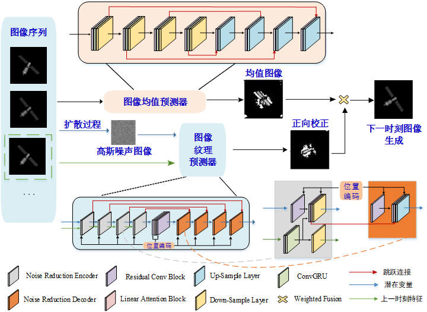
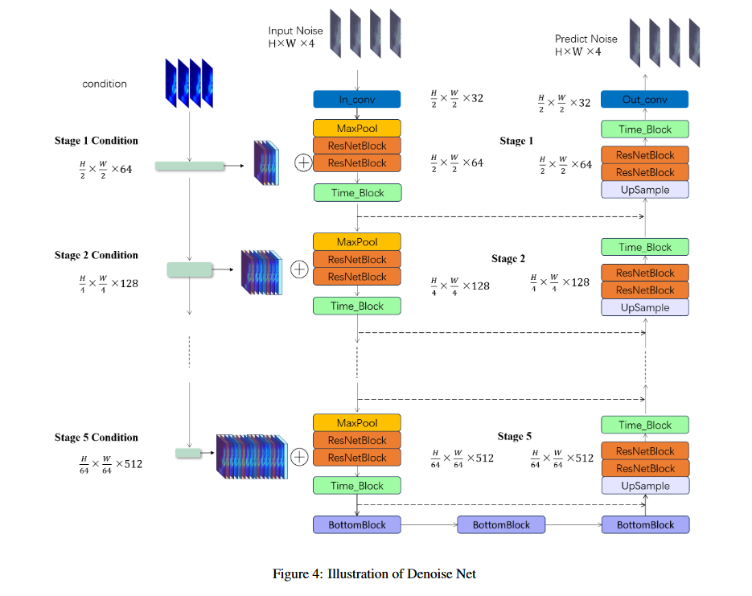

#### 扩散模型中引入时间信息的结合方式

在扩散模型中引入时间信息时，我们采用了主流的Embedding方法。具体来说，将时间步长T映射为向量表示，然后将其与网络的每个编码/解码模块中的图像特征进行融合。这就为模型提供了时间步的上下文信息。与直接拼接时间步不同，Embedding使用线性层映射来学习时间序列的语义表示，帮助模型更好地感知和处理图像沿时间轴的动态变化

### 损失函数

提出了一个混合平衡损失函数，它不仅保证了Diffusion的生成能力，而且保护了模型对长期依赖信息的把握能力，平衡损失函数如式所示。