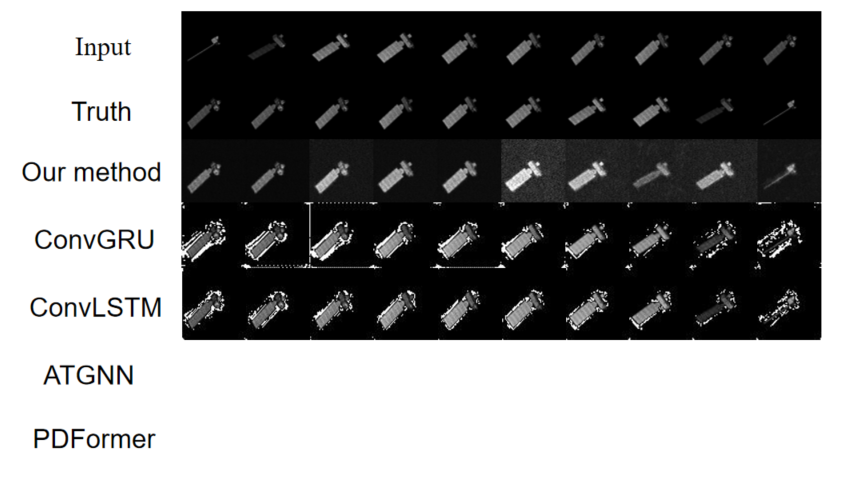
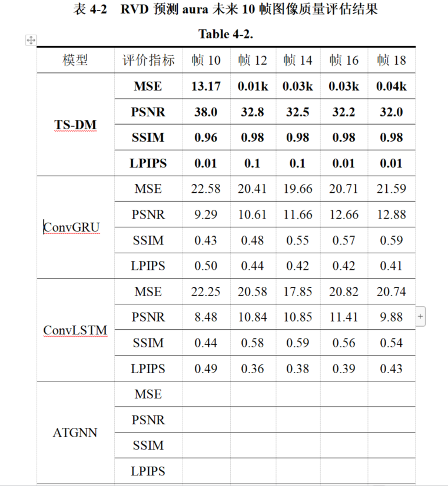

## 本周

- 主要补充了ConLSTM和ConvGRU两种基本方法的对比实验，之前数据集是封装好的，并且TG-1和另外3个目标（Aura，WorldView，Cartography）有差异 （刚开始不知道这个差异，所以走了很多弯路现在搞定），

- 对主流时空数据预测做小调研，（RNN类，图神经网络类，基于注意力机制（Transformer）的方法）下周图神经网络（GNN）的方法，Transformer的方法

- **基于图神经网络（GNN）的方法**：

  - - STGCN (Yu et al., 2018)：利用图神经网络捕捉交通网络中的复杂时空依赖关系。
    - STSGCN (Song et al., 2020)：通过同步机制有效处理复杂的局部时空相关性和数据异质性。
    - STG-NCDE (Choi et al., 2022)：利用神经控制微分方程（NCDEs）的概念进行时空处理。
    - DDGCRN (Weng et al., 2023)：通过分离正常和异常信号并采用新颖的图卷积递归网络方法动态捕捉时空特征。

  **基于注意力机制（Transformer）的方法**：

  - - ASTGCN (Guo et al., 2019)：结合空间注意力和时间注意力机制与图神经网络的创新方法。
    - ASTGNN (Guo et al., 2021)：引入独特的趋势感知自注意力和动态图卷积来处理时间动态性、空间相关性。
    - PDFormer (Jiang et al., 2023)：引入了一种定制的Transformer模型，擅长捕捉动态空间依赖性和交通条件传播的时间延迟。
    - STAEformer [CIKM23] (Liu et al., 2023)：通过引入时空自适应嵌入组件来增强传统Transformer。
    - MultiSPANS [WSDM24] (Zou et al., 2024)：利用多滤波卷积模块、Transformers和结构熵优化来有效建模STG预测中的复杂多范围依赖性

  ### 部分实验结果

  匀速

  

  