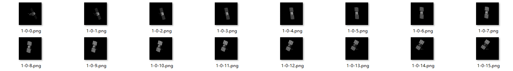
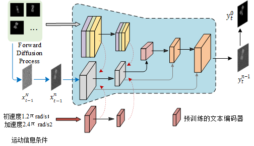

### 1.文本驱动图片序列中的目标做精准旋转运动

现将图片中的目标提取，然后根据文本

数据集， 文本图片对，如何去准确使用文本描述图片目标中的姿态，并且是具体是如何变化的，绕某一个特定轴旋转一个具体 的度数1.2  

#### 文本条件编码

- **文本嵌入**：首先，需要将运动状态参数（如角速度、角加速度，**姿态变化率（如绕特定轴的旋转速度），旋转矩阵**、变换矩阵等)  转化为可用的文本描述。可以使用预训练的语言模型（如BERT或GPT）将这些文本描述编码为高维向量表示。

  BERT（Bidirectional Encoder Representations from Transformers） 是一种双向Transformer模型，能够理解上下文信息，特别适合处理较为复杂的文本。它的预训练任务包括Masked Language Modeling (MLM) 和 Next Sentence Prediction (NSP)。

  GPT   (Generative Pre-trained Transformer）是单向Transformer模型，专注于生成任务。GPT-3 及以后的版本已经表现出非常强的文本生成与编码能力。GPT适合于任务驱动的文本生成与理解（）

  在条件扩散模型中，通常会采用**条件卷积**或**注意力机制**来融合 这些文本向量和数值输入。

  

  

将**成像运动状态参数估计作为文本条件**输入到扩散模型的每一层

原本已经有以ConvGRU为主的时间条件，加入文本后，多通道，多模态

基于卫星运动状态条件生成姿态图像或直接估计姿态参数的时序条件DDPM模型。

目的？ 扩散模型本身具有     

应用设想，把文本输入运动描述当做目标正常运行的，若预测和文本描述相差大，自动告警。

### 2.分辨率变化的融合

需要明确的一点？ 这里分辨率的变化是否有规律？若有规律可以引入分辨率估计因子的做法

在逆合成孔径雷达（ISAR）成像中，距离分辨率和方位分辨率是两个关键的指标，它们直接影响成像的清晰度和细节的表现能力。

- **距离分辨率**（Range Resolution）：

  距离分辨率主要由**雷达发射信号的带宽决定**。带宽越大，距离分辨率越高。较高的距离分辨率能够更好地区分距离相近的多个目标或目标的不同部位，使得图像中的细节更加清晰。

- **方位分辨率**（Azimuth Resolution）：

  ISAR成像中的方位分辨率主要由**目标与雷达之间的相对运动以及雷达系统的波束宽度决定**。较高的方位分辨率能够使得目标的横向细节更加清晰，特别是在识别目标形状和轮廓时表现更好。

**图像方位分辨波动因子进行参数估计**

1. 目前的数据集是存在分辨率变化，需要重新设置生成

   变分辨率下关键点特征提取，解决不同尺度和分辨率下的特征提取稳定性问题（JX）
   变分辨率下ISAR序列预测

- **自适应分辨率调整**：在模型中引入**自适应模块**，根据输入图像的分辨率自动调整模型参数。这可以通过注意力机制来实现，使得模型可以根据输入图像的特性动态调整处理方式。
- **在线学习**：通过引入在线学习机制，模型可以根据不断输入的新数据进行微调，从而逐渐适应分辨率的变化。

- **分辨率敏感损失函数**：设计能够考虑分辨率变化的损失函数，使得模型在训练过程中能够关注不同分辨率下的预测误差。这样可以引导模型更好地处理分辨率变化带来的影响。

