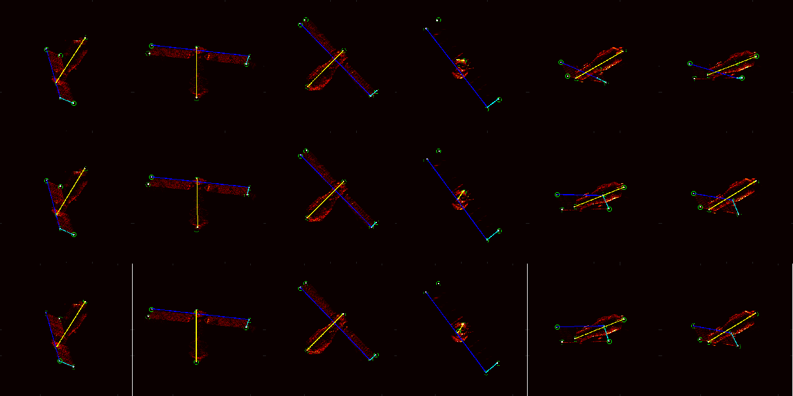
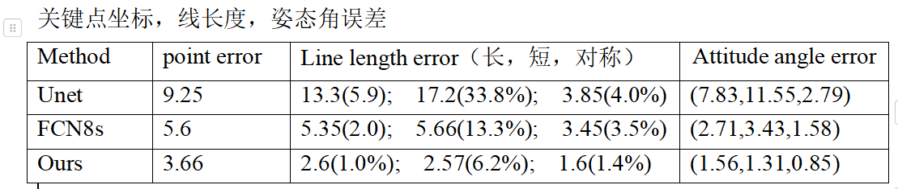

### 1.本周工作

-  撰写会议论文（见附件）与做ISAR特征提取实验

- 实验结果（依次为unet, fcn, ours）分别选择了三张 关键点 无遮挡和有遮挡

- 评价标准 
  

### 2.下周安排

- 10.10 摘要提交

- 10.12-10.14 先翻译+排版，
- 10.14-10.15 看是否增加 变分辨率 估计实验

- 10.16-10.17 细节调整

- 10.18号终稿

  

