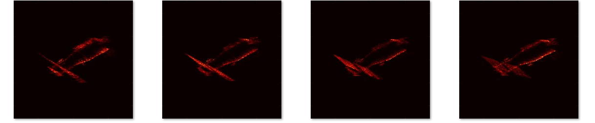
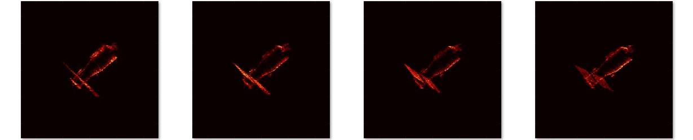

###  1.本周工作(10.10-10.16)

- 会议论文 实验补充，撰写，今天，明天 翻译排版，

- 10.18   DDL

  #### 方位分辨率变化下，姿态预测问题

- 为什么做？

  方位分辨率的变化会带来成像目标坐标的拉伸。整个目标形态有所变化。

  ​     

  先做测试，基 准分辨率下训练得到的网络   对 变分序列进行预测

  - 先要整理基准和变分的序列ISAR数据集（球面采样？序列采样）
  - 分辨率变化超出基准分辨率多少范围？基准分辨率网络 不可用

  深度学习/非深度学习

  分辨率估计因子/运动补偿
