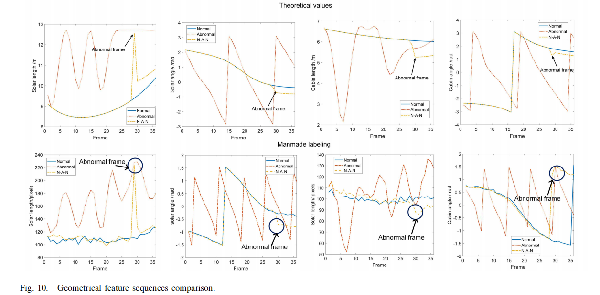

- 1.16 --1.27 (年前)

  - 项目测试
  - 意见回复（1.21左右完整初稿回复修改）

- 2.3--2.12   (年后)

  - 主要是接下来的工作，围绕  异常 或者 意图识别，+   方位分辨率

    - 如何有机结合？
    - 之前 想法是 按照  一组  序列图片 方位分辨率 是一样的。
    - 方位分辨率作为先验知识，去做异常识别，提高识别率。
    - 能去提高吗？ 感觉这个因果关系不是那么强烈。

    