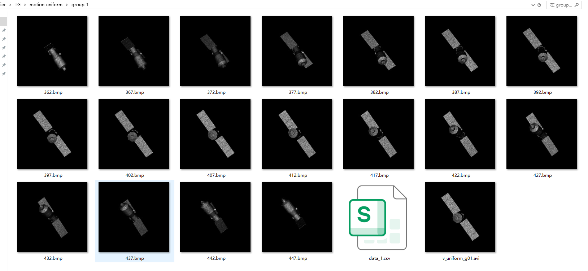
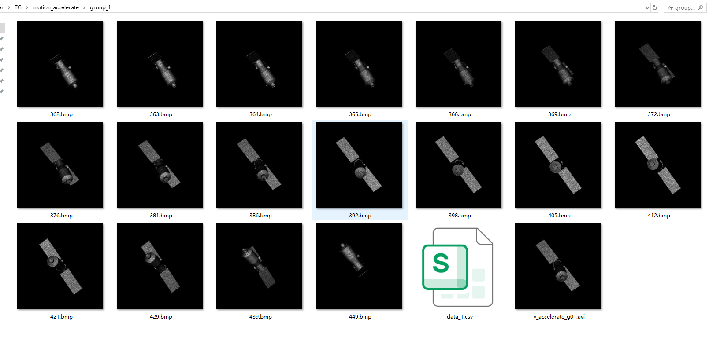
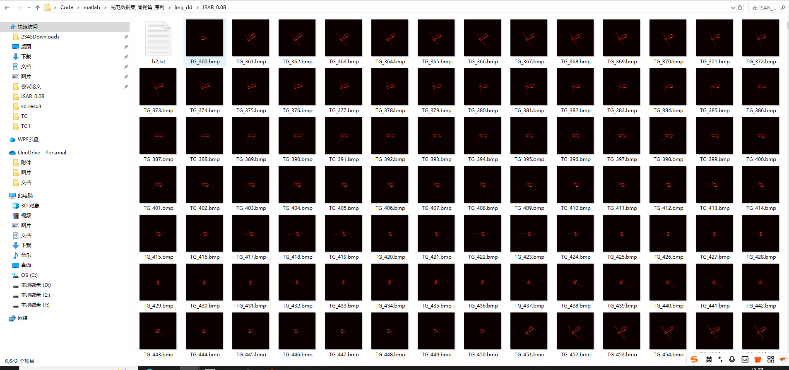

基础1.现有LSTM（包括新的版本）、卡尔曼net的调试；

基础2. 多种运动模式的模拟（最后落脚到目标某一维度的拉伸以及特征点位置的变化）

自己数据集上调试，第一步就是有关数据集，有关异常序列的设置，会比较麻烦，不够统一或说服力

看一些异常识别+小样本 这方面是比较多的

**模拟匀速，匀加速，匀减速，往返，停止，五种运动方式，**

5种运动方式×85组×18（每组18帧）

LSTM, Anomaly Transformer 等以**特征序列**为输入

把序列的关键点的真值序列作为 LSTM 输入，分类准确度99%，

- 五种运动方式差异过大？很容易分类出来，
- 特征提取的准，则分类就准

为了贴合实际，无关键点标签，打算采用LRCN, slowfast ,  timesformer 等以**视频序列**为输入进行分类

- 相关数据集.avi格式
- 服务器无法联网，下载所需依赖包

此外就是ISAR数据集连续序列仿真（之前都不是完全的连续的，为了能够做序列，）

研究拓展1. 已知异动分类

（参考段老师文章实验设计、运动参数维度跟特征维度怎么对齐，是否可以借鉴token化的思路）

**核心参考 多模态（图像、特征点位置、基准分辨率序列间的对齐机制）**

实验设置：投影角，投影长度，RCS序列，

研究拓展2. 未知运动类型的判据 

（基于特征点序列，套用新的开集识别框架，对运动参数进行同步估计）

