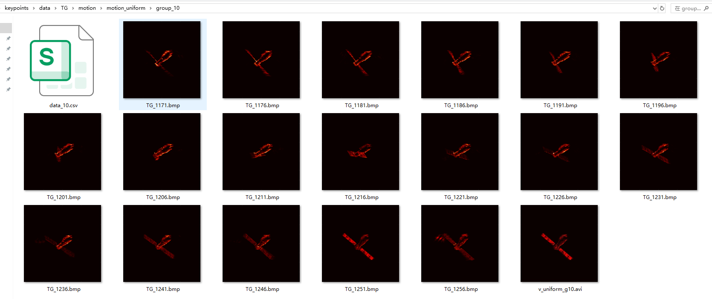
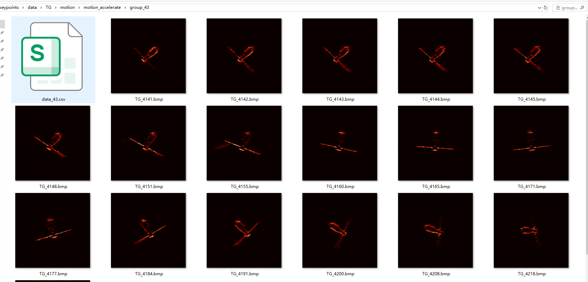
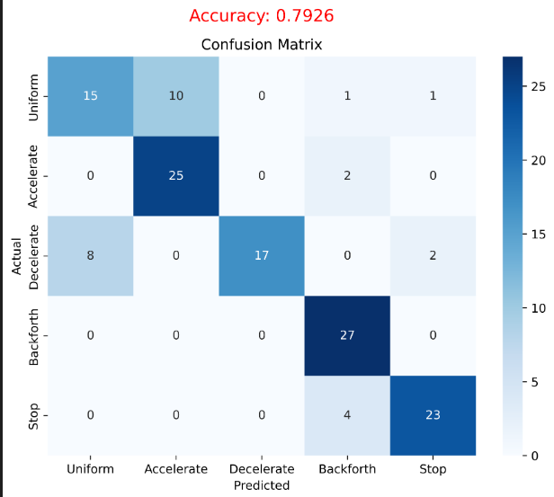
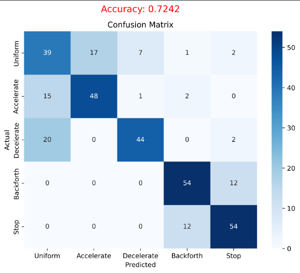
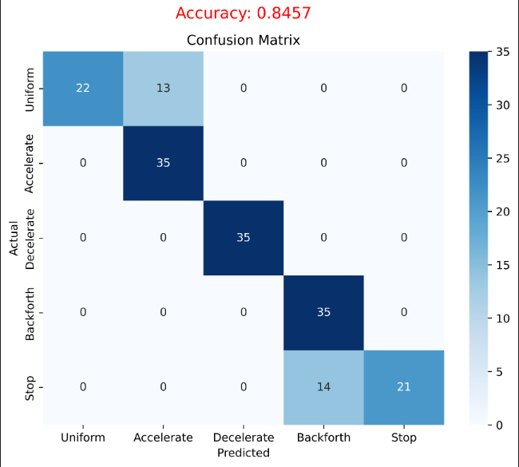
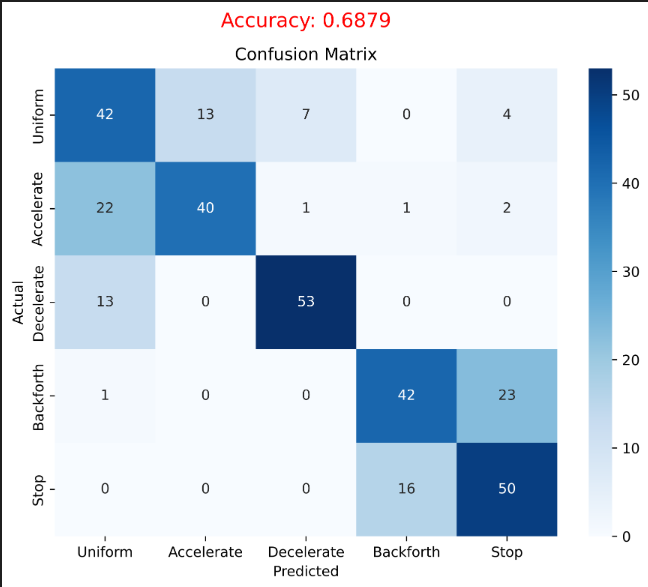
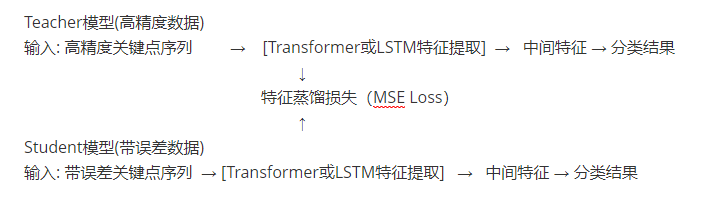

# 周报（03012-0317）

- 运动方式时间序列分类

  **主要分为两个步骤 特征提取+ 序列分类器**

  特征提取指从原始时间序列数据中提取能够较好表示原序列的特征。

  分类器将提取的特征作为输入，输出原序列的类别标签

  - ISAR 运动方式分类数据集：目前是 86个圈次序列，每个圈次 5类运动方式数据

  motion_uniform

  

  加速：

    

  

  - 使用LSTM进行时间序列分类 （86个圈次，7：3）

  Truth 关键点作为输入:

  

  

  关键点预测（存在误差）作为输入:

  

  

  

  - 使用Anomaly-Transformer（6:4）

  Truth 

  

  关键点预测（存在误差）作为输入:

  

分析：训练数据目前只采用了真实特征点序列进行训练时间分类模型，后续对训练数据进行更丰富的扩充，

​     **增加关键点预测（存在误差）的序列 部分数据进行一同训练。**

- 后续改进：去提高序列分类精度...

1. 不只把关键点输入作为特征序列输入，图像序列语义特征等

2. 排除离群点，减小异常关键点的影响

3. **Teacher-Student架构:  用高精度标注数据作为监督信号，引导模型更好地容忍关键点提取的误差。**（还不太成熟）

      首先，利用 高精度标注关键点序列 数据训练Teacher模型，获得对噪声鲁棒的中间特征表征；然后，设计特征蒸馏损失函数，使Student模型在处理带误差数据时，能自动逼近Teacher模型的鲁棒特征，从而显著提高运动状态识别精度，降低了对输入关键点精度的敏感性。

