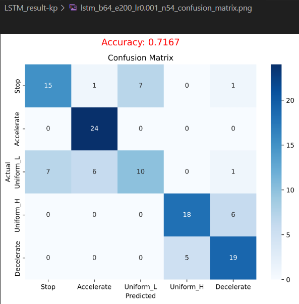
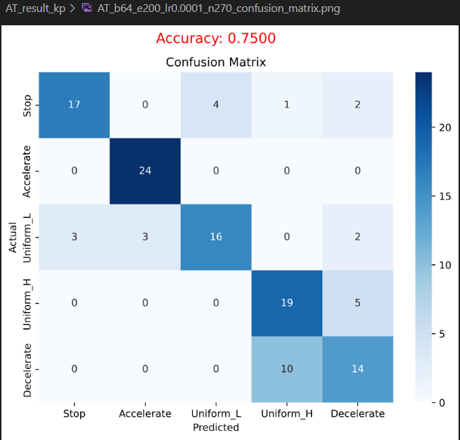

# 本周工作（0318-0324）

- 仿真数据集，先特征提取 再时序分类， 两步走思路简单，但是实际训练起来还是很繁琐的。

仿真连续光学观测数据（非光电同视角）5种匀速运动模式

序列为10帧; 帧间间隔时间100s ; 分别为 

静止 （目标v=0, a=0）

匀加速（目标v=0.005 rad/s, a=0.0001 rad/s^2）

低匀速 （目标v=0.015  rad/s, a=0）

高匀速（目标v=0.04  rad/s, a=0）

匀减速（目标v=0.04  rad/s, a= - 0.00002 rad/s^2）

# 下周计划

创新点

- 任务方面为多分类，

- 网络模型方面 做改进，并提升效果，目前还是想从两步并一步，此外可能是想考虑目标做为刚体，将刚体特有的规律嵌入模型。