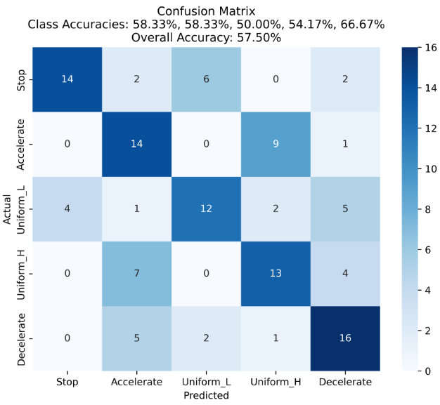
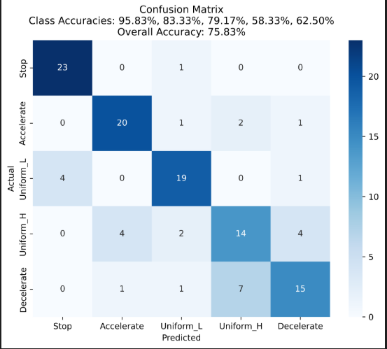

# 本周工作（0324-0331）

- 仿真数据集，先特征提取 再时序分类， 两步走思路简单，但步骤繁琐且需要关键点的真值,
使用Resnet 提取图片卷积特征

仿真连续光学观测数据（非光电同视角）5种匀速运动模式

序列为10帧; 帧间间隔时间100s ; 分别为 

静止 （目标v=0, a=0）

匀加速（目标v=0.005 rad/s, a=0.0001 rad/s^2）

低匀速 （目标v=0.015  rad/s, a=0）

高匀速（目标v=0.04  rad/s, a=0）

匀减速（目标v=0.04  rad/s, a= - 0.00002 rad/s^2）

方法1:
    A[图像序列输入] --> B[ResNet18特征提取] --> C[LSTM时序建模] --> D[全连接分类]

    A[ResNet18特征提取] --> B[位置编码] --> C[Transformer编码器] --> D[全连接分类层]

# 下周计划

创新点

- 任务方面为多分类+无需人工标注关键点
- 网络模型方面 做改进，并提升效果，此外考虑目标做为刚体，将刚体特有的规律嵌入模型。

1.考虑到刚体运动具有旋转和平移不变性，使用群等变卷积网络（Group Equivariant Convolutional Networks，G-CNN）或可控旋转不变特征提取器，这类网络设计具有内在的旋转/平移不变性，在网络初期替换传统卷积层。

2.在 Transformer 部分加入物理约束（例如考虑刚体旋转矩阵的特性）

在 Transformer 的多头注意力层中加入物理约束，模拟刚体旋转矩阵固有的正交性或旋转不变性。核心思路是在计算自注意力或输出时，加入额外的正则项，使得注意力权重矩阵尽可能满足正交性质，从而反映刚体旋转矩阵的不变性特征。

计算主任务损失（交叉熵损失）的基础上，加上所有 Transformer 层的物理约束损失

3. 设计多分支结构，一支专门提取外观（静态特征），另一支提取运动信息（动态特征），最后融合分类结果。（slowfast）