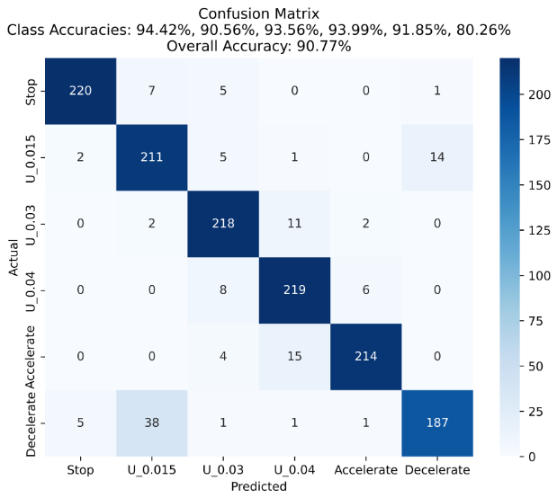
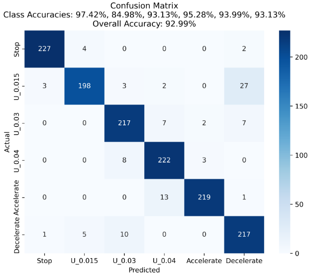

## **本周工作（0407-0414）**

- 仿真数据集，先特征提取 再时序分类， 两步走思路简单，但步骤繁琐且需要关键点的真值,
使用Resnet 提取图片卷积特征

仿真连续光学观测数据（非光电同视角）5种匀速运动模式

序列为10帧; 帧间间隔时间100s ; 分别为 

**之前每种运动方式是78组数据， 现在扩充到775组（223用于测试**），在按照之前5种运动划分，精度在90%以上

因此又增加了两个初速度梯度 

静止 （目标v=0, a=0）

低匀速 （目标v=0.015  rad/s, a=0）

**新增加    v = 0.03  rad/s,**

**新增加    v = 0.035  rad/s,**

高匀速（目标v=0.04 rad/s, a=0）

匀加速（目标v=0.005 rad/s, a=0.00001 rad/s^2）

匀减速（目标v=0.03  rad/s, a= - 0.00002 rad/s^2）

方法1:
    A[图像序列输入] --> B[ResNet18特征提取] --> C[LSTM时序建模] --> D[全连接分类]

方法2:

    A[ResNet18特征提取] --> B[位置编码] --> C[AT-Transforme] --> D[全连接分类层]

感觉这里准确高，进一步**增加初速度为 v=0.035  rad/s,**

创新点

- 任务方面为多分类+无需人工标注关键点
- 网络模型方面 做改进，并提升效果，

