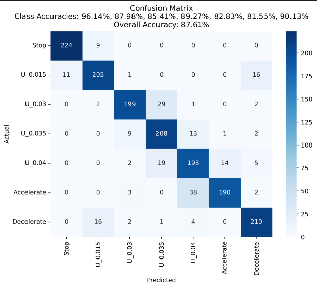

## **本周工作（0415-0421）**

**每种运动方式是78组数据， 现在扩充到775组（223用于测试**）

静止 （目标v=0, a=0）

低匀速 （目标v=0.015  rad/s, a=0）

**新增加    v = 0.03  rad/s,**

**新增加    v = 0.035  rad/s,**

高匀速（目标v=0.04 rad/s, a=0）

匀加速（目标v=0.005 rad/s, a=0.00001 rad/s^2）

匀减速（目标v=0.03  rad/s, a= - 0.00002 rad/s^2）

方法1:
    A[图像序列输入] --> B[ResNet18特征提取] --> C[LSTM时序建模] --> D[全连接分类]

方法2:

    A[ResNet18特征提取] --> B[位置编码] --> C[AT-Transforme] --> D[全连接分类层]

## 改进：采用一阶差分特征模拟速度向量，之后融合原始特征

输入: [batch_size, seq_len, C, H, W]  # 输入图像序列
    |
    v
ResNet18 特征提取器 (预训练)    # 提取每帧图像的特征
    |
    v
提取的特征: [batch_size, seq_len, 512]  # 每帧的特征向量
    |
    +--------------------+
    |                         |
    v                         v
**原始特征            差分特征  # 计算相邻帧之间的差分模拟速度向量**
    **|                      |**
    **v                      v**
**特征降维 (全连接层, d_model=1024)  # 将特征映射到统一维度**
    **|                    |**
    **+---------+---------+**
              **|**
              **v**
**特征融合块 (动态注意力机制)  # 门控融合模块（FeatureFusionBlock）融合原始特征和差分特征**
              |
              v
融合后的特征: [batch_size, seq_len, d_model]  # 融合后的序列特征
              |
              v
AnomalyTransformer  # 使用 Transformer 进行序列建模
              |
              v
输出: [batch_size, num_classes]  # 分类结果

使用一个门控融合块，对原始特征和一阶差分特征分别进行投影，然后利用门控融合模块（FeatureFusionBlock）注意力机制动态生成权重，降低差分特征自身噪声对融合结果的干扰；  

## 有关速度和加速度进行直接回归，估计

首先是利用原始特征和一阶差分特征利用门控融合模块后  映射实际的速度，做回归任务。
目前的误差，Mean Absolute Error: 0.0027 （数据集，0，0.015，0.03，0.035，0.04）

测试0.023 ，预测为0.0247，
测试0.038，预测为0.0391

测试0.05，预测为0.031（不在范围内，误差很大）

加速度和速度，现在比较乱，没能正确估计，

数据集不平衡，二阶差分特征噪声较大，同时回归两个参数

创新点

- 任务方面为多分类+无需人工标注关键点
- 网络模型方面 做改进，并提升效果，

