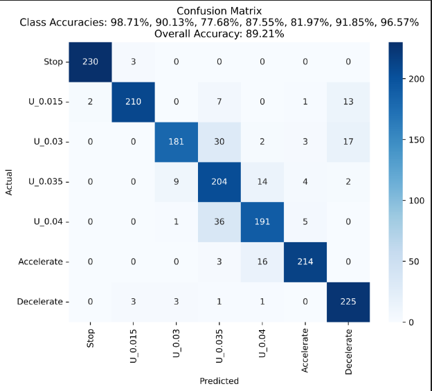
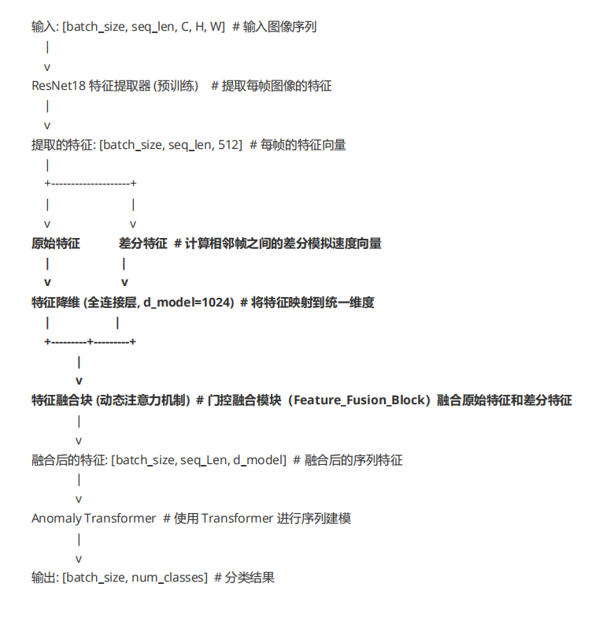
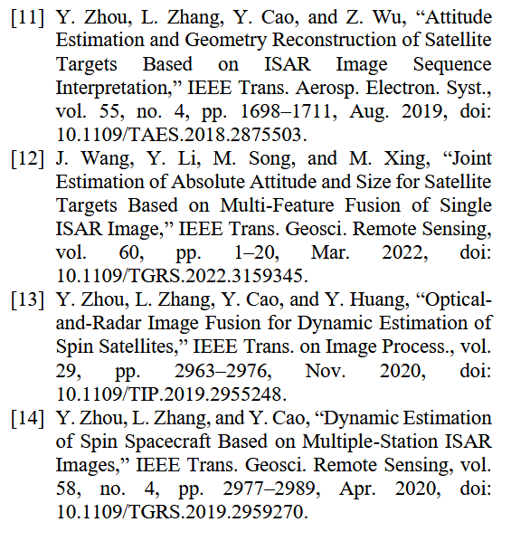
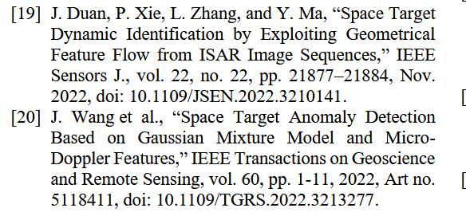
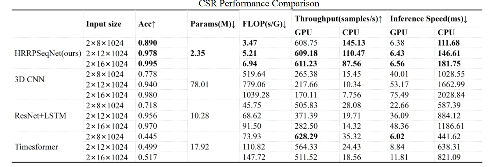
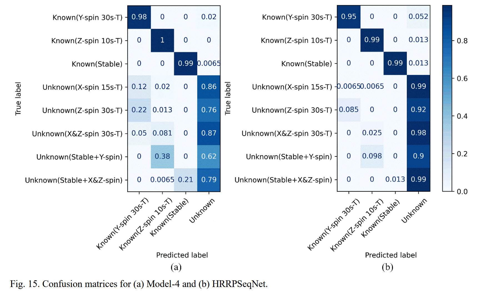
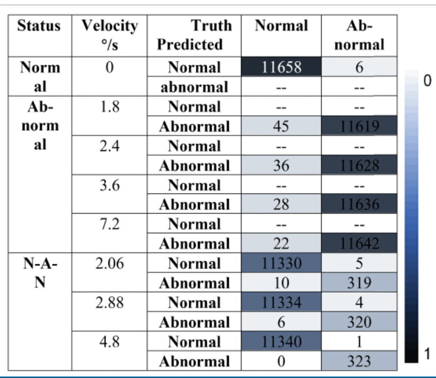
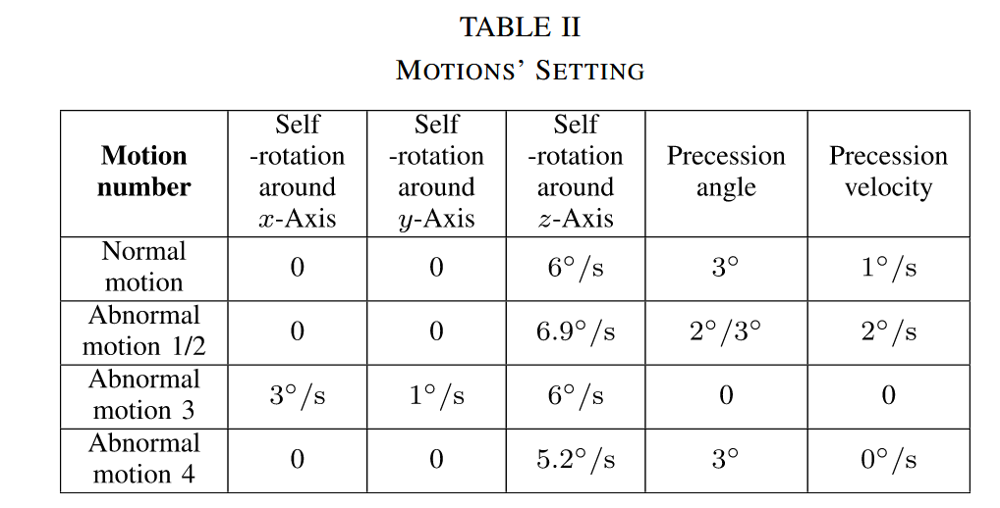
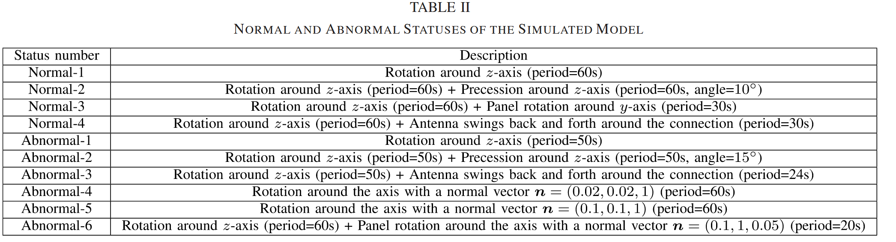

## **本周工作**

静止 （目标v=0, a=0）

低匀速 （目标v=0.015  rad/s, a=0）

**新增加    v = 0.03  rad/s,**

**新增加    v = 0.035  rad/s,**

高匀速（目标v=0.04 rad/s, a=0）

匀加速（目标v=0.005 rad/s, a=0.00001 rad/s^2）

匀减速（目标v=0.03  rad/s, a= - 0.00002 rad/s^2）

方法1:
    A[图像序列输入] --> B[ResNet18特征提取] --> C[LSTM时序建模] --> D[全连接分类]

方法2:

    A[ResNet18特征提取] --> B[位置编码] --> C[AT-Transforme] --> D[全连接分类层]

## 改进：采用一阶差分特征模拟速度向量，之后融合原始特征

使用一个门控融合块，对原始特征和一阶差分特征分别进行投影，然后利用门控融合模块（FeatureFusionBlock）注意力机制动态生成权重，降低差分特征自身噪声对融合结果的干扰；  

## 有关速度和加速度进行直接估计

**首先只是利用Resnet提取原始特征和一阶差分特征利用门控融合模块后  映射实际的速度，**
目前的误差，Mean Absolute Error: 0.0027 （数据集，0，0.015，0.03，0.035，0.04）
**在训练数据速度误差百分之10%左右**，但是我认为速度估计的数据集不应该是这样的

测试0.023 ，预测为0.0247，
测试0.038，预测为0.0391

测试0.05，预测为0.031（不在范围内，误差很大）

尽力去尝试做了一些模型的改变，但是效果都没有明显的提升，本身就是用Resnet提取特征去映射估计实际的速度，

**之前说是先分类再去知道估计角速度，但问题是现在是分类和估计模型很像，只是模型的最后一层分类头，还是回归头的差别**

角速度估计，计算姿态角--再到角速度，直接用帧间特征计算角速度感觉怪怪的

**运动模式的分类**，

 角速度，姿态角等其他特征为输入，

**轨迹变化，整体调姿，和部件微动（自旋，进动, 章动，）**以及各种轴和速度的旋转

**异常检测文献阅读：**

### 论文1  HRRPSeqNet：使用 HRRP 序列对空间目标运动进行开放集识别+2025+TAES+散射与辐射国家重点实验室+杨浩+[HRRPSeqNet: Open-Set Recognition of Space Target Motions Using HRRP Sequences](https://ieeexplore.ieee.org/document/10882892)

首先研究利用HRRP序列分析空间目标动态行为

#### 引言

雷达数据包括雷达散射截面 （RCS）、逆合成孔径雷达 （ISAR） 图像、高分辨率距离剖面 （HRRP） 等

逆合成孔径雷达 （ISAR） 图像，
许多方法利用ISAR成像投影原理来评估目标运动。例如，他们使用多角度ISAR图像来推断目标的姿态和大小[ 11 ]，[ 12 ]，提取动态参数[ 13 ]，[ 14 ]。这些方法虽然取得了较好的效果，但往往对ISAR图像的数据量和质量要求较高，然而，ISAR成像需要在一定的角度范围和带宽内进行数据积累，使得ISAR图像的仿真和测量成本都很高。此外，**目标平移或旋转引起的多普勒效应**会严重影响ISAR成像质量。这些问题共同限制了基于ISAR的方法的有效性。

数据库中的已知行为通常是从长期观察中积累的，可能包括常见行为，例如**三轴稳定、姿态调整、组件移动以及各种轴和速度的旋转**等。构建包含所有可能的运动状态的数据库是不切实际的。如果系统缺乏拒绝未知行为的能力，它们可能会被错误地归类到现有的类别中，从而干扰后续的分析。

#### 所提模型

编码器–解码器结构

- **浅层模块采用对称卷积与非对称步长/池化，逐步平衡HRRP序列中“空间（1024） vs. 时间（几十帧）”的维度失衡。**
- PartInception模块：改进自GoogleNet Inception，引入Partial Convolution (PConv) 技术，仅对部分通道做大尺度卷积，从而在**保留多尺度特征的同时大幅减少计算量**。
- Bridge 连接：在编码器与解码器之间的对应层加入双卷积“桥”，促进特征传递与细节恢复。

**结构特征联合建模与标签引导模块（Label‐guided Module）**
 基于条件变分自编码器（CVAE），为每个已知类别学习一个多元高斯先验分布。对输入样本，网络输出潜在空间的均值与方差，通过KL散度同时向对应标签先验吸引、向其他先验排斥，实现类内聚簇、类间分离。**提取HRRP的投影长度、散射熵、质心、偏度等四类结构特征序列**，经小型卷积分支融入标签引导模块，以增强对几何建模误差的鲁棒性

#### 实验设置

数据集
在本研究中，**我们重点关注空间目标的三轴稳定和无控自旋行为。根据相关研究，正常工作的目标保持一个稳定的三轴姿态，其中部件相对于机体坐标系保持固定。而不受控制的目标往往绕着一个固定的轴旋转或者有轻微的振荡**[ 34 ]，逐渐失去旋转能量。同时，自旋周期保持相对稳定。据文献报道，2013年9月失控的微波遥感卫星自旋周期每天仅增加36.7 ms [ 35 ]，2015年缓慢增加，每年增加26.14 s [ 36 ]。

根据实际情况，设计了空间目标模型的三轴稳定运动和一系列不受控制的自旋运动。在体坐标系中，我们假设X轴与目标主体对齐并向前指向，Z轴直接向下指向，Y轴垂直于其他两轴，遵循右手定则。不受控制的自旋运动包括沿X、Y或Z轴的单轴自旋，以及沿X & Y、X & Z或Y & Z轴的双轴自旋，**自旋周期设置为10s、15s或30s**。对于三轴稳定运动，没有定义自旋轴或周期。

**采样间隔为1s;**

| 序号 | 运动类别            | 说明                                              |
| ---- | ------------------- | ------------------------------------------------- |
| 1    | **Stable**          | 三轴稳定，不存在明显自旋                          |
| 2    | **X-spin 30 s-T**   | 围绕 **X 轴** 的单轴匀速自旋，周期 30 秒          |
| 3    | **Y-spin 30 s-T**   | 围绕 **Y 轴** 的单轴匀速自旋，周期 30 秒          |
| 4    | **Z-spin 30 s-T**   | 围绕 **Z 轴** 的单轴匀速自旋，周期 30 秒          |
| 5    | **X&Z-spin 30 s-T** | 同时围绕 **X 与 Z 轴** 的双轴组合自旋，周期 30 秒 |

每个序列由大约 960 个序列组成。每个类别的样本以 8：1：1 的比例分为训练集、验证集和测试集; 

#### 实验结果

**闭集识别表现**比较， **输入序列长度包括 8、12 和 16。**

**开集识别**

#### **真实数据实验**

正常运动中的目标稳定且姿态角变化缓慢，而异常运动中的目标具有快速的姿态角变化。基于此，我们通过以不同的方式对原始数据集进行采样，生成了三种类型的序列样本，每种样本包含 16 个 HRRP。

这里这真实数据模拟，应该是绕不同轴旋转，不好获取

**第一种类型标记为 “normal” ，连续 HRRP 之间的方位角变化仅为 0.5°，代表稳定的目标运动。**

第二种类型标记为 “abnormal”，**连续 HRRP 之间的方位角差为 5°，表明目标运动异常。**

第三种类型标记为“正常-异常”，**是由“正常”序列的前十帧与相应的“异常”序列的后六帧组合而成的**，代表从稳定运动到异常运动的过渡。从第1到 10帧，连续 HRRP 之间的方位角变化为 0.5°，而从帧 10 到 16，变化增加到 5°。

我们将 “normal” 和 “abnormal” 指定为用于训练和测试的已知类别，将 “normal-abnormal” 指定为仅用于测试的未知类别。训练集中的每个类都有大约 1000 个样本，测试集中的每个类大约有 150 个样本。

####  SSAE-LSTM 网络对 ISAR 图像序列空间目标的异常动态识别+TGRS2023+中山大学+段佳+[Abnormal Dynamic Recognition of Space Targets From ISAR Image Sequences With SSAE-LSTM Network | IEEE Journals & Magazine | IEEE Xplore](https://ieeexplore.ieee.org/document/10093913)

#**创建了 8 种不同的状态，包括 1 种正常状态、4 种不同速度的异常状态和 3 种不同速度的 N-A-N 状态。**

对于每个状态，生成 324 个特征序列，由 36 帧 ISAR 图像组成。总共有 12960 个序列。在试验中，我们随机选择了 9515 个序列进行训练，其余序列进行测试

### 论文2  **基于局部密度峰值和微动特征的雷达空间目标异常运动检测方法+GRSL+2023+清华大学+王德华，李刚**+[Detection Method of Radar Space Target Abnormal Motion via Local Density Peaks and Micro-Motion Feature ](https://ieeexplore.ieee.org/document/10124706/authors#authors)
基于**雷达回波提取的微动特征**，在保持低误警率的前提下精准识别异常微动，

**自旋是目标围绕自身轴心的旋转运动。**

**进动是自旋轴的方向缓慢变化，形成一个圆锥形轨迹。**

**章动**是进动运动上的小波动，就像是进动轨道上叠加的“摆动”或“抖动”。

在轨卫星并非像行星那样自然演化出大周期的“岁差章动”，但在姿态动力学层面，同样存在自旋（稳定）、重力梯度引起的进动，以及扰动导致的章动

备注：**绕X,Y,Z自旋，Precession angle 进动角，进动速度。**

### 论文3 基于高斯混合模型和微多普勒特征的空间目标异常检测+TGRS2022+清华大学+王德华，李刚+[Space Target Anomaly Detection Based on Gaussian Mixture Model and Micro-Doppler Features ](https://ieeexplore.ieee.org/document/9915454)

主要流程包括：微多普勒特征提取 → 正态性检验与预处理 → GMM拟合 → 基于置信度的异常判决区域确定。

空间目标的异常在于其工作或运行状态与正常状态存在显著差异，如部件异常旋转或摆动、身体无序旋转等。设计了 4 种正常运动状态和 6 种异常运动状态

| 状态编号 | 描述                                                         |
| -------- | ------------------------------------------------------------ |
| 正常-1   | 围绕 z 轴旋转（周期=60秒）                                   |
| 正常-2   | 围绕 z 轴旋转（周期=60秒）+ 围绕 z 轴的进动（周期=60秒，角度=10°） |
| 正常-3   | 围绕 z 轴旋转（周期=60秒）+ 围绕 y 轴的太阳能板旋转（周期=30秒） |
| 正常-4   | 围绕 z 轴旋转（周期=60秒）+ 天线在连接处来回摆动（周期=30秒） |
| 异常-1   | 围绕 z 轴旋转（周期=50秒）                                   |
| 异常-2   | 围绕 z 轴旋转（周期=50秒）+ 围绕 z 轴的进动（周期=50秒，角度=15°） |
| 异常-3   | 围绕 z 轴旋转（周期=50秒）+ 天线在连接处来回摆动（周期=24秒） |
| 异常-4   | 围绕法向量 **n** = (0.02, 0.02, 1) 的轴旋转（周期=60秒）     |
| 异常-5   | 围绕法向量 **n** = (0.1, 0.1, 1) 的轴旋转（周期=60秒）       |
| 异常-6   | 围绕 z 轴旋转（周期=60秒）+ 围绕法向量 **n** = (0.1, 1, 0.05) 的轴旋转（周期=20秒） |

**所以现有想法实在，现有模拟数据的基础上，再去模拟绕不同轴旋转，以及模拟进动，去做分类**，
先做闭集，之后视情况可以做开集分类，

## 基于时空频多域联合的目标异动行为认知研究（只是正在开展）+哈工大+雷达学术之星

**任务： 主要是异动类型实现三分类，轨迹变化，整体调姿，和部件微动（自旋，章动、进动,）**

**针对星载设备计算能力有限**，提出基于时空频多域联合的空间目标异动行为认知研究，**构建事件驱动的基于SNN(脉冲神经网络)的类脑异动行为认知模型，**

采用SNN , 把ISAR数据先转化为0，1,   基于事件驱动，**相对于ConvLSTM, 性能损失，但功耗低。**

