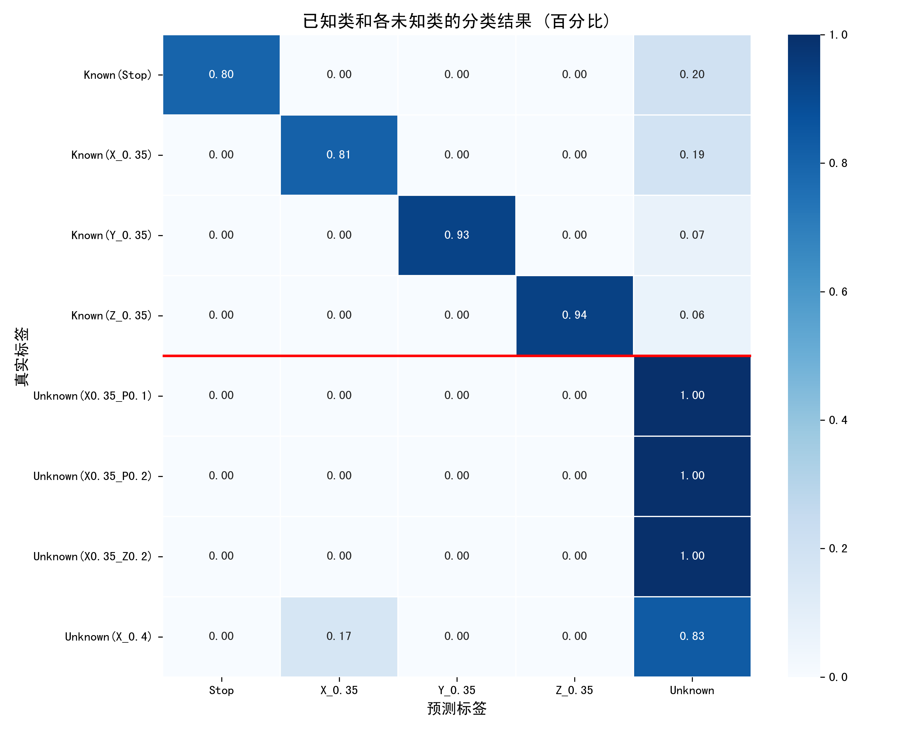
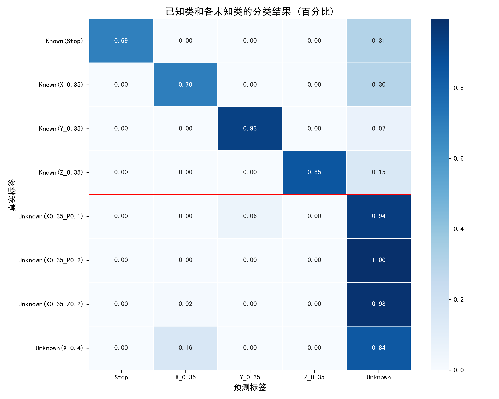
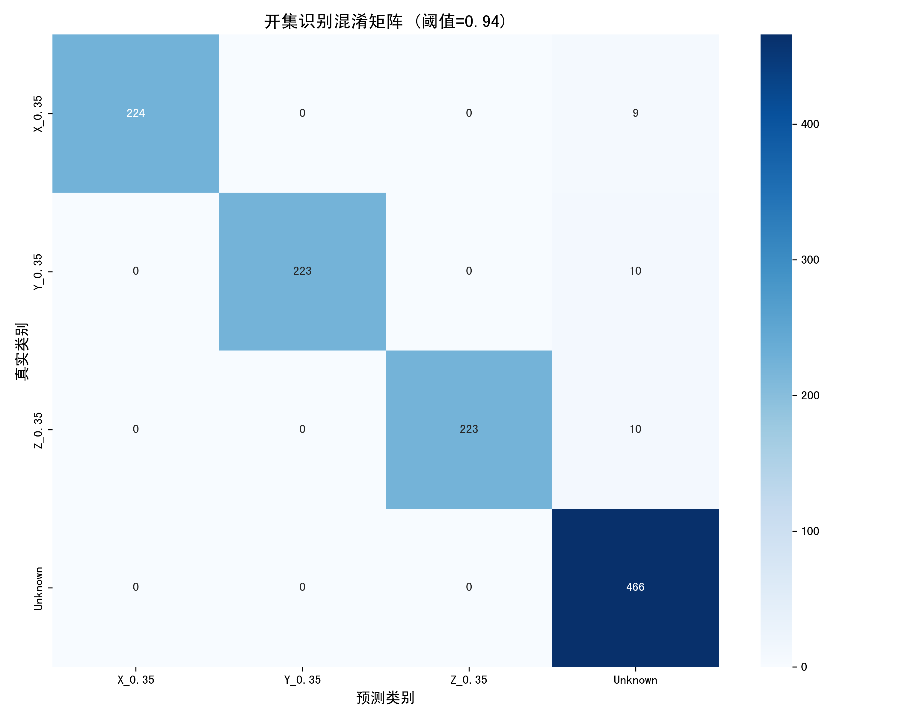
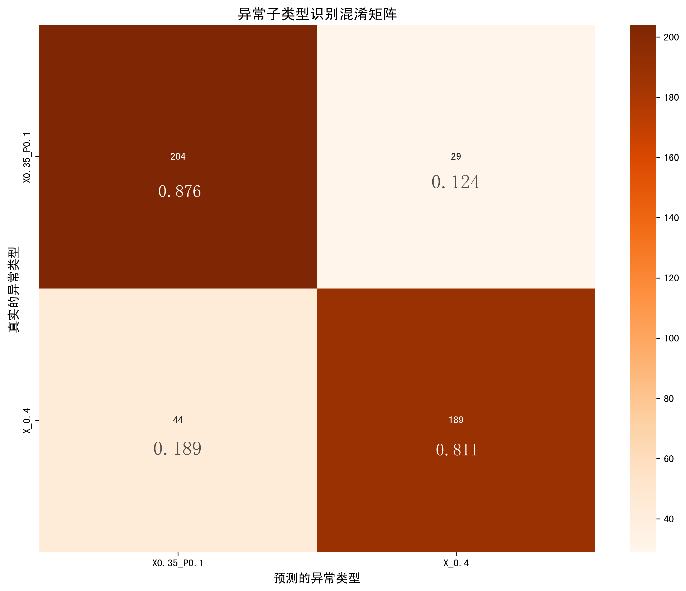
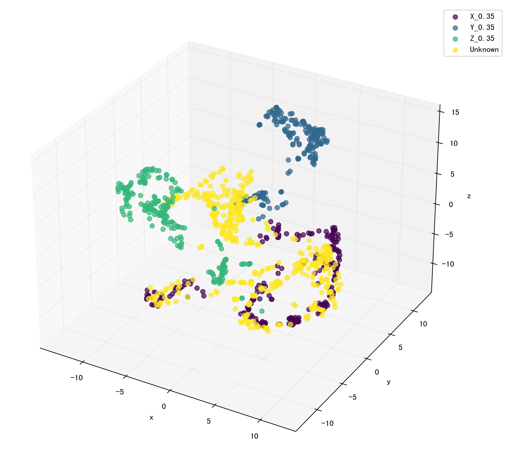
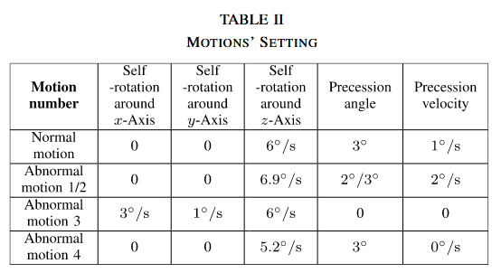
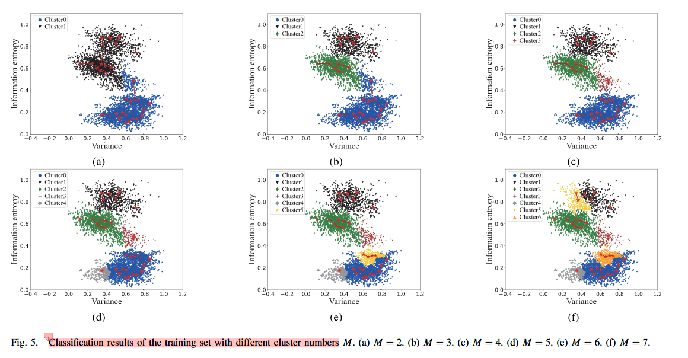
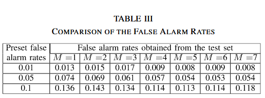

## **本周工作（0515-0520）**

上周是 将目标静止，单轴自旋（0.35）视为正常，将单轴自旋（0.4），进动，同时双轴运动视为异常，使用开集 的方法进行了正常/异常的二分类任务，

序列长度 = 10帧

序列长度 = 6帧

这周主要是在开集识别出来异常，再去对异常样本进行 高速自旋 和 进动的 分类；
这里降低了难度，把未知类只保留了 进动（X0.35_P0.1）,高速自旋（'X_0.4'）

先开集异常识别，再进行异常类型的聚类，
后续还是直接用**聚类**的方法，需要在**提取特征**方面深挖一下，

**基于局部密度峰值和微动特征的雷达空间目标异常运动检测方法+GRSL+2023+清华大学+王德华，李刚**+[基于局部密度峰值和微动特征的雷达空间目标异常运动检测方法 |IEEE 期刊和杂志 |IEEE Xplore --- Detection Method of Radar Space Target Abnormal Motion via Local Density Peaks and Micro-Motion Feature | IEEE Journals & Magazine | IEEE Xplore](https://ieeexplore.ieee.org/document/10124706)

**基于高斯混合模型和微多普勒特征的空间目标异常检测**+TGRS2022+清华大学+王德华，李刚+[Space Target Anomaly Detection Based on Gaussian Mixture Model and Micro-Doppler Features ](https://ieeexplore.ieee.org/document/9915454)

与基于 HRRP 和 ISAR 图像的方法相比，基于微多普勒特征的方法对距离分辨率的要求较低。
虽然这里使用的是聚类的方法，但也是 正常/异常 二分类
从基于正常状态的样本中提取**熵 、平均瞬时频率序列的方差 、归一化时频 （TF） 矩阵** 的方差 和能量。然后，使用 GMM 和期望最大化 （EM） 算法来拟合和估计多维归一化特征的概率密度函数 （pdf）。

 **HRRPSeqNet：使用 HRRP 序列对空间目标运动进行开放集识别**+2025+TAES+散射与辐射国家重点实验室+杨浩+[HRRPSeqNet: Open-Set Recognition of Space Target Motions Using HRRP Sequences](https://ieeexplore.ieee.org/document/10882892)

 基于条件变分自编码器（CVAE），为每个已知类别学习一个多元高斯先验分布。对输入样本，网络输出潜在空间的均值与方差，通过KL散度同时向对应标签先验吸引、向其他先验排斥，实现类内聚簇、类间分离。**提取HRRP的投影长度、散射熵、质心、偏度等四类结构特征序列**，经小型卷积分支融入标签引导模块，以增强对几何建模误差的鲁棒性。

