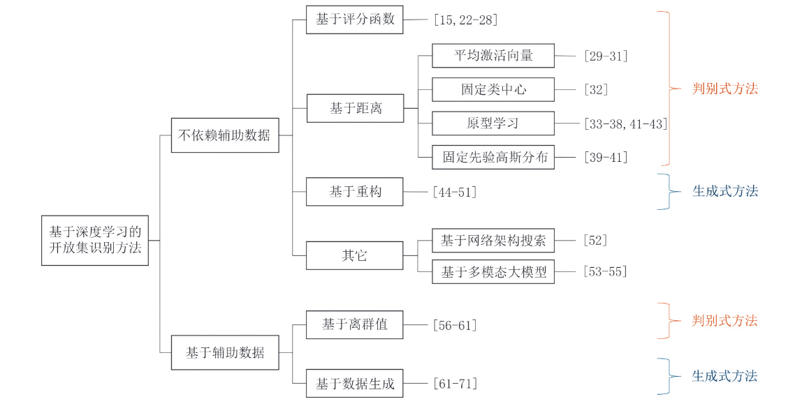
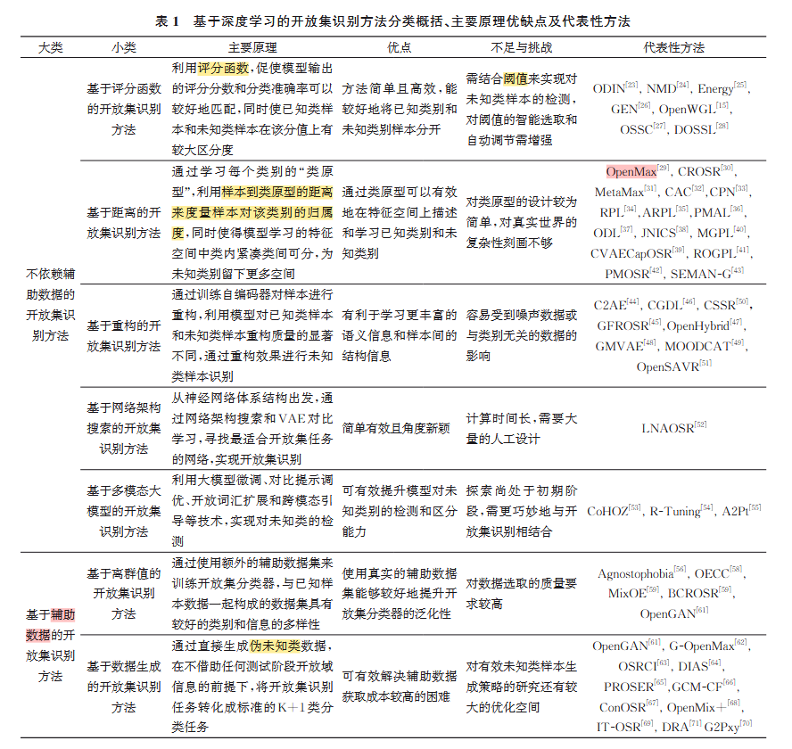
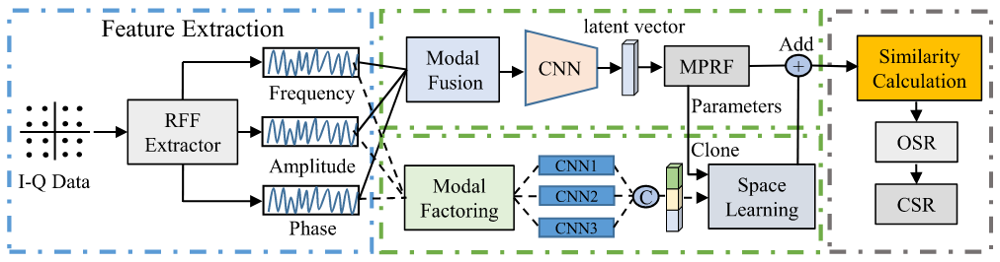
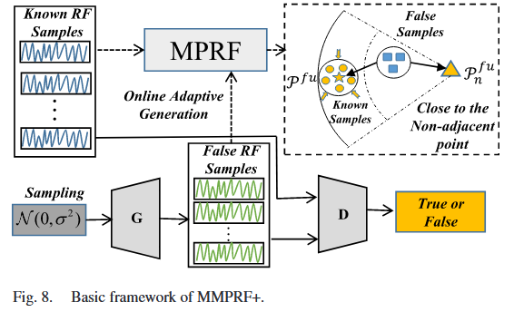
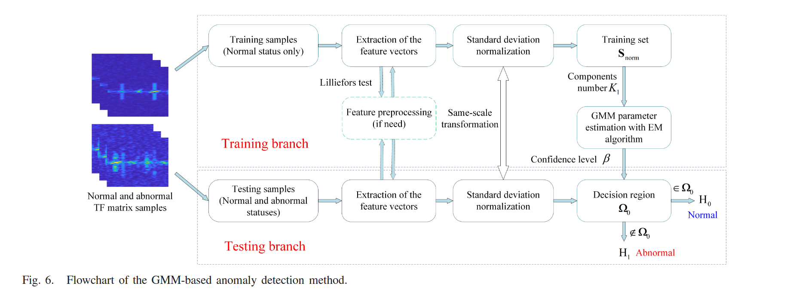
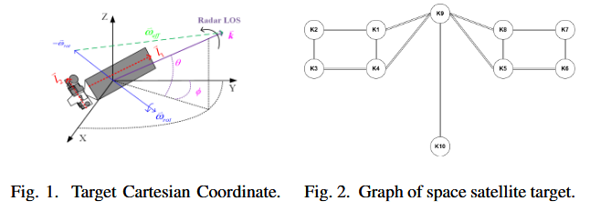
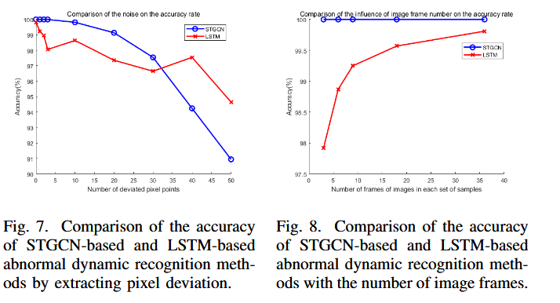
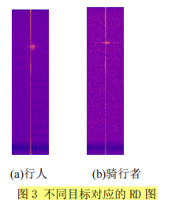

## **本周工作（0521-0526）**

### 开集识别

####  综述

模型**仅依赖已知类别**的数据,通过对已知类别进行深入细致的表达学习, 构建**紧凑的类边界**和精确的类归属度。

- 基于评分函数
   *核心思路*：对分类器输出（softmax 分数、置信度等、能量分数)重新设计**阈值**或后处理，之后引入阈值,将未知类别和已知类别区分开。 其潜在的难点除了**度量指标的构建和优化**之外,**阈值的选取**也是其难点和弊端之一,

- 基于距离: 例如通过特殊设计的损 失函数、“类原型”的挑选等,增强类间数据的可分离 性和类内数据的紧凑性,为未知类别预留足够的空 间。
  平均激活向量 (MAV)：计算样本到类均值向量的距离
  
  固定类中心：预定义或冻结中心，比较欧氏/余弦距离
  **原型学习：学习可区分的类别原型，再度量距离**
  
  **固定先验高斯分布: 约束特征服从高斯分布，基于概率判拒**
-  重构：在已知类数据上 训练的编码器-解码器模型对已知类和未知类中的 测试样本具有不同的重构质量,模型对训练过程中 **已见过类别的样本重构效果要远好于未见过类别样本的重构效果**

- 基于离群值的开放集识别：引入的未知类辅助数据集, 与测试集中的未知类数据不重合、不相关

#### **专业知识对自动调制开集识别的重要性**+TPMAI2023+李涛涛+[论文链接](https://ieeexplore.ieee.org/document/10210314)

1. 为了解决 AMOSR 任务的糟糕性能，我们**分析并提取可以显着提高性能的关键射频特征（即幅度、频率、相位）**。

2. 与以前的 OSR 算法相比，提出了一种新的优化策略，具有边缘原型，具有较低的开放空间风险;

3. 我们为提取的通用 RF 特征开发了一个多模态框架，它允许为不同模式保留单独的特征，从而缓解 OSR 任务中特征消失的问题;

4. **提出了一种基于 GAN 的未知样本生成策略，以使模型能够理解未知世界；**

对应创新点1：专业知识（例如，传统的无线电信号处理方法）并没有很好地连接到深度神经网络。**专家知识的主要优势之一是找到更好的特征表示形式，从而使神经网络更好地区分已知类和未知类。**

通过在特征嵌入分布空间中根据其原型中心压缩处于受限边际的已知类来降低开集空间风险和封闭集经验分类风险。此外，**我们利用专业知识并提取射频信号的一般模态特性（例如，频率、幅度和相位）。**

探讨 提取那些特征对异常检测更加有效
对应创新点3：所提MMPRF，**模态融合**来组合不同的模态，并应用所提出的 MPRF 算法来训练和测试 AMOSR 任务 为了防止特征的灾难性消失，使用**模态分解**作来提取各种模态之间的内部差异，并进行同步训练

对应创新点4. 所提MMPRF+，

#### **基于高斯混合模型和微多普勒特征的空间目标异常检测**+TGRS2022+清华大学+王德华，李刚+[论文链接 ](https://ieeexplore.ieee.org/document/9915454)

从基于**正常状态的样本**中提取**熵 、平均瞬时频率序列的方差 、归一化时频 （TF） 矩阵** 的方差 和能量。然后，使用 GMM 和期望最大化 （EM） 算法来拟合和估计多维归一化特征的概率密度函数 （pdf）。

#### **基于时空图卷积网络的序列 ISAR 空间目标动态异常检测**+GRSL+2025+中大+段佳+[论文链接](https://ieeexplore.ieee.org/document/11004154)

思路是 提取舱体两端中心、太阳翼各顶点 关键点，构建图结构，送入图网络，

实验结果 是 关键点像素偏差 0，1，2，3 ； 以及输入序列长度3，6，9，18，38帧，异常检测准确率也为百分之百。 **当然这是闭集，**

### 我们的思路

现在的思路  使用ResNet -- LSTM/Anomaly Transformer/ ---开集识别+对识别为未知类的样本进行聚类, **聚类后 计算与已知类簇前p% 相似的样本**，放回训练集 进行微调开集识别模型，

**开集识别本身就存在误差，相似的样本按照逻辑是包含 正常样本和异常样本的**，

就算全是异常样本，那为什么不直接将异常样本暴漏给模型，并且这样也不属于开集识别了，

后续还是要利用专业知识在特征提取方面， 通过数据生成的方法

### 比赛 低空监视雷达目标智能识别技术研究

#### 主题

低空经济，从低空监视雷达目标数据中自动识别出**小型旋翼无人机（如大疆M300）、轻型旋翼无人机（如大疆御3）、鸟以及空飘球**四类目标，
#### 数据集
**训练集**包括前述小型旋翼无人机、轻型旋翼无人机、鸟类、空 飘球四类目标以及其它杂波的**距离-多普勒图、点航数据及说明，**
同时提供雷达的载频、脉冲重复周期、相参脉冲积累数、 带宽、采样率、分辨力（距离、方位、俯仰、速度）、精度（距 离、方位、俯仰、速度）等相关参数

#### 评分
分为**初审和终审**，各占50分

指标项1得分=识别率×20   (满分为20分)

指标项2为识别时间得分   (满分为20分)

指标项3为程序运行算力需求得分 (满分为10分)

根据总分由高到低排序并确定前50% 进入终审。

作品**终审为答辩环节**，满分为50分。(作品符合性(15),完整性(15),创新性(20))

#### 报名时间
报名时间为2025年5月30日—6月30日，**待揭榜单位确定后告知数据集云盘地址**

提交  2025 年8月15日前
#### 设奖情况及奖励措施

评出特等 奖特等奖5个（含“擂主”），一等奖5个，二等奖6个，三等 奖8个。具体奖项数量根据实际参赛团队数量调整。计入第十九届“挑战杯”竞赛学校团体总分
“擂主”奖金100000元/队，特等奖10000元/队，一等奖5000 元/队，二等奖3000元/队，三等奖2000元/队。
获奖团队的应届毕业生参加校园招聘时，**符合应聘条件者， 直接进入面试环节**，同等条件下可优先录用；同时可为获奖团队的青年教师提供产学研合作平台，深度参与雷达系统研发与测试项目

雷达相应公开数据集

CARRADA 数据集包括 21.1 分钟 12666 帧数据，每一帧的脉冲数为 64，每个脉冲内采样点数为 256。因此，**距离-多普勒图**的尺寸大小为 256*64，目标类型**包括汽车、骑行者、行人和背景 4 类**。
链接：[valeoai/carrada_dataset](https://github.com/valeoai/carrada_dataset)

RADDET 数据集包括总共 10158 帧数据，每一帧脉冲数为 64，每个脉冲内采样点数为 256，**距离-多普勒图**的尺寸大小为 256*64，**目标类型包括行人、自行车、汽车、摩托车、公交汽车、卡车 6 类**
链接 [ZhangAoCanada/RADDet](https://github.com/ZhangAoCanada/RADDet)

