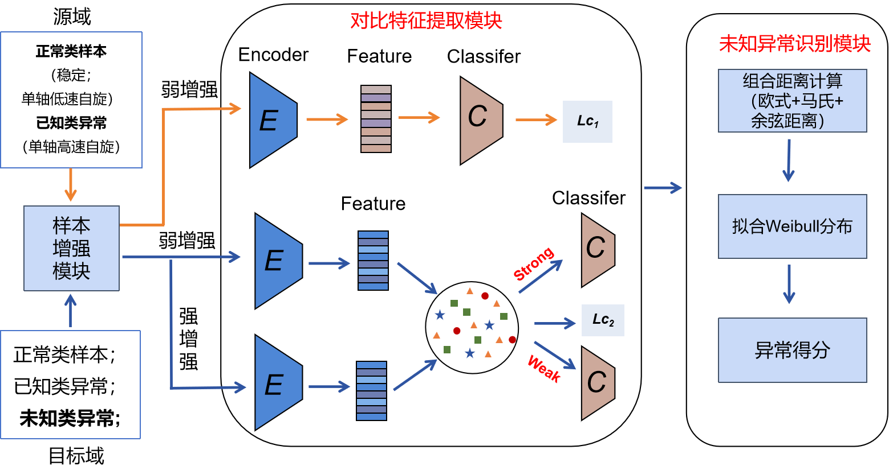
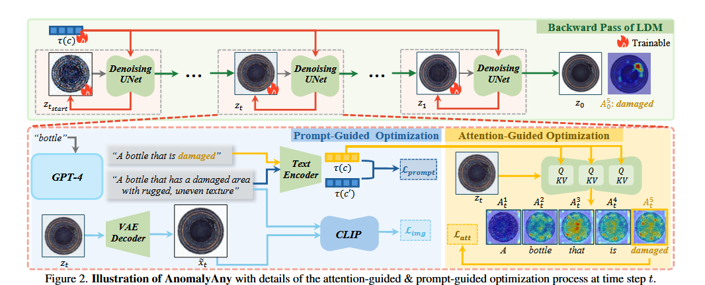
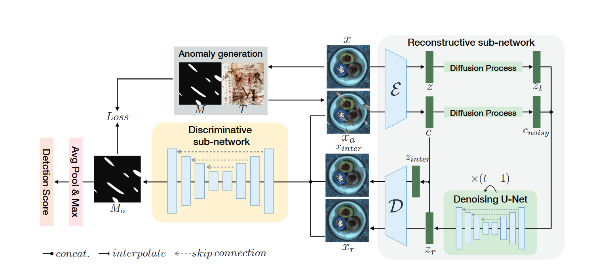
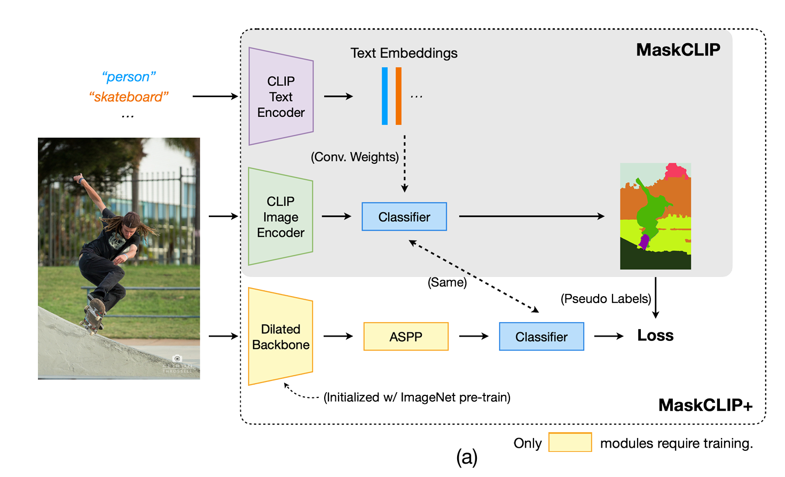
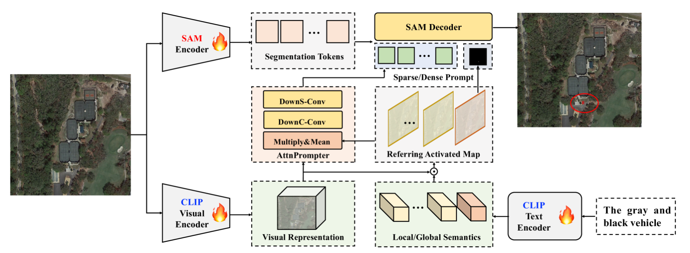

## **本周工作（0527-0506）**

有关序列开集异常检测， 主线就是 序列特征提取器+开集识别分类

有关特征提取，结合未知异常的特点，采用**自监督对比学习**的方式，

对比学习的目标通常是：

1. **拉近** 与其正样本之间在嵌入空间（embedding space）上的距离；
2. **推远** 与所有负样本之间的距离。

在自监督场景下，由于没有人工标签，就需要通过“数据增强+采样机制”来自动生成正负样本对。

**正常（稳定(1)，低速单轴自旋（3））；**

**已知异常（高速单轴自旋（2~3），双轴自旋（2~3））；**

**未知异常（存在进动的自旋(1~2)）；**

 **所提方法既能区分已知各类异常，又能在无标签的真实场景下自动识别新出现的未知异常**；

 **提出了一种基于自我监督对比学习的特征学习，通过混合增强不同运动模式样本的信息来挖掘鲁棒特征。**

弱增强：包括对振动信号进行归一化 和 随机水平/垂直翻转（**整条序列统一操作，保证时空结构一致**） 。

强增强：包含归一化、随机添加高斯噪声、缩放、拉伸和时序裁剪，可用于随机生成严重失真的样本。

**现在我要对源域样本进行弱增强。**

**对目标域（测试集所有样本）的所有样本进行弱增强，和强增强，**

得到两个视图

正样本对： 同一条原始序列 ，通过“弱增强 → 强增强”得到两个视图

负样本对：只要两个视图不属于同一条原始序列，就构成负样本对。

自监督对比学习阶段，所有不同序列都被当成彼此的负样本对

对比学习通过**拉近相似样本（正对）、推远不相似样本（负对）**，迫使编码器关注区分不同运动模式的关键线索

### 有关生成式方法进行异常识别

模型**仅依赖已知类别**的数据,通过对已知类别进行深入细致的表达学习, 构建**紧凑的类边界**和精确的类归属度。

之前也说过和扩散模型能不能联系起来

### 基于生成异常数据的方式，

#### Anomaly Anything:可提示的不可见视觉异常生成+CVPR2025+华科+曹云康

异常图案通常只占据图像的一小部分区域，这使得它们在生成过程中很容易被忽视。为了解决这个问题，我们提出了**注意力引导的异常优化** ，通过最大化与异常标记相关的注意力值来加强模型对生成异常概念的关注。

我们利用 SD **生成带有异常文本描述的看不见的视觉异常**，这些描述可以手动定义，也可以从 GPT-4 [[24](https://arxiv.org/html/2406.01078v3#bib.bib24)] 中自动获取。

### 基于重构的方法   破坏+修复+对比

- 重构：在已知类数据上 训练的编码器-解码器模型对已知类和未知类中的 测试样本具有不同的重构质量,模型对训练过程中 **已见过类别的样本重构效果要远好于未见过类别样本的重构效果**。

#### 使用扩散概率模型进行无监督表面异常检测

   基于重建网络的方法假设，当以异常样本作为输入时，在正常样本上训练的重建模型仅在正常区域成功，而在异常部分失败

我们遵循之前的工作 来创建模拟的异常训练样本，以补偿真实异常样本的缺失，并利用最近的潜在扩散模型作为我们重建子网络的支柱，该子网络能够生成高质量和多样化的样本。

重建子网络是一个伴随着噪声条件嵌入的潜在扩散模型，学习正常样本的分布。在采样阶段，以异常样本作为条件输入，能够产生与整体外观异常条件相当的高质量正常样本。接下来，判别子网络从输入图像、其重建版本和有助于区分异常的其他插值通道的串联中生成分割图。

文本提示指导图像生成有比较多的应用，但是指导生成序列图像比较困难。尤其是在我目前的序列任务中很难，嵌入

人和滑板

灰色和黑色的车辆

帆板和舱体/ 机身，机翼，机尾 
