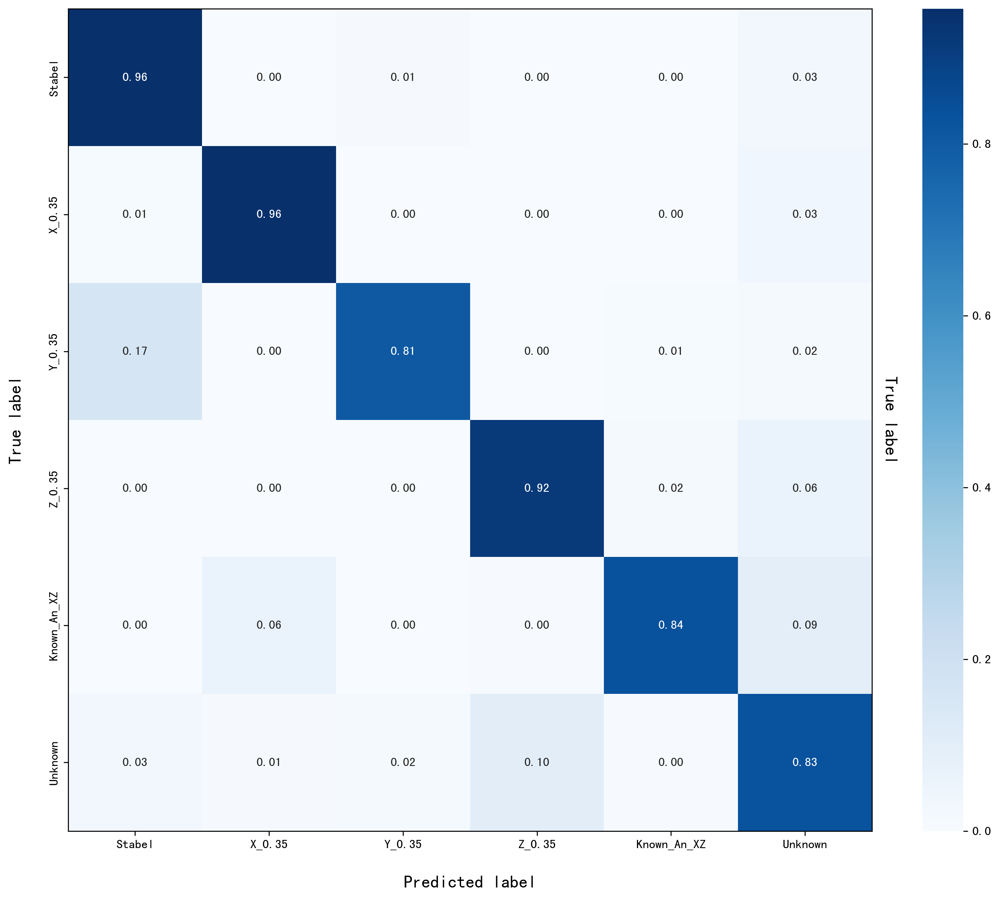

## **本周工作（0611）**

有关序列开集异常检测， 主线就是 序列特征提取器+开集识别分类

有关特征提取，结合未知异常的特点，采用**自监督对比学习**的方式，

对比学习的目标通常是：

1. **拉近** 与其正样本之间在嵌入空间（embedding space）上的距离；
2. **推远** 与所有负样本之间的距离。

在自监督场景下，由于没有人工标签，就需要通过“数据增强+采样机制”来自动生成正负样本对。

**正常（稳定(1)，低速单轴自旋（3））；**

**已知异常（高速单轴自旋（2-3），双轴自旋（2-3））；**

**未知异常（存在进动的自旋(1~2)）；**

**所提方法既能区分已知各类异常，又能在无标签的真实场景下自动识别新出现的未知异常**；

**提出了一种基于自我监督对比学习的特征学习，通过混合增强不同运动模式样本的信息来挖掘鲁棒特征。**

弱增强：包括对振动信号进行归一化 和 随机水平/垂直翻转（**整条序列统一操作，保证时空结构一致**） 。

强增强：包含归一化、随机添加高斯噪声、缩放、拉伸和时序裁剪，可用于随机生成严重失真的样本。

**现在我要对源域样本进行弱增强。**

**对目标域（测试集所有样本）的所有样本进行弱增强，和强增强，**

得到两个视图

正样本对： 同一条原始序列 ，通过“弱增强 → 强增强”得到两个视图

负样本对：只要两个视图不属于同一条原始序列，就构成负样本对。

自监督对比学习阶段，所有不同序列都被当成彼此的负样本对

对比学习通过**拉近相似样本（正对）、推远不相似样本（负对）**，迫使编码器关注区分不同运动模式的关键线索

