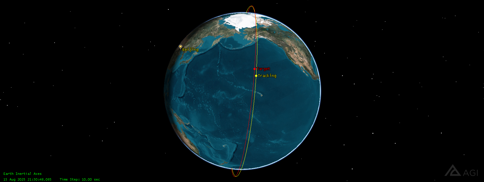
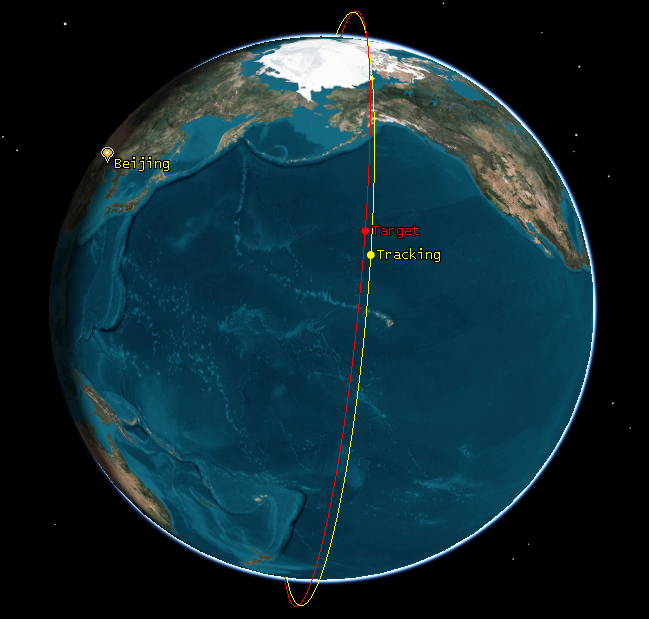
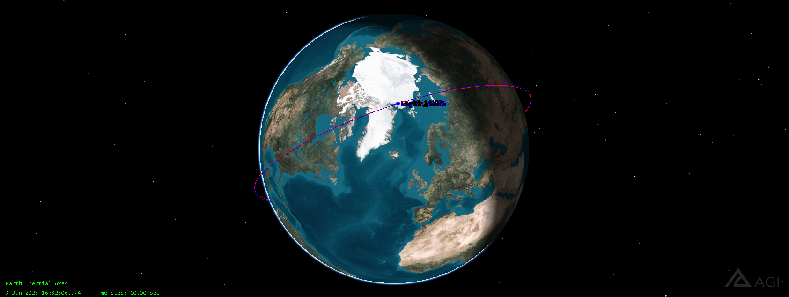
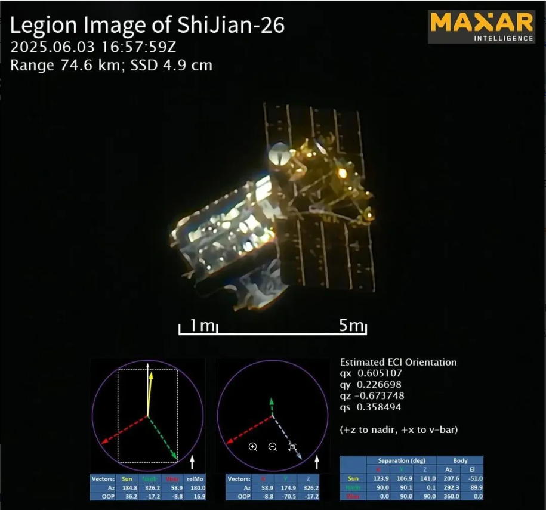
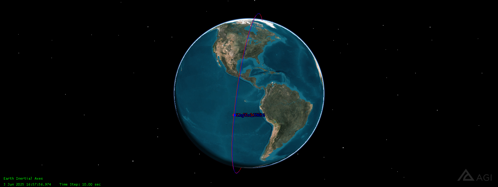
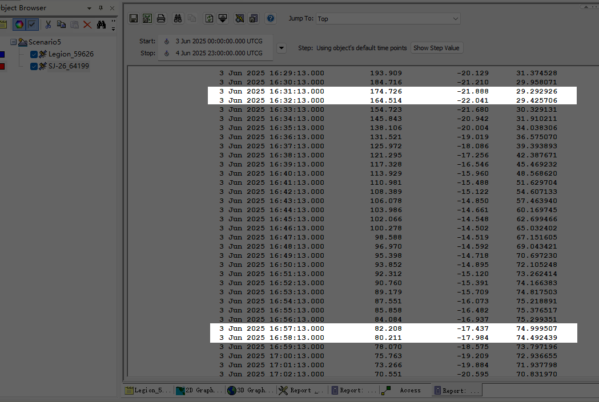
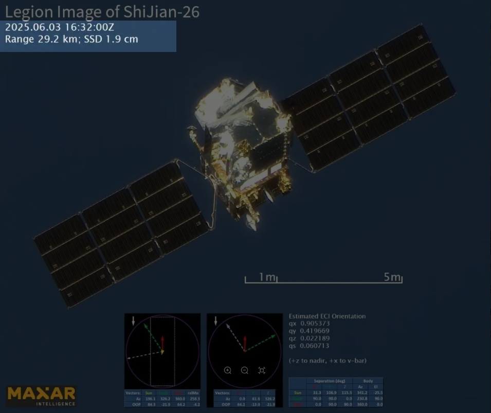
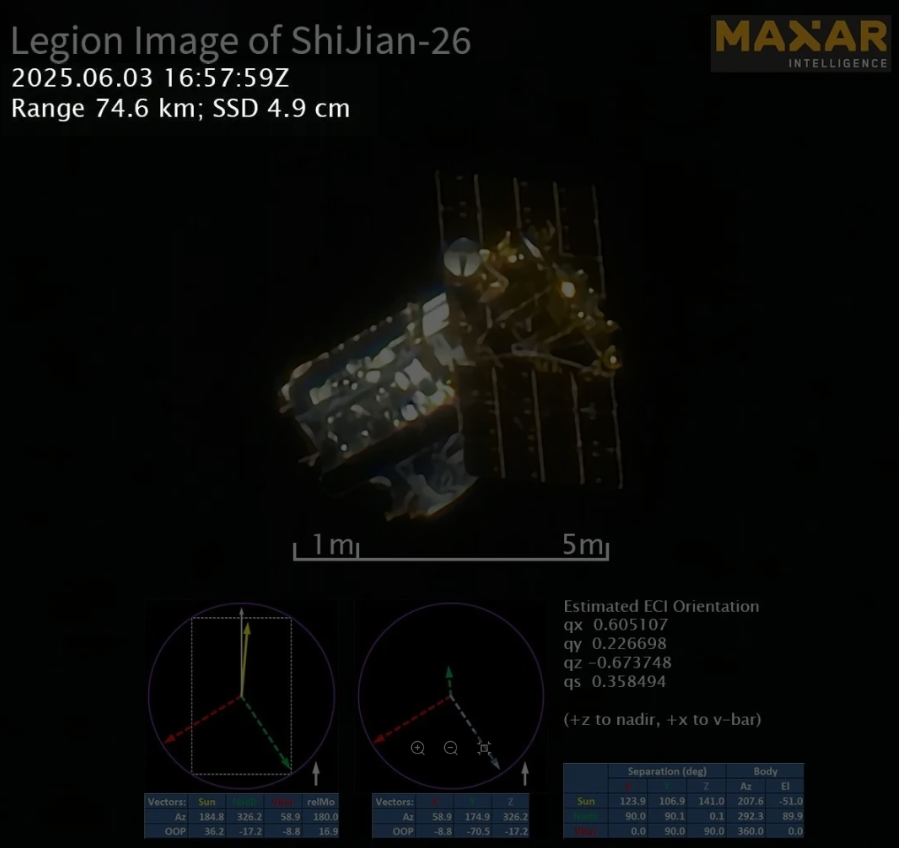
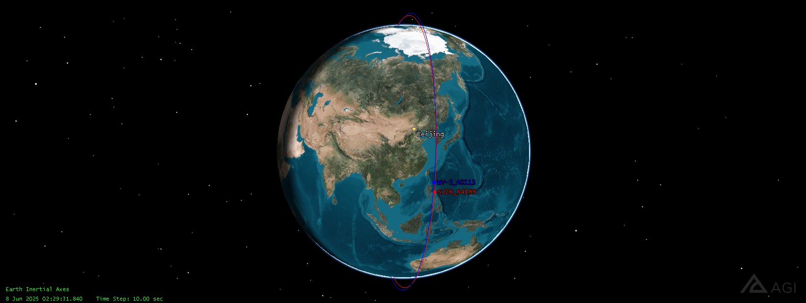
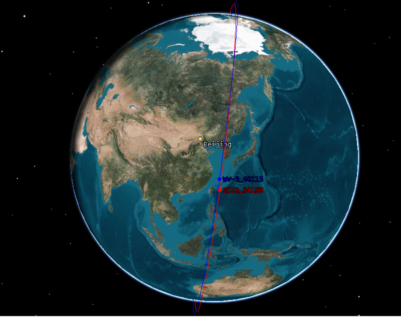

### STK轨道仿真

TRS（在 STK 软件中构建了一个双站空间 ISAR 观测场景，如图 Fig. 10 所示。**选择 TG-I 作为目标卫星，其轨道参数与高度为 1400 公里的 OPS-SAT 公开卫星之一相同**。在确定目标在 ECEF 坐标系中的瞬时位置后，选择星链星座在 550 公里轨道上的两个相邻卫星作为同步成像观测者。）

刚开始想找TG 1400km左右的，轨道高度在1000KM以上的比较少,  不太好找两个轨道很近（除了同一个卫星，cosmos 2489; cosmos2490）

最后选择的轨道仿真用的是 WV-3_40115,600km 做目标 和60534  在 8.15的TLE参数

```
1 40115U 14048A   25227.53254850  .00000868  00000-0  10779-3 0  9997
2 40115  97.8743 301.2652 0004141 217.2933 142.7995 14.85089105596544
```

```
1 60534U 24149BU  25227.46716277  .00001714  00000-0  16368-3 0  9996
2 60534  97.7146 302.8180 0001581  81.6294 278.5106 14.94573580 54274
```

倾角 i = **97.7146°**（同为 SSO）; RAAN = **302.8180°**;平均运动 n = **14.945736 rev/day**





#### Maxar商业卫星拍摄中国SJ-26卫星

''麦克萨”（Maxar）是美国最大的商业遥感公司，

MAXAR正在发展接替Worldview系列卫星的新星座，含6颗“军团”（Legion）卫星和6颗“侦察兵”（SCOUT）卫星新闻报道： [美国商业卫星频频对我国航天器拍照](https://mp.weixin.qq.com/s/zjUX6h-Z9Q30hATcmARXtA)；[Maxar商业卫星拍摄中国SJ-26卫星](https://news.qq.com/rain/a/20250712A078TJ00)

近日公布一张前所未有的高清轨道影像，首次清晰捕捉到新一代光学遥感卫星「实践26号」（ShiJian-26）在轨运行的结构细节与位置，被称为「水晶般清晰」（crystal-clear），象征太空监控能力迈入解析度革命的新纪元。

 Legion2_59626和 SJ-26_64199在6.3的TLE 

```
1 59626U 24081B   25154.54032166  .00007776  00000-0  40026-3 0  9999
2 59626  97.5365 230.5503 0003736 106.2132 253.9513 15.16692388 60145
```

```
1 64199U 25115A   25154.73806193  .00007049  00000-0  30156-3 0  9995
2 64199  97.4905 230.1417 0009366 246.7178 113.3073 15.23100606   846
```

根据space-track公布的两行轨道要素，**实践-26发射于2025年5月29日**，处于500km左右的太阳同步轨道；而WorldView Legion卫星处于515km的太阳同步轨道、515km左右的45°倾角倾斜轨道和700km的倾斜轨道三类轨道。








#### 用STK软件计算的当天两颗卫星的相对距离



最近29.3km, WorldView Legion在518km高度的地面分辨率为30cm，折算到29.3km，分辨率为1.7cm




此外 worldview-3  距离SJ26也很近




