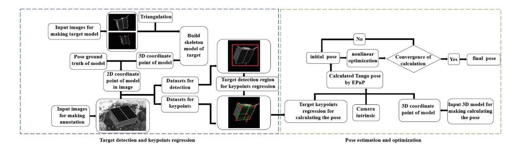
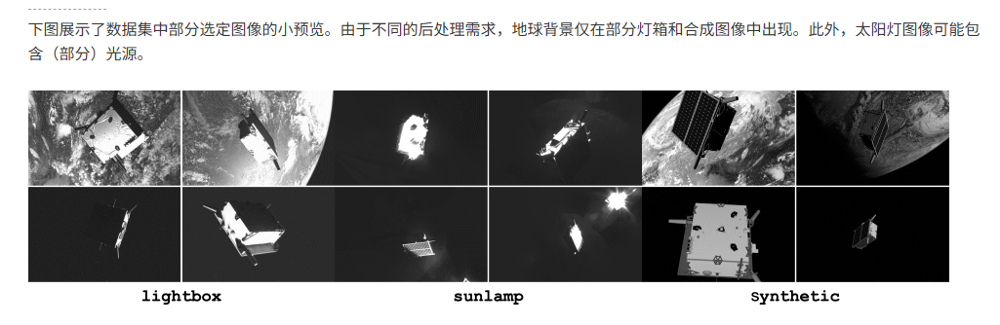
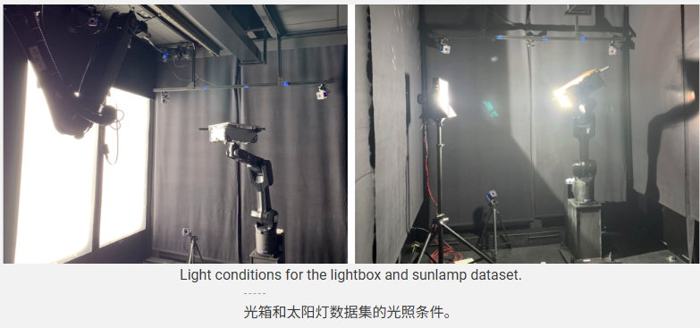
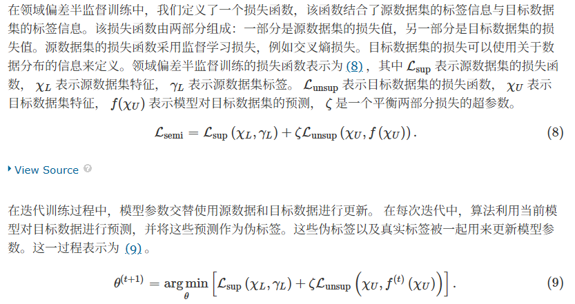
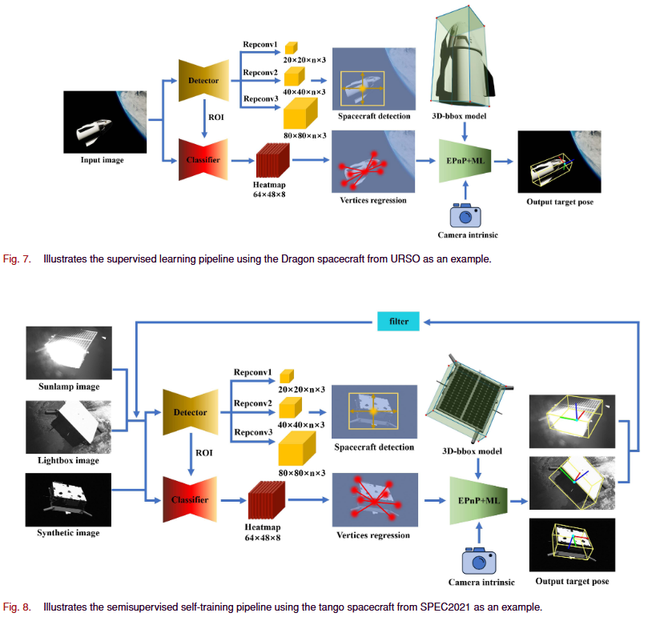
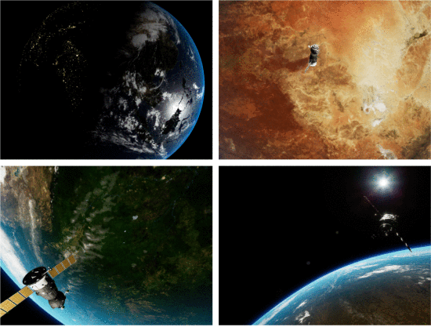
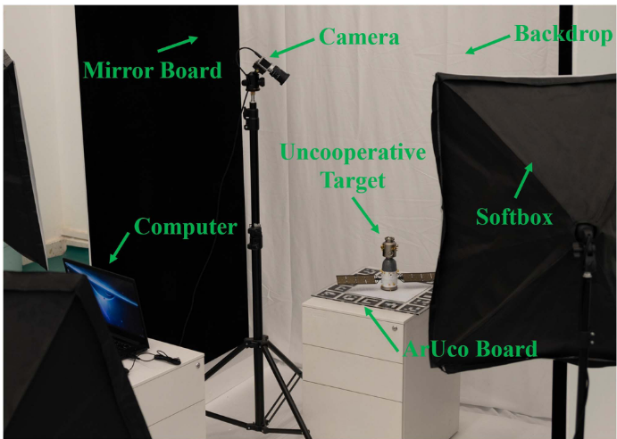
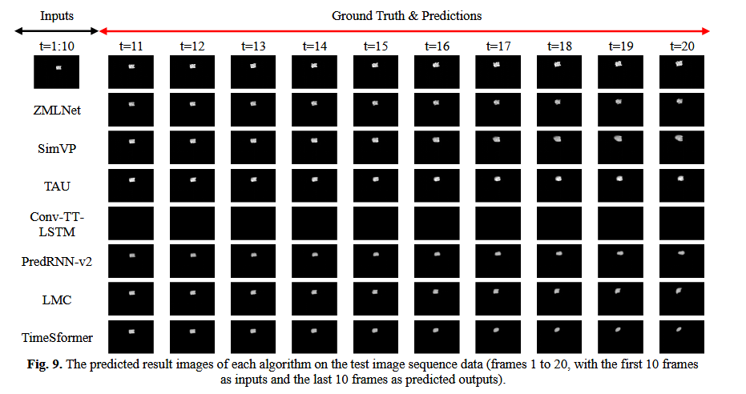
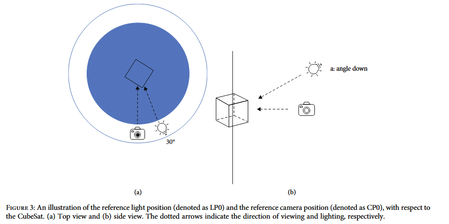

## 文献整理

### 光学测姿

####  1.深度学习在空间目标姿态估计中的关键点过滤非线性优化+TII+2024+钟立军/**杨夏**+中山大学航空航天学院+**[paper](https://ieeexplore.ieee.org/abstract/document/10614915)**

提出一种基于关键点预测概率的姿态估计非线性优化方法，

第一部分：**通过训练数据集构建空间目标骨架模型**。随后，基于训练数据集提供的真实姿态，可以生成神经网络的标注标签。这些标注标签具有双重作用：一是用于目标检测，二是用于提取二维关键点。当数据集缺乏真实姿态信息时，可以按照 Common Objects in Context (COCO) [15] 的格式生成标注。

第二部分：通过将两个神经网络依次连接，可以创建一个两阶段网络。初始阶段是一个检测网络，负责定位空间目标区域。随后，第二阶段是一个分类网络，设计用于**从空间目标检测区域提取二维关键点**。

第三部分：**涉及二维-三维关系的几何约束方程可以通过两阶段网络提取的二维关键点信息与空间目标骨架模型相结合来建立。然后通过求解这些几何约束方程可以推导出空间目标的近似姿态**。此外，通过非线性细化技术可以实现精确的空间目标姿态。

**光学图像设计的领域偏差  **目标到相机的距离，数据集分为三类：近、中、远。数据集是SwissCube Dataset: https://github.com/cvlab-epfl/widedepth-range-pose/

不同光源条件下，如下，公开数据集SPEC 2021 Dataset: https://kelvins.esa.int/pose-estimation-2021/ 

**解决源数据集和目标数据集之间的数据集分布差异。合成图像被视为源数据集，而 lightbox 图像和 sunlamp 图像是目标数据集。然而，源数据集和目标数据集在光照、阴影和视觉纹理方面存在显著差异。**

1. SPEC 2019 Dataset: https://kelvins.esa.int/satellitepose-estimation-challenge/ 

2. SPEC 2021 Dataset: https://kelvins.esa.int/poseestimation-2021/ 

3. SwissCube Dataset: https://github.com/cvlab-epfl/wide-depth-range-pose/

   瑞士洛桑联邦理工学院提供 。根据目标到相机的距离，数据集分为三类：近、中、远。分类标准是 {Near|1.0deq−4.0deq} 、 {Medium|4.0deq−7.0deq} 和 {Far|7.0deq−10.0deq} ，其中 deq 表示空间目标 3D 模型的等效直径，定义为目标点云模型中两个最远点之间的距离。数据集的训练集、验证集和测试集分别包含 27 989、4 245 和 8 223 个样本。这是首个具有精确 3D 模型、基于物理的渲染以及太阳、地球和恒星物理模拟的空间载荷数据集。

   

4. Our code is available for use at https://github.com/SYSU-CSP/KeypointsFiltrating

5. 2. 使用归一化分割坐标空间的非合作航天器姿态估计+:IEEE/ASME TM +2025+钟立军/**杨夏**+中山大学航空航天学院+[paper](https://ieeexplore.ieee.org/document/10682976/figures#figures)

在轨服务中，空间探索的常见科研活动包括垃圾处理、监测与跟踪、交会对接、维护与维修，以及空间态势感知与防御。不合作航天器姿态估计是空间探索的关键技术。在这些在轨服务的研究中，**传统测量技术包括激光雷达技术、微波雷达技术和光学图像测量技术。然而，激光和微波雷达测量所使用的设备体积大、耗能高、成本昂贵，导致其在实际工程应用中存在显著限制。另一方面，具有设备体积小、耗能低、传感器信息丰富的光学图像测量技术，在非合作航天器姿态估计任务中具有潜在优势。**

一种基于深度学习的航天器姿态估计目标分割方法。该方法可以直接预测图像中 3D 边界框（3D-bbox）投影的顶点，并估计目标相对于相机的 6D 姿态。为应对具有挑战性的场景和领域偏差，我们通过自训练流程增强了基于目标分割的航天器姿态估计方法，展示了所提方法的有效性和泛化能力。

当源数据集和目标数据集属于同一分布时，我们采用监督学习策略来解决 3D-bbox 顶点回归任务，如图 7 所示。SPEC2021 方法旨在解决源数据集和目标数据集之间的数据集分布差异。合成图像被视为源数据集，而 lightbox 图像和 sunlamp 图像是目标数据集。然而，源数据集和目标数据集在光照、阴影和视觉纹理方面存在显著差异。为了解决 3D-bbox 顶点回归任务，我们采用半监督自训练策略，如图 8 所示。具体而言，从 lightbox 和 sunlamp 数据集中随机选择一部分图像，按 1:4 的比例进行选择。手动提取特征点以建立几何约束方程来求解姿态。然后，选定的图像和获得的姿态与源数据集合并进行标注，并通过网络进行迭代训练。 此外，对 lightbox 和 sunlamp 图像应用了一系列预处理操作，包括平移、旋转、反射、放大和缩小，以增强数据多样性。

SPEC 2021 Dataset: https://kelvins.esa.int/pose-estimation-2021/ 

SPEC2021 数据集由三部分组成：lightbox、sunlamp 和合成 [14] 。lightbox 包含 6740 张在 lightbox 条件下拍摄的实拍图像，而 sunlamp 子集包括 2791 张在阳光灯条件下拍摄的实拍图像。因此，lightbox 和 sunlamp 数据集真实地再现了太空中的卫星成像场景。这些图像是在斯坦福大学的航天会合实验室（SLAB）使用会合光学导航测试平台拍摄的。合成部分由光学相机模拟软件生成的 60000 张合成图像组成，并按 1:4 的比例分为验证集和训练集。合成部分用于训练，而 lightbox 和 sunlamp 用于测试。在这种情况下，合成部分作为源数据集，而 lightbox 和 sunlamp 作为目标数据集。

URSO Dataset: https://github.com/pedropro/UrsoNet/

航天器 Dragon 和 Soyuz 在绕地球轨道运行时的各种姿态 。Dragon 是一个圆柱形航天器。Dragon 的训练集、验证集和测试集样本数量分别为 4000、500 和 500。Soyuz 数据集分为两部分：Soyuz_easy 和 Soyuz_hard。这两部分的区别基于成像距离；Soyuz_easy 具有近距离成像（10.0–20.0 米），而 Soyuz_hard 具有远距离成像（10.0–40.0 米）。

SwissCube Dataset: https://github.com/cvlab-epfl/wide-depth-range-pose/同上

The SZ-12 and DFH-1 datasets: https://drive.google.com/file/d/1rwl7yXqJpFt3WPUEozoqLyqKOKSnaJIe/view?usp=sharing

利用搭建的硬件系统生成了两个数据集：SZ-12 数据集和 DFH-1 数据集。（无法访问）

### 序列预测

#### 1.ZMLNet: 一种用于空间目标图像序列预测的 Z 字形增强多层视觉 Mamba 和 LSTM 框架+TGRS2025+余凡/ 杨奕康+西交+[paper](https://ieeexplore.ieee.org/abstract/document/11129932)

#### 2.基于多级运动记忆的智能学习空间目标图像序列预测+TGRS2025+余凡/ 杨奕康+西交+[paper](https://ieeexplore.ieee.org/document/11028082)

（竟然是同样的任务，写的时候有这两篇文章，引言和背景应该不会写的当时那么痛苦，但是早有的话，那篇可能发生不出来了）

也有值得参考的地方，等写完这篇论文再细看

数据使用：（SPAcecraft Recognition leveraging Knowledge of Space Environment） (SPARK 2022 dataset）

[SPARK 2022 数据集 ](https://cvi2.uni.lu/spark-2022-dataset/)，航天器轨迹估计着重于利用时间数据知识来估计航天器的 6 自由度姿态。集包含在真实太空模拟环境下生成的目标卫星“Proba-2”的 100 多条轨迹（每条轨迹包含 300 张 RGB 图像）是由卢森堡大学提供

