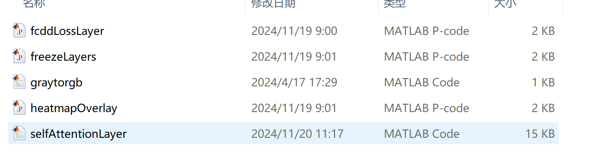
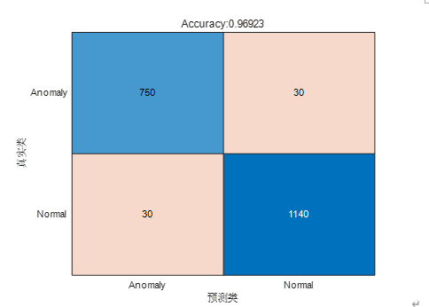
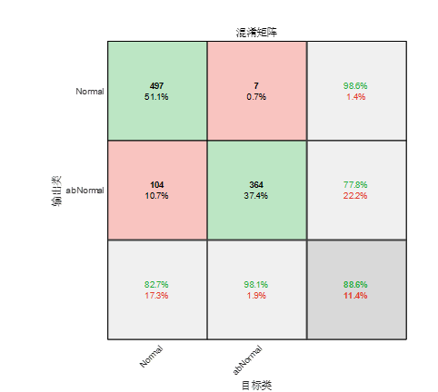
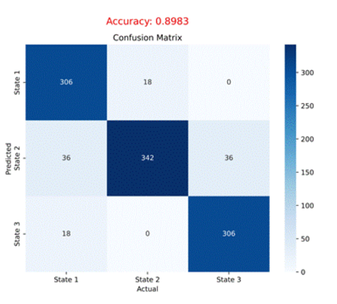

## 有关异动检测算法的问题

#### 形态异常识别测试 -- Demo6

**<u>首先现状 只有测试代码  测试数据集，也没有训练集，网络结构封装看不到内部，</u>**

输出混淆矩阵、异常识别准确率、虚警率和每张图片耗时

#### 姿态异常测试

为什么要转为python，目的

姿态 和形态的异动都需要吗？

之前青基结题时候写过一个小的 是否能满足要求

本节采用LSTM作为特征序列分类器，网络参数设置如表3-6所示。运动状态分类混淆矩阵如图3-8所示。

如前所述，在理想情况下，单个特征序列足以对目标运动状态进行分类。因此，本节基于每个提取的特征序列以及合并的特征序列测试了LSTM分类器。

图3-8意图识别结果混淆矩阵

模拟实际观察场景，本节将空间目标运动划分为三个运动状态

（a）正常运动状态：对应表3-7中state 1，空间目标处于轨道或预定路径上，照惯性和引力的作用自由运行，通常表现为沿着特定的轨迹稳定运动。目标在此状态下的速度和加速度变化较为平缓，轨迹通常为圆形或椭圆形，适用于卫星、航天器等的常规轨道运行。

（b）往返状态：对应表3-7中state 2，空间目标在此状态下，沿某一预定轨迹来回运动，通常表现为目标在两个位置之间周期性地往返。目标在往返过程中可能出现反向的运动方向，速度和加速度随着时间变化，例如卫星在轨道上的周期性调整、地面站与卫星之间的信号传输等情形。

（c）静止状态：对应表3-7中state 3， 空间目标在该状态下，位置和姿态保持不变或变化极小，目标的运动速度接近零，处于稳定的静止状态。这种状态下，目标的各项运动参数（如速度、加速度等）可以认为为零，例如出现在卫星停泊、对准、姿态稳定等操作阶段。

#### 异常检测论文写作进展

目前 加参考文献 ，先首次全文翻译一共10页，之后去润色检查语句到第5页方法部分，

初次提交 是不是12 13 页 比较好

目前主要是对比算法实验的  一共设计了四个 目前有两个跑完 还剩两个 调对比实验也挺折磨的

下周主要是推进这两个事情 还有论文汇报 

