## 基于TLE和序列观测图像的在轨卫星的轨道-姿态联合估计

### STK 基于TLE 计算RAE,

设置西安站，喀什站，佳木斯站 

时间：2025.11.12- 11.14

卫星ATARLINK5921;   TLE:

1 55926U 23037N  25316.16832052  .00000962  00000-0  88383-4 0  9997

2 55926  69.9999 220.8871 0002733 269.8423  90.2423 14.98329523146374

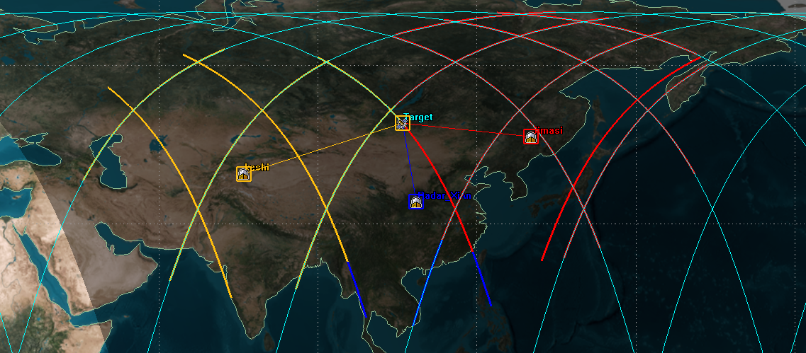

部分时间有 AER 数据，Access 设置报表默认只**在有“可见/有链路”的时间段输出结果**，可观测窗口，这里可直接通过python脚本计算

- A：Azimuth 方位角(卫星“在地平线上的投影”相对于某基准方向（通常是正北）的角度)
- E：Elevation 仰角； R：Range 距离（站–星直线距离）

###  TLE 到 RAE 计算流程

输入: TLE (两行轨道元素) + 观测站坐标 (lat, lon, h) + 时间点列表

  ↓

步骤1: SGP4 轨道传播 → TEME 坐标系

步骤2: TEME → ECEF 坐标转换 (通过 GMST 旋转)

步骤3: 观测站地理坐标 → ECEF 坐标

步骤4: ECEF → ENU 坐标转换 (本地坐标系)

步骤5: ENU → RAE 计算 (距离/方位角/仰角)

  ↓

输出: Range (km), Azimuth (deg), Elevation (deg)

**基于西安站进行计算，输出保存 观测时刻， A E R 目标ECEF坐标，观测站点ECEF坐标**

#### 地基场景
已经与STK输出进行比对，

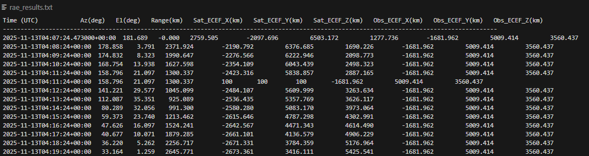

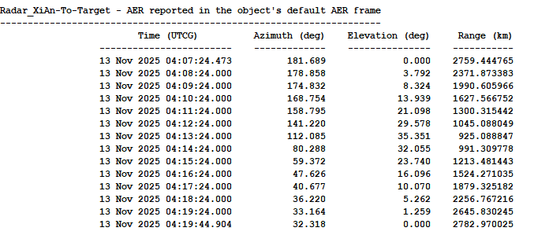

#### 天基场景设定 

美国商业卫星拍摄中国ShiJian-26卫星（2025年5月29日发射）

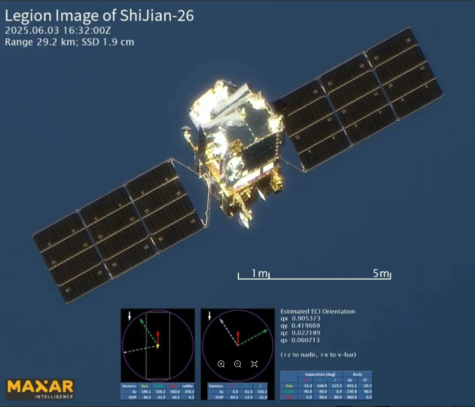

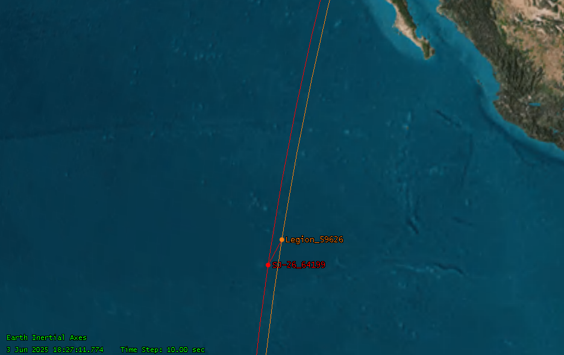

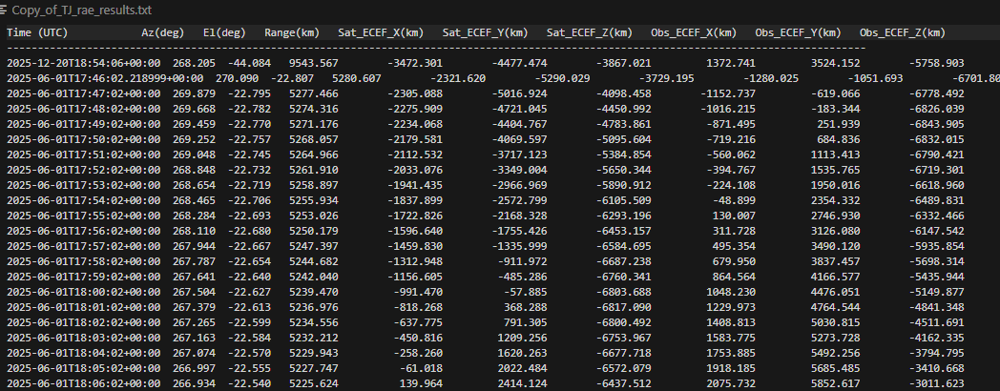

**将上述输出的包含ECEF坐标的txt文件作为输入，接入仿真图片序列生成代码，**

**输出序列图片按照姿态（通过四元数，目标本身的运动）-轨道（可见时间段进行划分）-序号（时刻）进行命名**

**以及图片对应的RAE,目标的ECEF,站点的ECEF（txt）**

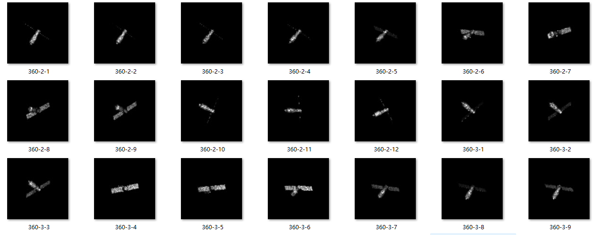

看了一些文章，试图找了一些灵感，

#### 轨道异常+中科院国家空间科学中心+ 2024+空间科学学报+基于分段寻优的轨道异常检测方法+[paper](https://www.sciengine.com/CJSS/doi/10.11728/cjss2024.05.2023-0122)

背景

尽管“星链”规划的卫星数量众多，但单纯这一点并不是威胁太空安全的最主要原因——因为目前太空碎片的数量比在轨卫星的数量多得多，**“星链”卫星的特殊之处在于，会频繁利用电推进系统变轨或保持轨道。**据报道，从2024年12月到2025年5月底的半年内，“星链”卫星执行了超过14万次变轨机动，

卫星轨道异常主要分为轨道面内异常和轨道面异常, 

其中轨道面内异常体现在轨道形状和大小的改变, 对应变化参数是半长轴、偏心率; 在基地情况下 和 R

轨道面异常对应的变化参数是倾角、升交点赤经; AE

轨道面的改变需要耗费较多的燃料, 发生频率较低, 相比之下, 半长轴的变化发生频繁且耗费燃料较少, 因此分析轨道平均运动或半长轴的变化是判断卫星轨道是否发生异常最常用的方法. 

卫星ATARLINK5921;   TLE:

1 55926U 23037N  25316.16832052  .00000962  00000-0  88383-4 0  9997

2 55926  69.9999 220.8871 0002733 269.8423  90.2423 **14.98329523146374**

**平均运动 (圈/天)：** TLE 第二行末尾的参数，表示每天绕行圈数。如果 n 突然减小，意味着卫星轨道升高了；如果 n 突然增大，意味着轨道降低了。

半长轴计算

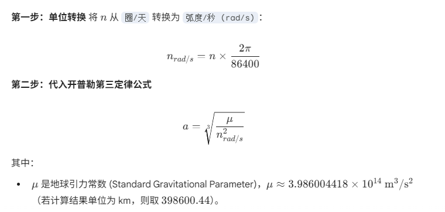

星链卫星 2023 年 3 月 1 日至 4 月 26 日期间的 TLE 数据进行分析, 该批次卫星刚刚 发射不久, 于 3 月 16 日左右突然变轨, 其中**两颗星轨道已经降低至接近 370 km**, 且降轨速度很快. 

昨天TLE, 直接通过RAE

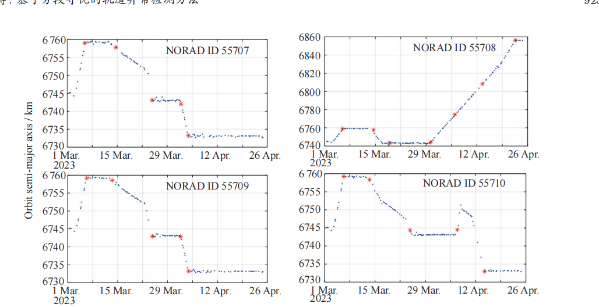

| **观测现象**                           | **判定结论**                             |
| -------------------------------------- | ---------------------------------------- |
| **平均运动 (n) 突减，半长轴 (a) 突增** | 卫星进行了**升轨**机动                   |
| **平均运动 (n) 突增，半长轴 (a) 突减** | 卫星进行了**降轨**机动                   |
| **n 和 a 稳定，但倾角 (i) 发生突变**   | 卫星进行了**轨道平面调整**               |

#### 语言跨模态实现零样本行为识别

[IMUZero: Zero-Shot Human Activity Recognition by Language-Based Cross Modality Fusion](https://dl.acm.org/doi/epdf/10.1145/3770669)

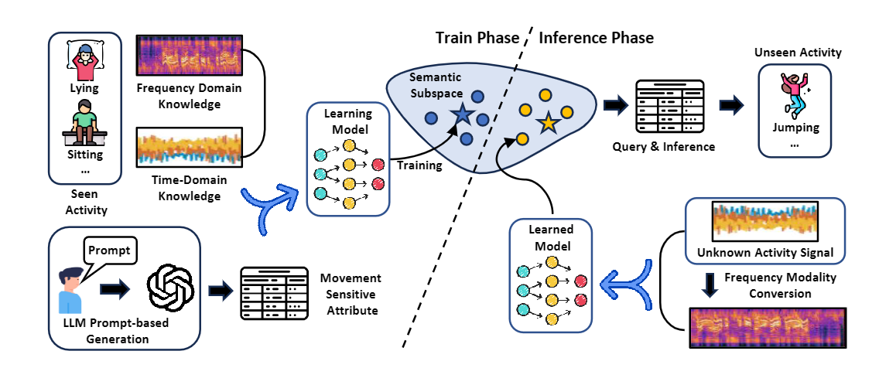

这里主要关注是如何利用大语言模型的

- **输入：**

  - IMU 段信号及已知类的标签 /
     多通道时间序列片段 

- **额外的语义信息（由 LLM 预先生成）：**

- 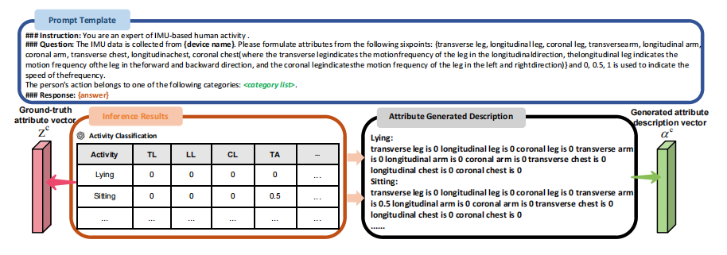

- 每个类别 c 一条 **属性向量** zc：长度 9（腿/臂/胸 × 3 个轴），每个元素取值 ∈ {0, 0.5, 1}，表示该部位在该方向上的运动强度（几乎不动 / 中等 / 高频)

  每个类别 c 一条 **文字描述** ac：把上面那 9 个属性用一句话描述出来（如 “transverse leg is 1, longitudinal leg is 1, …”）。

  告诉 LLM：

  - 传感器来源（device name）；
  - 9 个属性名以及它们的物理含义（哪一维代表腿/臂/胸哪个方向的运动）；
  - 属性取值只允许 {0, 0.5, 1} 三档；
  - 给出一个**动作类别列表**（如 lying, sitting, walking, …）；

  要求 LLM 输出：

  - 一个表格，行是动作类别，列是属性值（0/0.5/1）；
  - 再把每行属性转成一段自然语言描述

在训练前就把所有动作类别（包括用于测试的未见类）统一输入 LLM，通过精心设计的属性模板和 Prompt 生成数值属性向量和文字属性描述，作为统一的语义空间原型，训练阶段仅使用已见类的 IMU 数据去学习“信号→属性空间”的映射；当真正出现未见类样本时，只需利用其预先生成的属性原型进行相似度匹配即可，

关键在于**对 LLM 来说**

- LLM 只需要“动作名字 + 人类语言描述”，不需要任何 IMU 数据。

- 所以只要这个动作在现实世界里是“可描述的”（比如 “上楼梯”，“俯卧撑”），LLM 基本都能理解并给出合理的“身体部位 + 频率”属性。

  **其实并不是十分切合，**

先基于三轴角速度和进动角速度等物理参数设计了一套有限维的“姿态属性空间”，

`wx_level`：绕 X 轴角速度强度`wy_level`：绕 Y 轴角速度强度`wz_level`：绕 Z 轴角速度强度

`wp_level`：进动角速度强度`axis_count_level`：参与旋转的轴数量（0/1/2/3）

`rate_variation_level`：角速度是否随时间变化（0=恒定，1=中等变化，2=剧烈变化）

并借助大语言模型将每种姿态运动模式（如三轴稳定、自旋稳定、进动、翻滚等）的文字描述自动映射为离散属性向量和属性文本。

####  后续

现在也在学习 HMM 的文章--可以通过序列投影长度实现自旋速度的估计

还需要补充一些有关测距 测角的基本知识

对每一帧，先从 RAE/ECEF 抽出更有物理含义的量：

- 角度拆成 sin/cos，避免 0/360° 不连续：
  - sin⁡At,cos⁡At,sin⁡Et,cos⁡Et\sin A_t, \cos A_t, \sin E_t, \cos E_tsinAt,cosAt,sinEt,cosEt
- 距离及其变化：
  - RtR_tRt, ΔRt=Rt+1−Rt\Delta R_t = R_{t+1}-R_tΔRt=Rt+1−Rt
- 由 ECEF 做差分：
  - 速度：vt=(pt+1−pt)/Δt\mathbf{v}_t = (p_{t+1}-p_t)/\Delta tvt=(pt+1−pt)/Δt
  - 加速度：at=(vt+1−vt)/Δt\mathbf{a}_t = (v_{t+1}-v_t)/\Delta tat=(vt+1−vt)/Δt

单独用这条几何分数做 **纯轨道/几何异常检测**；

把这个分数/标签再喂给图像模型做 **辅监督或先验条件**

固定站点观测和天基观测都可以进行仿真，接下来主要需要考虑固定站点，每次成像的可见序列的图片数是不一定的（因为可见范围段不一样），牵扯到间隔时间，

需要按照6.2之前的TLE,去看6.3的行为，时间差？那我只有错误的AE, 这可咋办啊，没有思路啊

直接就是 序列 结合现有的TLE，更好更能解释异常背后的原因

在分辨率不变的情况下，由于距离靠近会不会出现图片中目标放大的情况，但不是这样的（不可行）

原有的基础是姿态，形态 异常（单独依靠图片），有什么情况下姿态，形态异常是单独依靠图片序列不能

机动变轨，通过半长轴很常见，

那么轨道集合侧，

TLE这条路，新的数据进来做观测，基于老的本身去做预测，分别计算几何/轨道侧异常分数

没有实测 AE

隐式几何条件化

- 在网络内部，把 RAE 当作条件输入，使网络学到：“不同 RAE 下的外观差别哪些是轨道几何导致的、哪些是目标自身导致的”；

最终的结果，是触发异常，也详细的解释，

例如 ：在该异常时间段，半长轴/平均运动变化速率较小（明显断崖阶跃），但目标图像轮廓和散射中心分布显著改变，因而倾向于判断为姿态或构型异常（机动升轨/降轨）。

