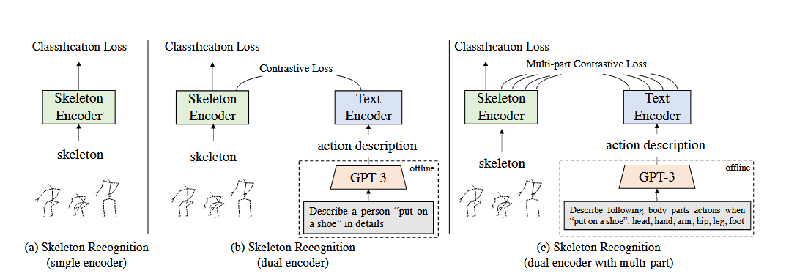
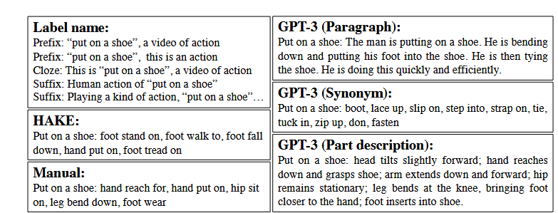
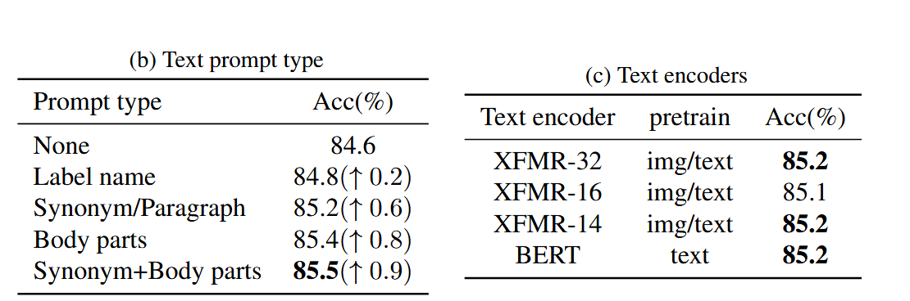
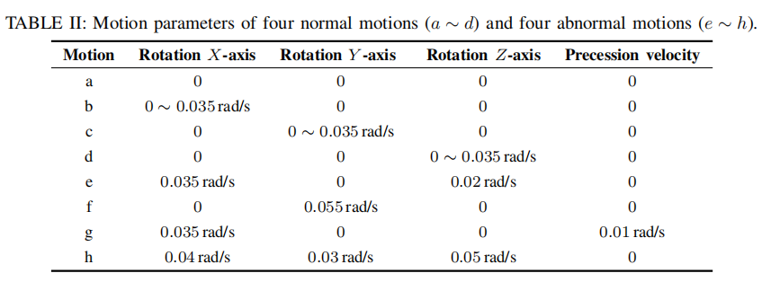

## 20251230

####  LLM

目前 LLM 在行为识别中的核心思路主要有三类：

- **LLM as a Recognizer:** 将行为数据（如骨骼点序列，传感器）直接转化为语言描述或者离散Token，让 LLM 进行无样本分类。
- **LLM for Feature Alignment (特征对齐与增强):** 利用 LLM 的文本编码器（Text Encoder）**生成的语义嵌入**，指导视觉或骨骼特征的学习（类似 CLIP 的思路）。
- **Multimodal Agents:** 使用多模态大模型（Video-LLM）直接对视频进行问答和推理，实现复杂行为理解。

LLM for Feature Alignment (特征对齐与增强):

**技术实现流程：**

1. **知识生成 (Knowledge Generation)**：利用 LLM（如 GPT-3.5）针对每个动作类别生成详尽的描述。
   - *输入*：“请描述‘喝水’的动作细节。”
   - *LLM 输出*：“手臂弯曲，手部握持圆柱状物体，手部向嘴部移动，头部轻微后仰...”
2. **文本编码**：将这些详细描述输入文本编码器（Text Encoder, 如 BERT 或 CLIP-Text），得到包含丰富语义的文本嵌入（Text Embeddings）。
3. **对比学习 (Contrastive Learning)**：训练骨骼/视频编码器，使其提取的特征向量与上述 LLM 生成的文本向量在特征空间中尽可能接近。
4. **分类**：推理时，计算视频特征与所有动作类别文本特征的相似度

这一方向的论文主要在**如何构造更好的文本特征**（即 Prompt Engineering 和 Knowledge Refinement）上做文章

#### 基于骨骼的动作识别生成动作描述提示+[paper](https://arxiv.org/abs/2208.05318)

1.**label name**直接使用标签名称：“这是一个穿鞋动作的视频“

2.**HAKE dataset ：**每个样本都手动标注六个身体部位动作（头部、手部、手臂、臀部、腿部、脚部），

3.**Manual Description.**按照动作的时间顺序手动写下身体部位运动的描述

4.大语言模型（ *例如* GPT-3）来生成文本描述。文本描述通过三种方式生成。

 **Paragraph *段落*** ：详细描述动作的完整段落;  Describe a person [action] in details.

**Synonym(同义词)**：10 个动作标签的同义词;Suggest 10 synonyms for [action].

**Part description（部件级描述）**：描述每个动作中不同身体部位的。Describing following body parts actions when [action]: head, hand, arm, hip, leg, foot.

#### 语言跨模态实现零样本行为识别+[paper](https://dl.acm.org/doi/epdf/10.1145/3770669)

每个类别 c 一条 **属性向量** zc：长度 9（腿/臂/胸 × 3 个轴），每个元素取值 ∈ {0, 0.5, 1}，表示该部位在该方向上的运动强度（几乎不动 / 中等 / 高频)

每个类别 c 一条 **文字描述** ac：把上面那 9 个属性用一句话描述出来（如 “transverse leg is 1, longitudinal leg is 1, …”）。

告诉 LLM：

- 传感器来源（device name）；
- 9 个属性名以及它们的物理含义（哪一维代表腿/臂/胸哪个方向的运动）；
- 属性取值只允许 {0, 0.5, 1} 三档；
- 给出一个**动作类别列表**（如 lying, sitting, walking, …）；

要求 LLM 输出：

- 一个表格，行是动作类别，列是属性值（0/0.5/1）；
- 再把每行属性转成一段自然语言描述

**如何去描述在轨卫星的行为？**

**如果只关注姿态**

**三轴稳定，这是一段三轴稳定的序列**,按照顺序去描述运动

### 轨道测定（Orbit Determination，OD)

通过轨道测定（OD）**确定航天器的位置和速度，**对于太空交通管理、轨道保持等任务至关重要。

仅通过少量电光（EO）视线测量数据，就能利用高斯法、双 R 迭代法或古丁法等初始轨道测定（IOD）方法获取卫星的位置和速度 [1-4]。

完成初始轨道测定后，会采用序贯估计或批量估计算法进行精密轨道测定（POD），基于初始轨道测定的状态估计值来推算航天器当前的运行状态 [5]

#### 初始轨道测定（IOD）

仅测角数据 (Angles-Only IOD):**Gauss 法 (高斯法):** 利用三次观测的角度和时间。假设观测期间目标主要受二体引力影响。

**Double-R 迭代法 (Double-R Iteration)** 猜测两个时刻的地心距离（$r_1, r_2$），通过几何关系和动力学时间约束进行迭代收敛。

**雷达数据 (Range + Angles):** 由于直接掌握了位置矢量 $\mathbf{r}$，通过两次位置观测即可利用 Gibbs 或 Herrick-Gibbs 方法快速解算速度矢量 $\mathbf{v}$。

####  精密定轨与轨道改进 (Orbit Refinement / POD)

序贯处理 / 卡尔曼滤波 (Sequential Processing / Kalman Filtering)

  - **核心思想：** 每一个新的观测数据到来时，立即更新当前的轨道状态和协方差矩阵。
    - **扩展卡尔曼滤波 (EKF)：** 将非线性轨道动力学线性化，是目前星上实时定轨的标准。
    - **无迹卡尔曼滤波 (UKF)：** 通过采样点处理非线性，精度通常优于EKF，但计算稍繁琐。
    
  - **优点：** 适用于**实时定轨 (Real-time OD)**，能估计并在一定程度上补偿未建模的误差（过程噪声）。

    

| **观测手段**            | **数据类型**                                                 | **特点**                                     | **常用定轨方法**            |
| ----------------------- | ------------------------------------------------------------ | -------------------------------------------- | --------------------------- |
| **地基光学**            | 角度 (赤经，赤纬；$\alpha, \delta$)                          | 无距离信息，受天气/光照限制                  | Gauss, Laplace, Double-R    |
| **地基雷达**            | 距离 ($R$)、多普勒 ($\dot{R}$)、角度                         | 全天候，包含距离信息，精度高，**非合作目标** | Lambert, Herrick-Gibbs, EKF |
| 星载**GNSS (GPS/北斗)** | 伪距（接收机到GPS卫星的粗略距离（含钟差））、载波相位，必须有**接收机**和**天线** | 星载接收机，连续覆盖，精度极高，合作目标     | 载波相位差分 (RTK), 批处理  |
| **SLR (卫星激光测距)**  | 双向距离，必须有**角反射器 (CCR)**                           | 极高精度 (cm级)，**卫星编队飞行**            | 批处理最小二乘 (用于校准)   |

#### 和序列图像怎么结合

在观测条件极度受限（单站、无定标）的情况下，将“连续估计问题”退化为“离散序列匹配问题”更鲁棒

 ISAR系列i太顾及

