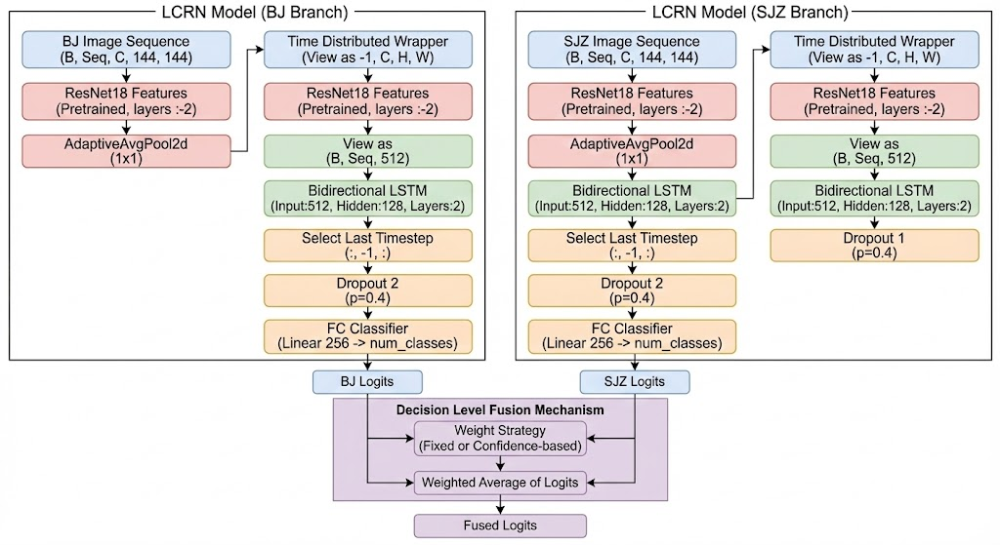
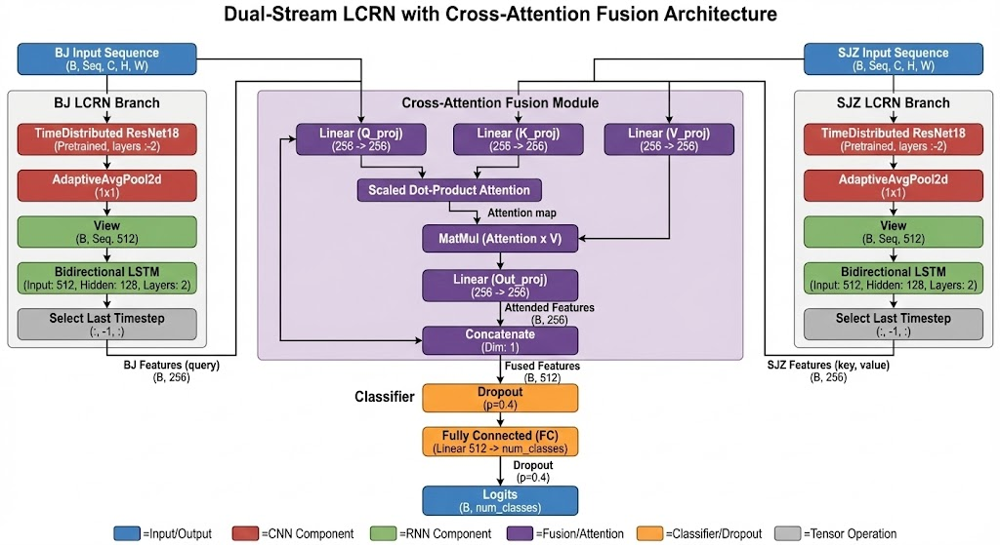

## 20260115

站点选择：北京（BJ），石家庄(SJZ)，构建可观测轨道，序列长度为10帧，采样间隔时间60s。

### 模型分别采用决策级融合，特征级融合

##### 决策级融合网络架构：采用置信度加权

#### 特征级融合采用，特征拼接，和交叉注意力

交叉注意力网络架构如下图：

该模型采用双流 LCRN（长短期记忆卷积网络）架构并行处理 BJ 和 SJZ 两地的图像序列：首先，两个独立支路分别通过 TimeDistributed ResNet18 提取每一帧的空间特征，并经由 双向 LSTM 捕捉时序依赖，各自输出最后一个时间步的全局特征向量；**随后进入核心的交叉注意力融合模块（Cross-Attention Fusion），利用 BJ 的特征向量作为查询（Query）去“关注”并动态加权检索 SJZ 的特征（Key/Value），从而提取出两地数据间最相关的互补信息；最终，将经过注意力机制增强的特征进行拼接（Concatenate），**并通过包含 Dropout 的全连接分类头（Classifier） 输出最终的分类结果（Logits）。

### 实验场景与结果

#### 场景1.双站观测目标异动

1.1 目标姿态异动(a:目标在RVN下姿态保持不变;b:目标在RVN下姿态发生变化)

a:目标在RVN下姿态保持不变---具体数据 ：三轴稳定

b:目标在RVN下姿态发生变化----具体数据 ：绕z轴单轴自旋0.0005 rad/s

**此场景较容易  决策级融合和特征级融合都可以达到90%以上**

#### 场景2 目标自旋异动

(a:目标在RVN下发生绕固定轴(x、y、z)进行转动;b:目标在RVN下发生随机转动)

a 绕z轴单轴自旋 ; b绕y轴单轴自旋且带加速度a

此场景显然比场景1 复杂，决策级融合很难到达90%以上，并且相对于单站提升很小

采用特征级融合交叉注意力，得到不错的提升

直接concat方式87.90%

所提交叉注意力：96.77%

### 后续

1.运动方式设计级的越相近，效果肯定就会越差，测试一下交叉注意力融合的极限

2.考虑天基，但是双天基  同时在 200km可观测范围，实际是不是不太常见，合理吗？

3.最近在看西工大  党朝辉课题组系列论文

1.西工大党朝辉+TAES2024+ BiGAT：识别空间非合作目标运动意图的模型+[paper](https://ieeexplore.ieee.org/document/10713184)

2.西工大党朝辉+AST(Aerospace Science and Technology )2025+基于不完整时间序列数据的空间非合作目标轨道运动意向识别+[paper](https://www.sciencedirect.com/science/article/pii/S1270963824010411#br0170)

3.西工大党朝辉+Space: Science & Technology (2025)+利用大型语言模型对空间非合作目标进行意图识别+[paper](https://spj.science.org/doi/full/10.34133/space.0271)

通过利用相对轨道动力学模型仿真生成轨迹数据，划分出 38 种不同的运动意图，,

所提方法采用位置、角度和距离测量时间序列来识别意图。

稍晚详细整理，后续先利用相对轨道动力学模型仿真生成轨迹数据，结合此轨迹下数据的图像，综合判断
