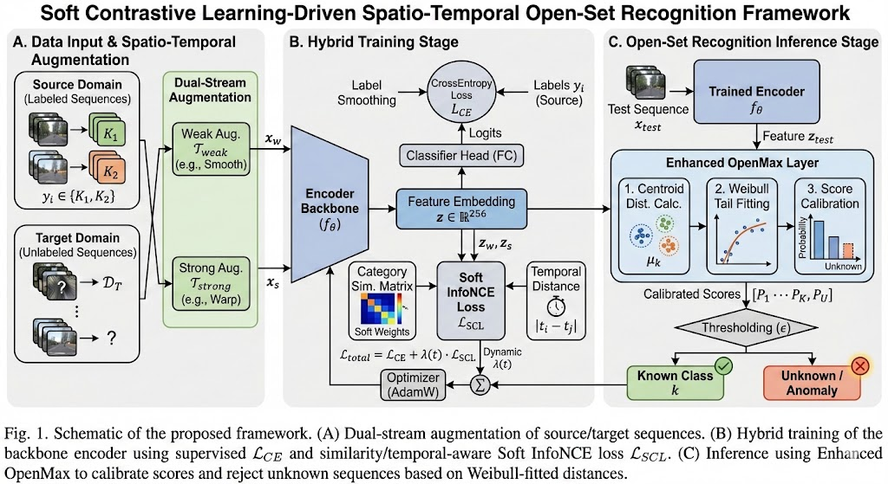
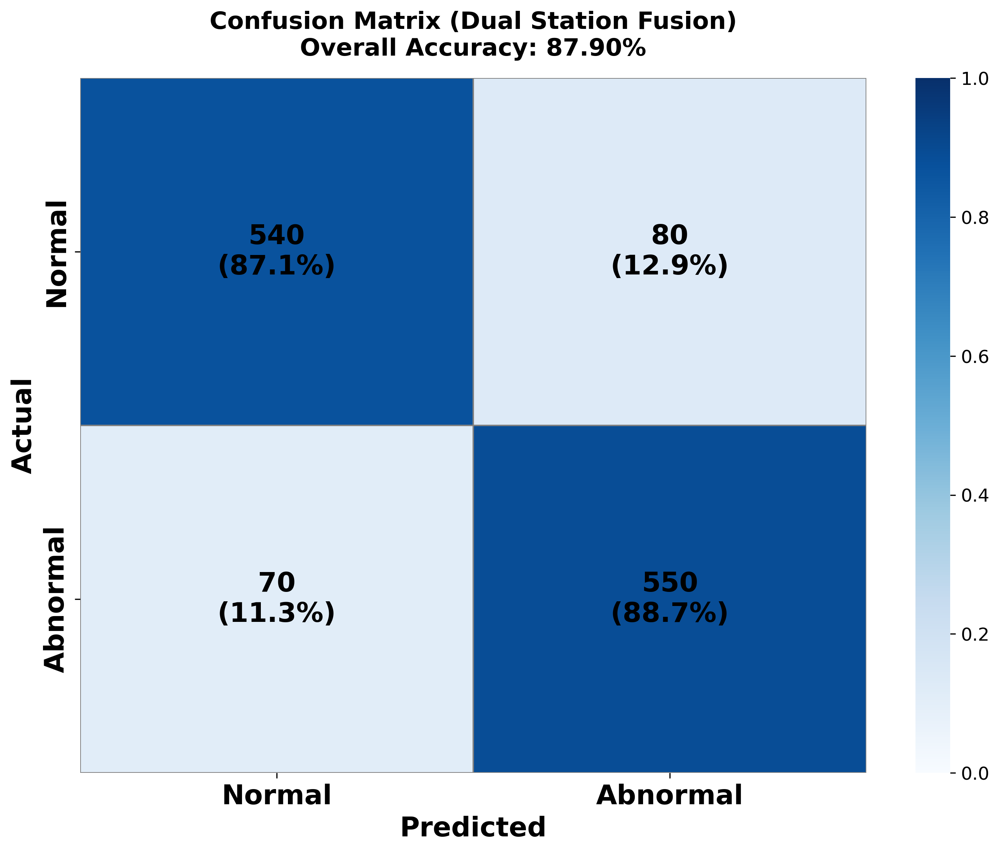
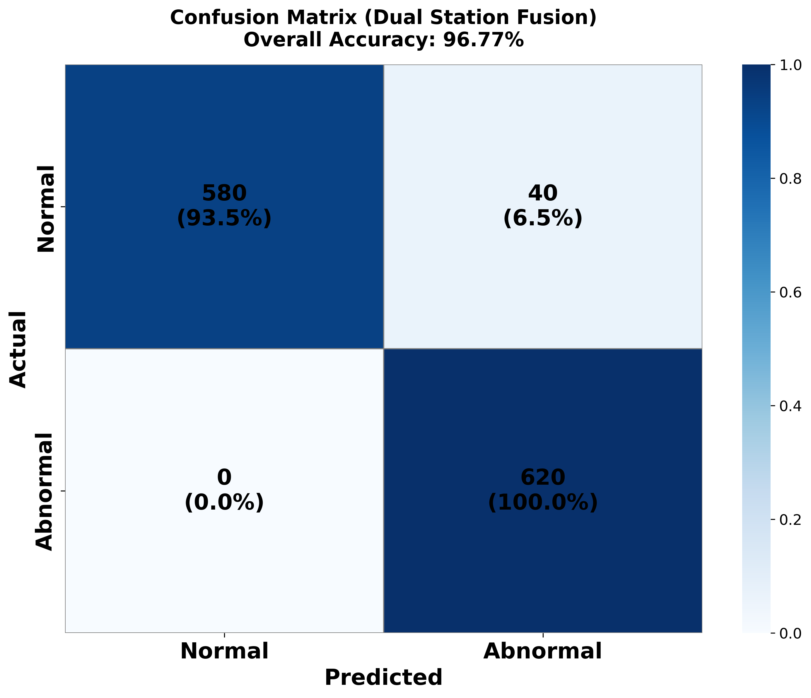
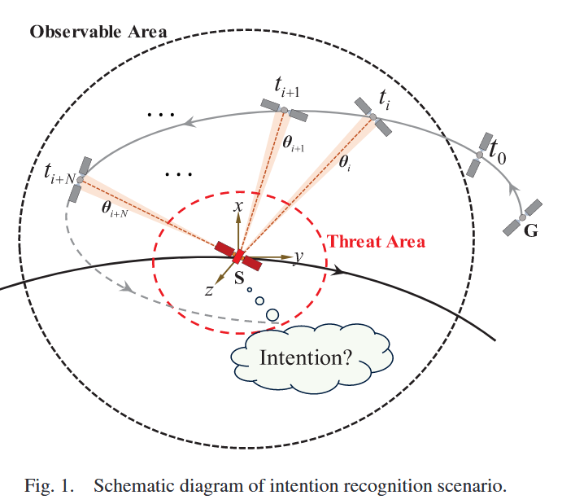
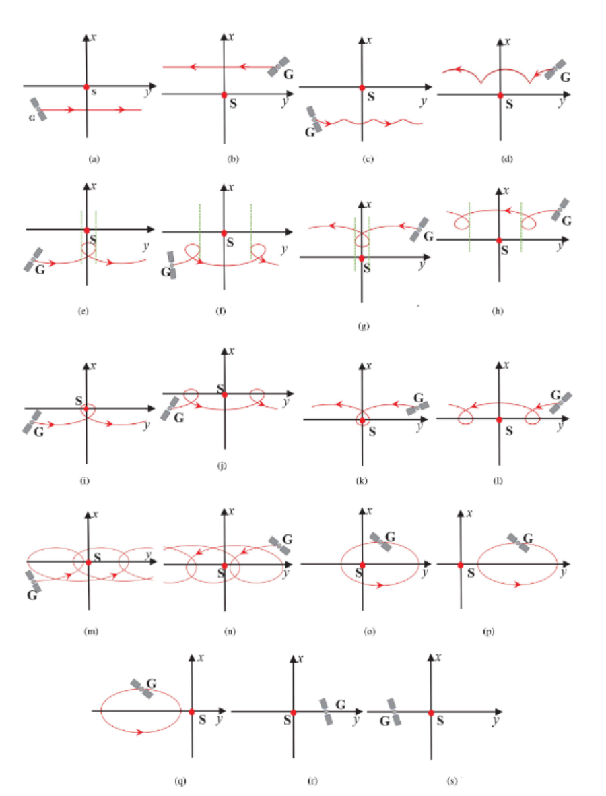
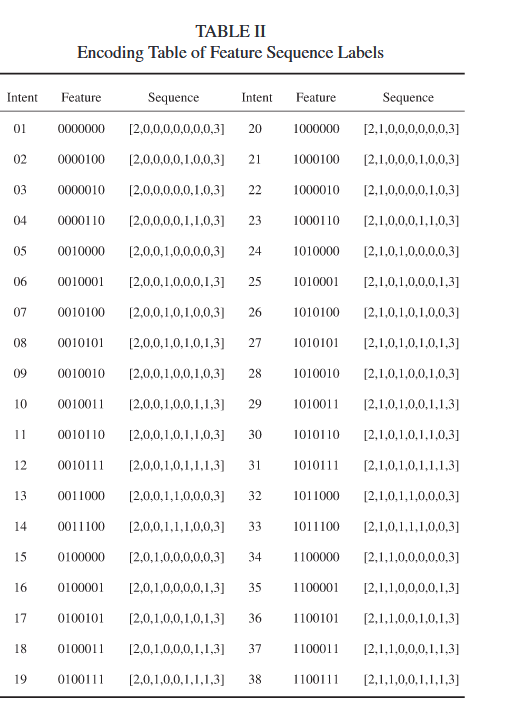
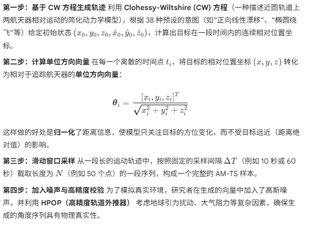
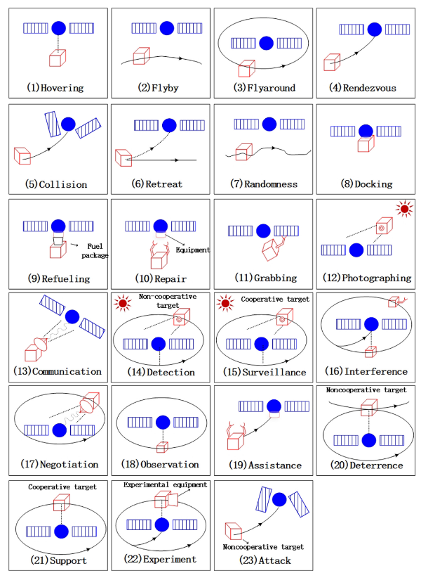

## 20260118

站点选择：北京（BJ），石家庄(SJZ)，构建可观测轨道，序列长度为10帧，采样间隔时间60s。

### 模型分别采用决策级融合，特征级融合

##### 决策级融合网络架构：采用置信度加权

#### 特征级融合采用，特征拼接，和交叉注意力

交叉注意力网络架构如下图：

该模型采用双流 LCRN（长短期记忆卷积网络）架构并行处理 BJ 和 SJZ 两地的图像序列：首先，两个独立支路分别通过 TimeDistributed ResNet18 提取每一帧的空间特征，并经由 双向 LSTM 捕捉时序依赖，各自输出最后一个时间步的全局特征向量；**随后进入核心的交叉注意力融合模块（Cross-Attention Fusion），利用 BJ 的特征向量作为查询（Query）去“关注”并动态加权检索 SJZ 的特征（Key/Value），从而提取出两地数据间最相关的互补信息；最终，将经过注意力机制增强的特征进行拼接（Concatenate），**并通过包含 Dropout 的全连接分类头（Classifier） 输出最终的分类结果（Logits）。

### 实验场景与结果

#### 场景1.双站观测目标异动

1.1 目标姿态异动(a:目标在RVN下姿态保持不变;b:目标在RVN下姿态发生变化)

a:目标在RVN下姿态保持不变---具体数据 ：三轴稳定

b:目标在RVN下姿态发生变化----具体数据 ：绕z轴单轴自旋0.0005 rad/s

**此场景较容易  决策级融合和特征级融合都可以达到90%以上**

#### 场景2 目标自旋异动

(a:目标在RVN下发生绕固定轴(x、y、z)进行转动;b:目标在RVN下发生随机转动)

a 绕z轴单轴自旋 ; b绕y轴单轴自旋且带加速度a

此场景显然比场景1 复杂，决策级融合很难到达90%以上，并且相对于单站提升很小

采用特征级融合交叉注意力，得到不错的提升

直接concat方式87.90%

所提交叉注意力：96.77%

### 后续

1.运动方式设计级的越相近，效果肯定就会越差，测试一下交叉注意力融合的极限

2.考虑天基，但是双天基  同时在 200km可观测范围，实际是不是不太常见，合理吗？

3.最近在看西工大  党朝辉课题组系列论文

1.西工大党朝辉+TAES2024+ BiGAT：识别空间非合作目标运动意图的模型+[paper](https://ieeexplore.ieee.org/document/10713184)

2.西工大党朝辉+AST(Aerospace Science and Technology )2025+基于不完整时间序列数据的空间非合作目标轨道运动意向识别+[paper](https://www.sciencedirect.com/science/article/pii/S1270963824010411#br0170)

3.西工大党朝辉+Space: Science & Technology (2025)+利用大型语言模型对空间非合作目标进行意图识别+[paper](https://spj.science.org/doi/full/10.34133/space.0271)

通过利用相对轨道动力学模型仿真生成轨迹数据，划分出 38 种不同的运动意图

所提方法采用位置、角度和距离测量时间序列来识别意图。

稍晚详细整理，后续先利用相对轨道动力学模型仿真生成轨迹数据，结合此轨迹下数据的图像，综合判断

| **基础构型描述 (Shape Description)**                         | **异面意图编号(Non-coplanar)** | **共面意图编号(Coplanar)** |
| ------------------------------------------------------------ | ------------------------------ | -------------------------- |
| **01. 前方直线漂移** (Forward Linear Drift) 目标在前方沿直线飞越，轨迹位于己方下方。 | **Intent 01**                  | **Intent 20**              |
| **02. 后方直线漂移** (Reverse Linear Drift) 目标在后方沿直线飞越，轨迹位于己方上方。 | **Intent 02**                  | **Intent 21**              |
| **03. 前方曲线漂移** (Forward Curved Drift) 目标在前方沿曲线飞越，轨迹位于己方下方。 | **Intent 03**                  | **Intent 22**              |
| **04. 后方曲线漂移** (Reverse Curved Drift) 目标在后方沿曲线飞越，轨迹位于己方上方。 | **Intent 04**                  | **Intent 23**              |
| **05. 居中下方水滴状飞越** (Center bottom drip-style fly-by) 正下方穿越，己方位于水滴轨迹顶端切线之间。 | **Intent 05**                  | **Intent 24**              |
| **06. 偏心下方水滴状飞越** (Non-center bottom drip-style fly-by) 偏向一侧的下方穿越。 | **Intent 06**                  | **Intent 25**              |
| **07. 居中上方水滴状飞越** (Center top drip-style fly-by) 正上方穿越。 | **Intent 07**                  | **Intent 26**              |
| **08. 偏心上方水滴状飞越** (Non-center top drip-style fly-by) 偏向一侧的上方穿越。 | **Intent 08**                  | **Intent 27**              |
| **09. 前方水滴状绕飞** (Forward drip-style fly-around) 在前方区域进行水滴状环绕。 | **Intent 09**                  | **Intent 28**              |
| **10. 前/后下方水滴状飞越** (Front/rear bottom drip-style fly-by) 己方被包含在目标的水滴状轨迹包络内。 | **Intent 10**                  | **Intent 29**              |
| **11. 后方水滴状绕飞** (Reverse drip-style fly-around) 在后方区域进行水滴状环绕。 | **Intent 11**                  | **Intent 30**              |
| **12. 前/后上方水滴状飞越** (Front/rear top drip-style fly-by) 己方被包含在轨迹包络内，且轨迹位于上方。 | **Intent 12**                  | **Intent 31**              |
| **13. 前方螺旋飞越** (Forward spiral fly-by) 在前方进行螺旋状运动（包含多个水滴环）。 | **Intent 13**                  | **Intent 32**              |
| **14. 后方螺旋飞越** (Reverse spiral fly-by) 在后方进行螺旋状运动。 | **Intent 14**                  | **Intent 33**              |
| **15. 椭圆绕飞** (Elliptical fly-around) 围绕己方进行完整的椭圆环绕。 | **Intent 15**                  | **Intent 34**              |
| **16. 前方椭圆伴飞/悬停** (Front elliptical circulate hover) 在前方区域进行周期性的椭圆环绕。 | **Intent 16**                  | **Intent 35**              |
| **17. 后方椭圆伴飞/悬停** (Rear elliptical circulate hover) 在后方区域进行周期性的椭圆环绕。 | **Intent 17**                  | **Intent 36**              |
| **18. 前方定点悬停** (Front fixed-point hover) 在前方相对静止。 | **Intent 18**                  | **Intent 37**              |
| **19. 后方定点悬停** (Rear fixed-point hover) 在后方相对静止。 | **Intent 19**                  | **Intent 38**              |

**多特征标签序列**：将意图编码为 7 位二进制特征序列（如“是否共面”、“是否封闭”、“正向或反向”等），显著提升了结果的可解释性 

| **特征位**  | **功能描述** | **状态 0 含义**            | **状态 1 含义**          |
| ----------- | ------------ | -------------------------- | ------------------------ |
| **Bit [6]** | 空间平面性   | **非共面**相对运动         | **共面**相对运动         |
| **Bit [5]** | 轨迹闭合性   | 非闭合类型运动             | 闭合类型运动             |
| **Bit [4]** | 相对运动大类 | **单向型** (One-way)       | **摆动型** (Swinging)    |
| **Bit [3]** | 细分轨迹形状 | **水滴型** (Drip-type)     | **螺旋型** (Spiral-type) |
| **Bit [2]** | 运动方向     | **正向** (Forward)         | **反向** (Reverse)       |
| **Bit [1]** | 几何形状特征 | 直线/不穿过z轴/闭合        | 曲线/穿过z轴/悬停        |
| **Bit [0]** | 相对位置关系 | 中心型/绕飞型 (Fly-around) | 非中心型/飞越型 (Fly-by) |

**角度测量时间序列**--高精度轨道预报器 (High-Precision Orbit Propagator, HPOP)

#### 3.西工大党朝辉+Space: Science & Technology (2025)+利用大型语言模型对空间非合作目标进行意图识别+[paper](https://spj.science.org/doi/full/10.34133/space.0271)

| **意图类别**                        | **编号** | **意图名称**                | **详细描述**                                                 |
| ----------------------------------- | -------- | --------------------------- | ------------------------------------------------------------ |
| **运动意图** (Motion intentions)    | (1)      | **悬停** (Hovering)         | 目标与运行航天器保持恒定的相对距离，相对速度为零。           |
|                                     | (2)      | **飞越** (Flyby)            | 目标与运行航天器之间的相对距离由大变小，再由小变大，但从未变为零。 |
|                                     | (3)      | **绕飞** (Flyaround)        | 目标与运行航天器之间的相对距离不为零，且在较小的范围内波动。 |
|                                     | (4)      | **交会** (Rendezvous)       | 目标执行了轨道机动，导致其与运行航天器的相对距离为零，相对速度也为零。 |
|                                     | (5)      | **碰撞** (Collision)        | 目标与运行航天器的相对距离为零，但相对速度不为零。           |
|                                     | (6)      | **撤离** (Retreat)          | 目标原本与运行航天器发生了碰撞（或接触），经过轨道机动后，现在已远离运行航天器。 |
|                                     | (7)      | **随机/无序** (Randomness)  | 意图不明确或随时间变化。                                     |
| **操作意图** (Operation intentions) | (8)      | **对接** (Docking)          | 在交会期间，目标与运行航天器通过机械臂或对接机构在结构上结合成一体。 |
|                                     | (9)      | **加油/补加** (Refueling)   | 目标通常是合作目标，配备有燃料包。运行航天器协助进行燃料加注。 |
|                                     | (10)     | **维修** (Repair)           | 合作目标包含运行航天器需要更换和添加的维护工具（如机械臂）及设备部件。 |
|                                     | (11)     | **捕获/抓取** (Grabbing)    | 在悬停或交会期间，目标通过机械臂、飞爪等装置附着在运行航天器本体上。 |
|                                     | (12)     | **拍照** (Photograph)       | 相对距离足够近，以便目标通过相机对运行航天器进行拍摄。       |
|                                     | (13)     | **通信** (Communication)    | 目标配备通信设备，并向运行航天器发射电磁信号。               |
| **任务意图** (Task intentions)      | (14)     | **侦察/探测** (Detection)   | 目标为非合作目标。运动意图为悬停和绕飞。操作意图为拍照并收集关于运行航天器的信息。 |
|                                     | (15)     | **监视** (Surveillance)     | 目标为合作目标。其运动意图和操作意图与“侦察”相同。           |
|                                     | (16)     | **干扰** (Interference)     | 目标为非合作目标。运动意图为悬停、交会和绕飞。操作意图包括抓取和电磁干扰等。在一段时间内，使运行航天器丧失在轨执行任务的能力。 |
|                                     | (17)     | **协商/交互** (Negotiation) | 运动意图为悬停和绕飞。操作意图为通信。                       |
|                                     | (18)     | **观察** (Observation)      | 运动意图与“侦察”类似，但没有操作意图。目标正在等待接收操作指令。 |
|                                     | (19)     | **辅助/协助** (Assistance)  | 目标为合作目标。运动意图为交会。操作意图为维修。             |
|                                     | (20)     | **威慑** (Deterrence)       | 目标为非合作目标。运动意图包括悬停、飞越、交会和绕飞。目标反复展示上述意图。操作意图不确定。 |
|                                     | (21)     | **支援/护卫** (Support)     | 合作目标用于保卫运行航天器。运动意图为悬停和绕飞，但没有操作意图。 |
|                                     | (22)     | **试验** (Experiment)       | 合作目标搭载试验设备，运动意图为悬停、交会和绕飞，操作意图不确定。 |
|                                     | (23)     | **攻击** (Attack)           | 目标为非合作目标。运动意图为碰撞。没有（其他复杂的）操作意图。 |

### . 输入的核心构成

输入不再是原始的传感器波形数据，而是经过预处理和语义转化的**多源信息描述**：

- **运动状态描述 (Motion Status)**：
  - 来自底层模型（如 BiGAT 或其他轨迹分类器）的识别结果。
  - 例如：“目标当前处于**悬停 (Hovering)** 状态”或“目标正在进行**绕飞 (Fly-around)**”。
- **视觉/外观特征描述 (Visual Characteristics)**：
  - 基于图像识别提取的目标物理特征。
  - 例如：“目标装备有**机械臂 (Robotic arm)**”、“目标具有**光学敏感器 (Optical sensor)**”、“目标带有**对接口 (Docking port)**”。
- **任务背景/交互历史 (Context/Interaction)**：
  - 目标的身份属性（如“非合作目标”）以及之前的机动历史（如“曾多次尝试接近”）。

### 2. 输入的具体形式 (Prompt Template)

模型采用了 **P-tuning V2** 微调技术，其输入通常遵循类似以下的“指令-输入”模板格式：

> **[Instruction / 指令]** 你是一名空间态势感知专家。请根据以下目标的运动状态和外观特征，分析其可能的操作意图和任务意图。
>
> **[Input / 输入描述]**
>
> - **目标类型**：非合作目标
> - **运动行为**：该目标保持在距离我方卫星 100米处**相对静止（悬停）**。
> - **外观特征**：观测到该目标展开了**高分辨率相机**，且没有明显的攻击性武器或对接机构。
>
> **[Response / 输出]** (模型将在此处生成推理结果，例如：该目标的**操作意图**是“拍照/侦察”，**任务意图**是“情报收集/监视”。)

### 3. 为什么输入变成这样了？

- **跨模态融合**：传统的 BiGAT 只能看懂“轨迹”，看不懂“机械臂”。LLM 的输入将**视觉信息**（机械臂）和**动力学信息**（悬停）在语义层面结合了起来。
- **推理逻辑**：
  - 如果输入只有“悬停”，它可能是“加油”、“维修”或“侦察”。
  - 如果输入加入了“有相机”，LLM 就能推理出是“侦察”。
  - 如果输入加入了“有机械臂”，LLM 就能推理出是“维修”或“抓捕”。
