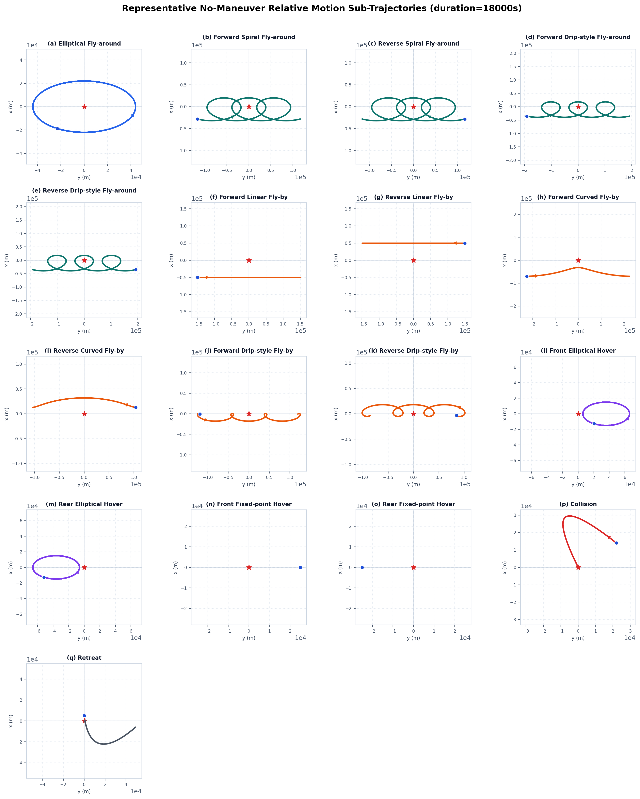
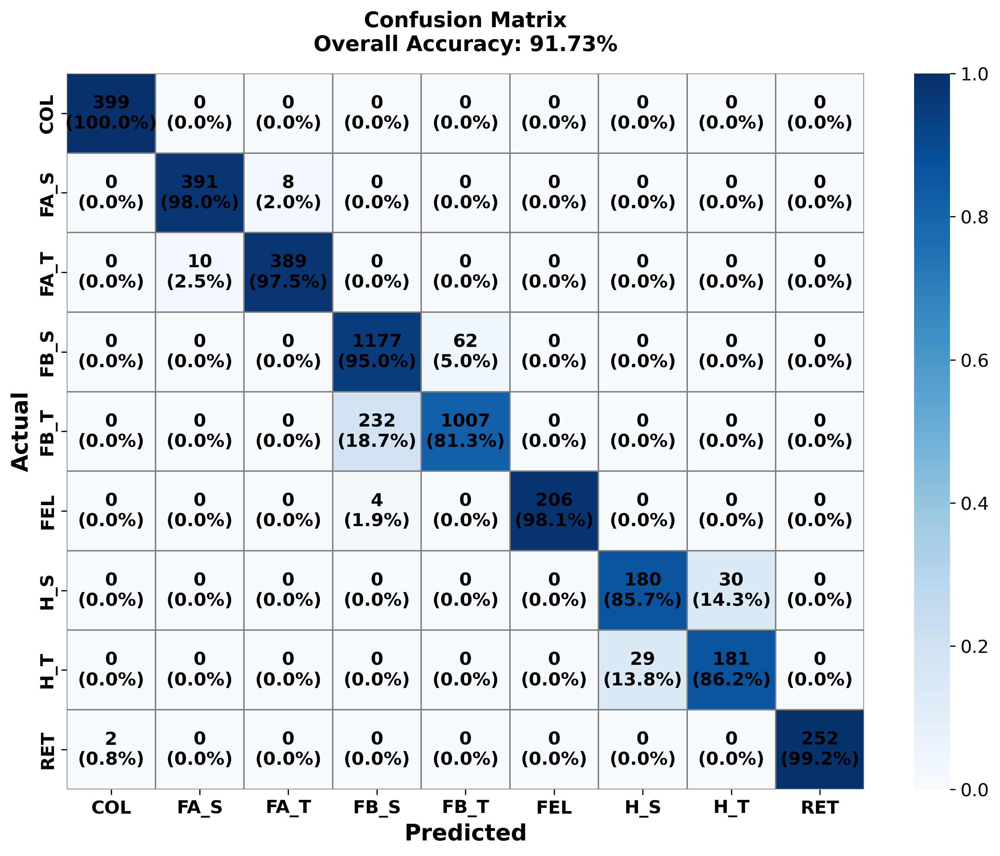
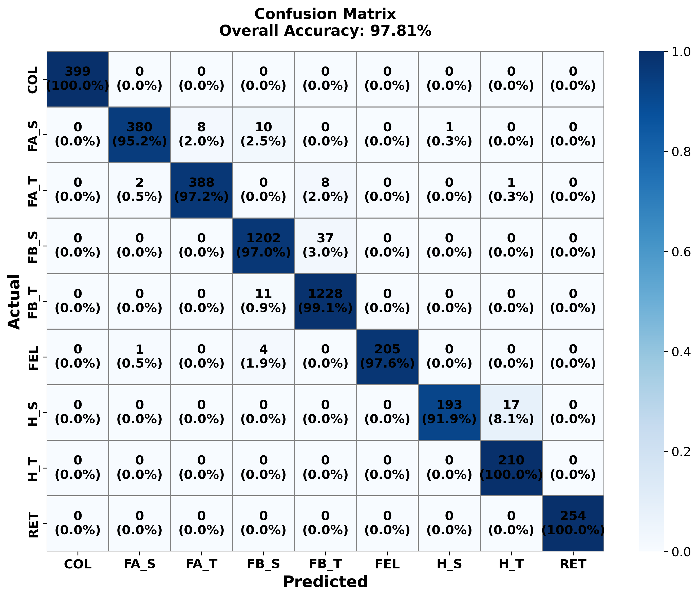

# 2026 0508周报

## 意图空间集的构造

1. 椭圆绕飞（a）

   不判姿态1

2. **螺旋/滴落式绕飞（b-e）：含前方滴式绕行、反向滴漏式绕行、前螺旋绕行、反向螺旋绕行**

   **稳定/三轴自旋；进动/翻滚两类**或者三类  2,3

3. **掠过（f-k）：含正向线性掠过、反向线性掠过、正向弯曲掠过、反向弯曲掠过、正向滴漏式掠过、反向滴漏式掠过 、**

   **稳定/三轴自旋；进动/翻滚两类** 4,5

4. **悬停（l-o）：含前椭圆悬停、后椭圆悬停、前固定点悬停、后固定点悬停**

   **稳定/三轴自旋；进动/翻滚两类 **6,7

5. 碰撞（p）

   不判姿态 8

6. 撤退（q）

   不判姿态 9

   总共9类

   姿态 区分受控任务行为

现在在仿真这个9类数据集

之前一直考虑变轨

## 网络模型

决策后融合和这种方式 ，

特征级融合，肯定的优选特征级的融合；更有解释性，实验结果也验证这种方法的精度高更高

直接拼接；

1. **轨道大类：轨道物理信息引导(分大类时图像和轨道信息都去参与)**

   将轨道信息作为条件先验，而不是简单与图像特征在分类前拼接。具体来说，轨道特征中的距离、方位、俯仰角、距离变化率和相对方向**等信息用于指导视觉特征提取过程**，包括多尺度视觉特征选择、视觉 token 条件调制；这样模型可以根据不同观测距离和几何条件自适应地关注更合适的图像尺度和时序片段。

2. **是否姿稳/进动，轨道信息不去直接参与**

   区分同一轨道下稳定状态 `_S` 和高旋转/进动状态 `_T`：由于轨道数据的是相同或者相似的，这时轨道数据反而可能会起到反向作用，不能作为判别特征

   **R去调制图像，影响模型去关注到本身的旋转变换，而不是目标分辨率导致的大小变化**，或者置信度的调整，

   图像序列本身仍然保留独立的 raw visual 分支和 motion 分支，其中 motion 分支通过相邻帧特征图差分显式建模目标的运动、旋转和进动变化，用于区分同一轨道下稳定状态 `_S` 和高旋转/进动状态 `_T`。最终模型仍采用 9 类软分类，轨道引导分支主要学习轨道和成像几何相关的大类信息，raw/motion 分支主要学习同轨道内的细粒度视觉状态差异，并通过成对 `_S/_T` logits 的软校正增强状态判别，而不采用容易产生误差级联的硬两级分类。

### 部分实验结果

直接特征拼接

### 研究计划

一个是突出意图

运动

目标正在接近/绕飞/悬停/伴飞/撤离/异常机动

任务层面：

抵近观察；伴飞监视；绕飞侦察；通信中继；干扰准备；碰撞/逼近威胁
撤离规避；未知异常意图

一个是跟天基观测平台飞控系统的内外部观测体系融合

平台轨道、姿态、**相机指向**（现在的仿真图像都是默认相机指向目标的中心的，实际应该是一个跟踪）

（现实问题，**光学 可以归结到 相机指向问题**，成像的正中央的？ ）
